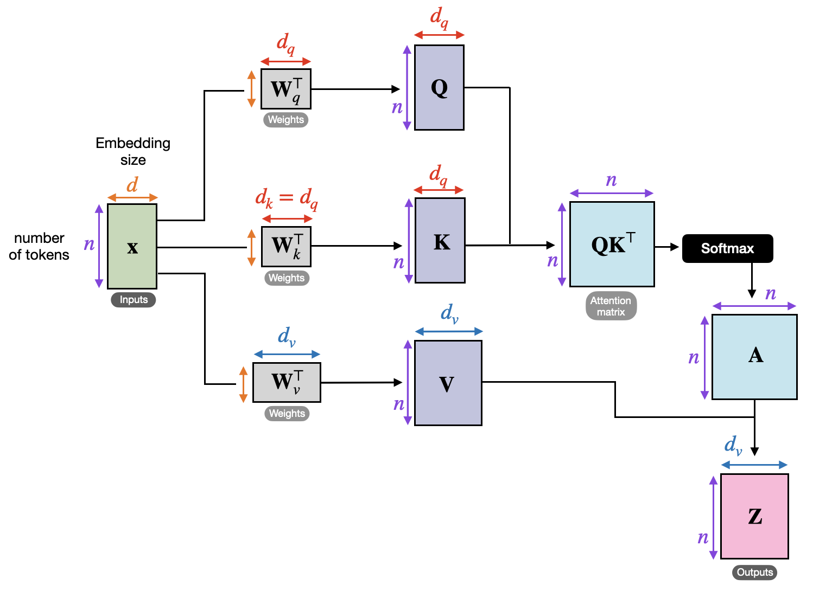
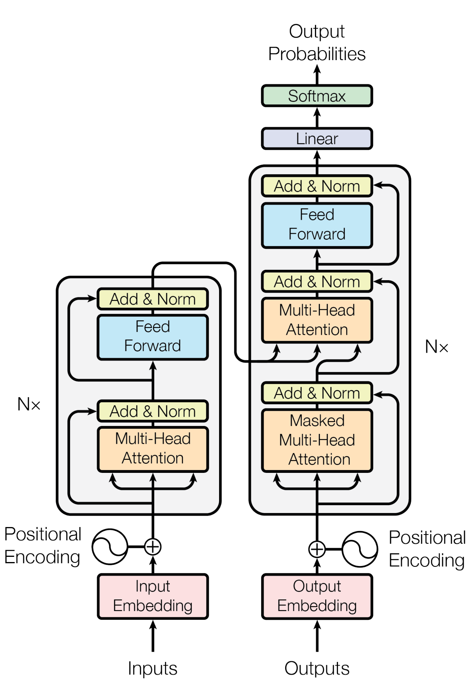
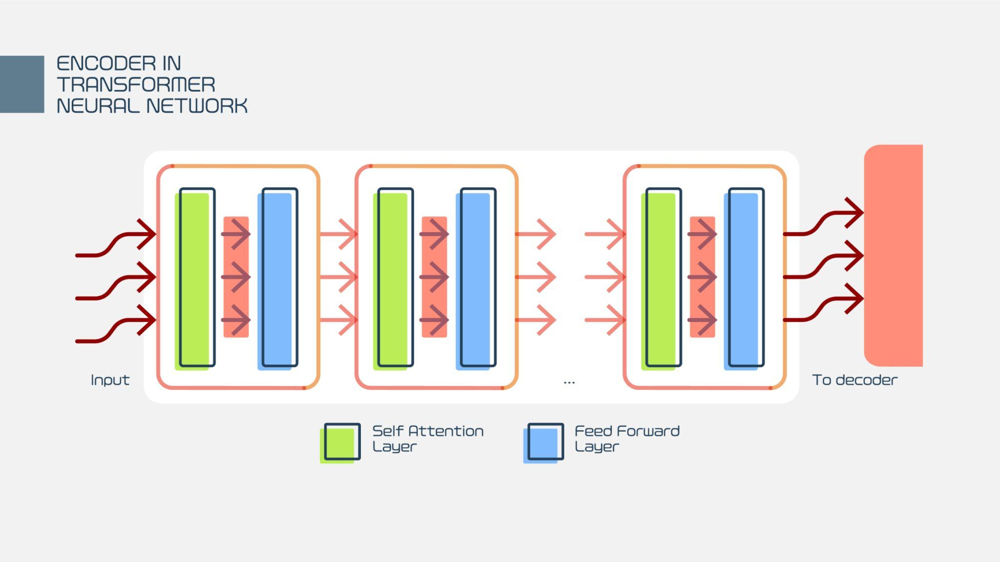
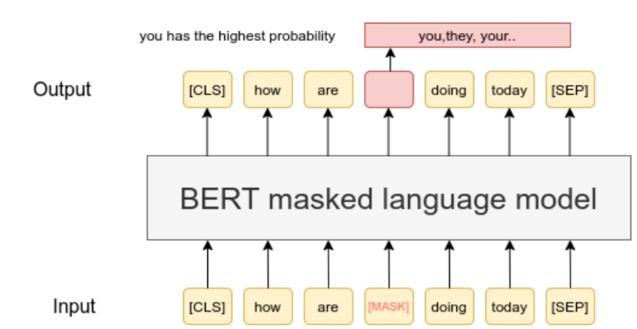

- **Transformers**
    - **motivation**
        - classical sequence models (e.g. RNNs) process text sequentially
        - long-range dependencies are difficult to capture
        - information from distant tokens tends to vanish or blur
    - **need for a mechanism that**
        - accesses all tokens directly
        - adapts dynamically to the task
        - scales efficiently to long sequences
    - **technologies**
        - __attention mechanism__
        - __BERT__
        - __GPT__
        - __instruction tuning__
        - __agentic coding__

- **attention mechanism**
    - **core idea**
        - each element of a sequence selectively focuses on other elements
        - relevance between tokens is learned, not predefined
        - context is computed as a weighted combination of all tokens
    - **steps**
        - __attention mechanism steps__
    - **multi-head attention**: 
        - use several $Q_i,K_i,V_i$ matrices $\text{head}_i=\text{attention}(Q_i,K_i,V_i)$, and $\text{head} = \text{Concat}(\text{head}_i,\dots,\text{head}_H)$
        - train a weight of these heads $W_O\in \mathbb R^{(Hd_k)\times d_{model} }$
        - mix information of the attention heads
        - map it into the embedding dimension of the model
        - formally: $$\text{Multihead}(Q,K,V) = \text{head} W_O$$
    - **each head specializes to different things**:
        - syntax
        - agreement
        - semantic roles
        - long-range coreference
        - together, they form a rich contextual representation.
    - **interpretation**
        - attention builds a soft, learned dependency graph over tokens
        - each token dynamically decides which others matter
        - context is global and adaptive
    - **computational cost**: $\mathcal O(T^2d_k)$
        - all token-token interaction
        - sequence length is limited (e.g. 512 in BERT, 8k-1M+ in modern LLMs )
        - long-context variants are actively researched
        - parallelizable (GPUs)

- **attention mechanism steps**
    - **Inputs**: we start with a sequence of token representations $$\mathbf{x}_1,\dots,\mathbf{x}_T,\quad \mathbf{x}_t\in \mathbb R^{d_{model}},$$ including
        - token embedding
        - positional embedding
    - **Queries, Keys, Values** (linear projections): Each token is mapped into three different spaces: $$\mathbf{q}_t = W_Q \mathbf{x}_t,\; \mathbf{k}_t = W_K \mathbf{x}_t,\; \mathbf{v}_t=W_V \mathbf{x}_t,$$ 
        - where $W_Q, W_K, W_V\in \mathbb R^{d_k\times d_{model}}$ matrices (typically $d_k<d_{model}$)
        - query: what this token is looking for
        - key: what this token offers
        - value: the information to pass along
        - Crucial: relevance (Q·K) is computed separately from content (V).
        - 
    - **Simliarity scores**
        - Each token $t$ compares itself to every other token $s$: 
            $$
          \text{score}(t,s) = \dfrac{\mathbf{q}_t^\top \mathbf{k}_s}{\sqrt{d_k}}
          $$
        - full symmetric matrix $S\in \mathbb R^T\times \mathbb R^T$
        - information content: how relevant is every token to token $t$?
        - normalization
    - **attention weights**
        - apply softmax transformation
          $$
          \alpha_{t,s} = \frac{\exp(\text{score}(t,s))}{\sum_{s'} \exp(\text{score}(t,s'))}
          $$
    - **context aggregation**
        - weighted sum of the token values $$\mathbf{h}_t = \sum_s \alpha_{t,s} \mathbf{v}_t$$
        - provides contextual embedding
        - not selects tokens, but blends them
    - **compact matrix form**
        - $Q, K, V \in \mathbb R^{T\times d_k}$, and then
        $$ \text{attention}(Q,K,V) = \text{softmax}\left(\dfrac{Q^TK}{\sqrt{d_k}}\right) V$$

- **embedding in transformers**
    - take into account tokens (e.g. "unbelievable movie" $\to$ ["un", "##believable", "movie"])
    - also delimiter tokens (like beginning-of-sentence, end-of-sentence, etc.)
    - **token embedding**: token $t\mapsto \mathbf{e}_t^{token}\in \mathbb R^{d_{model}}$
        - learned during training
        - context independent (static)
    - **positional embedding**: $t\mapsto i$ position index (e.g. “dog bites man” vs “man bites dog”) use pre-trained $\mathbf{e}_i^{pos}$
        - represents order
        - originally a fixed formula
        - trainable version is better
    - **final embedding**: 
        - $$\mathbf{x}_t=\mathbf{e}_t^{token} + \mathbf{e}_i^{pos}$$

- **self-attention**
    - queries, keys, and values all come from the same sequence
    - each token attends to all other tokens (including itself)
    - **properties**
        - captures long-range dependencies
        - independent of token distance
        - fully parallelizable

- **transformer**
    - a neural architecture built entirely on __self-attention__
    - eliminates recurrence and convolution
    - processes sequences in parallel
    - **Transformer components**
        - 
        - multi-head attention → __attention mechanism__
        - position-wise feed-forward networks
        - residual connections (identity shortcut paths)
        - positional encoding → __embedding in transformers__
        - encoder-decoder architecture $\to$ 
    - **LLM system components**
        - tokenizer
        - input embedding
        - transformer blocks
        - output projection (linear + softmax)
    - **advantages**
        - global context modeling
        - efficient parallel training
        - flexible representation learning
        - strong scaling with data and model size
    - **conceptual shift**
        - from fixed context windows → learned relevance
        - from sequential processing → global interaction
        - from hand-designed structure → data-driven structure
    - **transformers provide**:
        - context-sensitive token representations
        - a unified architecture for many NLP tasks
    - **they form the foundation of**:
        - contextual word embeddings
        - modern language models
        - large-scale pretrained models

- **BERT**
    > transforms raw text into embedding to understand text
    - **alternative name**:  Bidirectional Encoder Representations from Transformers
    - **model type**
        - transformer-based, **encoder-only** architecture
        - relies entirely on self-attention mechanisms
    - **core idea**
        - learn deep, bidirectional representations of language
        - each token representation incorporates both left and right context
    - **input representation**
        - static token embeddings (subword-level)
        - positional embeddings
        - optional segment (token-type) embeddings for sentence pairs
        - all embeddings are summed before entering the transformer layers
    - **bidirectionality**
        - unlike autoregressive models, BERT attends to all tokens simultaneously
        - enables full-sentence context modeling
        - particularly effective for language understanding tasks
    - **pretraining objectives**
        - masked language modeling (MLM): randomly mask input tokens, and try to predict masked tokens using surrounding context
        - next sentence prediction (NSP): learn relationships between sentence pairs, supports entailment and discourse-level understanding
    - **training media**
        - BooksCorpus and English Wikipedia, using a relatively small but carefully curated corpus (c.a. 3.3B words)
    - **contextual embeddings**
        - produces one embedding per token *per occurrence*
        - meaning depends on full input sequence
        - resolves polysemy and contextual ambiguity
    - **architectural properties**
        - 
        - fixed maximum sequence length (typically 512 tokens)
        - no recurrence or convolution
        - deep stacking of transformer encoder layers
    - **strengths**
        - strong performance on sentence- and token-level understanding tasks
        - effective transfer learning via fine-tuning
        - robust contextual semantic representations
    - **limitations**
        - not designed for text generation
        - limited context window
        - computationally expensive compared to simpler models
    - **typical applications**
        - text classification
        - named entity recognition
        - __question answering with BERT__
        - natural language inference
    - **historical role**
        - established transformers as the dominant architecture for NLP
        - introduced contextual embeddings as a standard paradigm
        - foundation for many later pretrained language models

- **question answering with BERT**
    > BERT performs question answering by understanding and pointing, rather than generating language
    - **core idea**
        - answer questions by **selecting a text span** from a given context
        - no text generation is performed
    - **model**
        - transformer-based, encoder-only architecture
        - jointly encodes question and context using self-attention
    - **input format**
        - question and context are concatenated into a single sequence:
            $$\text{[CLS] question tokens [SEP] context tokens [SEP]}$$
        - special tokens mark structure but are part of the input sequence
    - **prediction**
        - probability of being the **start** of the answer
        - probability of being the **end** of the answer
        - answer is defined as the span between predicted start and end indices
    - **mathematical view**
        - let $ t = 1, \dots, T $ index tokens in the input
        - model outputs:
          $$
          P_{\text{start}}(t), \quad P_{\text{end}}(t)
          $$
        - selected answer:
          $$
          \text{answer} = \text{tokens}[t_{\text{start}} : t_{\text{end}}]
          $$
    - **example**
        - question: *Who wrote Hamlet?*
        - context: *Hamlet was written by William Shakespeare in the early 17th century.*
        - predicted answer span: *William Shakespeare*
    - **properties**
        - requires the answer to be present in the context
        - low risk of hallucination
        - strong alignment between question and evidence
    - **typical datasets**
        - SQuAD (extractive)
        - Natural Questions (extractive subset)
    - **strengths**
        - precise, evidence-based answers
        - strong performance on reading comprehension tasks
    - **limitations**
        - cannot generate novel answers
        - fails if the answer is not explicitly contained in the text
        - limited by maximum input sequence length

- **GPT**
    > generates text by predicting next token in a probabilistic way
    - **alternative name**: Generative Pretrained Transformer
    - **model family**
        - transformer-based, **decoder-only** architecture
        - relies on masked self-attention (causal attention)
    - **core idea**
        - model language as a **token-by-token generation process**
        - predict the next token given all previous tokens
    - **training objective**
        - **autoregressive language modeling**
          $$
          \max_\theta \sum_t \log P_\theta(w_t \mid w_1, \dots, w_{t-1})
          $$
        - trained on large-scale, unlabeled text corpora
        - ChatGPT-style models are trained on large and diverse mixtures of licensed data, human-created content, and publicly available text, enabling broad language competence (c.a. 500B words)

    - **input representation**
        - static token embeddings (subword-level)
        - positional embeddings
        - no explicit segment embeddings
        - sequence treated as a single stream of tokens
    - **unidirectional context**
        - each token attends only to earlier tokens
        - enforces causal, left-to-right generation
        - suitable for text generation and completion
    - **generation mechanism**
        - text is generated sequentially, one token at a time
        - each generated token is appended to the context
        - the model computes a probability distribution over the next token
        - a token is selected using a decoding strategy
    - **decoding strategies**
        - greedy decoding: choose the most probable next token at each step
        - beam search: keep the top-$B$ most likely partial sequences and extend them jointly
        - temperature sampling: sample from the probability distribution scaled by a temperature parameter
        - top-k sampling: sample only from the $k$ most probable next tokens
        - top-p (nucleus) sampling: sample from the smallest set of tokens whose cumulative probability is at least $p$
    - **generation fine-tuning / constraints**
        - applied during decoding, not during training
        - modify token probabilities before selection
        - reduce repetition, degenerate loops, sensitive words
        - enforce context consistency and fluency
    - **capabilities**
        - coherent text generation
        - dialogue and conversational interaction
        - few-shot and zero-shot task adaptation
        - reasoning over provided context
    - **task handling**
        - tasks are specified implicitly via prompts
        - no task-specific fine-tuning required in many cases
        - input format determines behavior
    - **context window**
        - fixed maximum sequence length
        - modern GPT-style models support thousands to tens of thousands of tokens
    - **strengths**
        - flexible, general-purpose language modeling
        - strong performance on open-ended and creative tasks
        - unified framework for many NLP tasks
    - **limitations**
        - higher risk of hallucination
        - weaker grounding without explicit context
        - computationally expensive inference
    - **typical applications**
        - text generation and summarization
        - conversational agents
        - code generation
        - generative question answering

- **instruction tuning**
    > does jobs following text prompts, turns a language model into a cooperative problem solver
    - **motivation**
        - pretrained language models learn to continue text, not to follow instructions
        - raw language modeling does not guarantee helpful, task-oriented behavior
        - users want models that *do things*, not just generate plausible text
    - **core idea (instruction tuning)**
        - adapt a pretrained generative language model to treat inputs as **instructions**
        - shift model behavior from “continue the text” to “solve the task”
        - achieved by additional supervised and preference-based training
    - **model setting**
        - decoder-only, autoregressive transformers
        - instruction tuning does not change the architecture
        - __technical pipeline__
    - **mathematical view (high level)**
        - base objective:
          $$
          \max_\theta \sum_t \log P_\theta(w_t \mid w_{<t})
          $$
        - instruction tuning modifies the data distribution and adds
          preference-based optimization terms
        - result: a new policy aligned with human intent
    - **effect on model behavior**
        - improved task adherence
        - reduced verbosity and randomness
        - stronger alignment with user goals
        - better safety and controllability
    - **examples of instruction-tuned models**: Copilot, Codex, Cursor, Claude Code

- **technical pipeline**
    - **(1) pretraining**:
        - next-token prediction on large-scale text corpora
        - learns general language competence
    - **(2) supervised instruction fine-tuning (SFT)**:
        - train on (instruction, desired output) pairs
        - question → answer
        - prompt → explanation
        - description → code
    - **(3) preference optimization** (optional but common):
        - humans rank multiple model outputs
        - model learns to prefer helpful, correct, safe responses
        - often implemented via reinforcement learning from human feedback (RLHF)

- **agentic coding:**
    > agentic coding treats the model as an active collaborator rather than a passive generator
    - extension of instruction tuning to **multi-step problem solving**
    - model behaves like a semi-autonomous coding agent
    - **typical capabilities**
        - plan solution steps
        - write and revise code
        - debug errors
        - iterate based on feedback
    - **interaction style**
        - user specifies intent, not full specification
        - model fills in details proactively
    - **technical ingredients of agentic coding**
        - instruction-tuned language model
        - long context window
        - iterative prompting and self-reflection
        - optional tool use (e.g. code execution, file editing)
    - **strengths**
        - dramatically lowers barrier to programming
        - accelerates prototyping and experimentation
        - supports exploratory and creative workflows
    - **limitations**
        - may hallucinate correct-looking but wrong code
        - lacks true understanding of execution unless tools are used
        - requires human oversight for correctness
