- **one dimensional classification**
    > simplest case where data are one dimensional
    - **simplest case**: two sets in 1D
    - **data model**: $$\mathcal M(x, x_{sep}) = 
        \begin{cases}
            \text{A, if}&  x> x_{sep}\\
            \text{B, if}&  x\le x_{sep}
        \end{cases}$$
    - **hard margin problem**: if $A$ and $B$ are well separated, i.e. $\max A < \min B$ or conversely, then there exist a good separation point, for example $$x_{sep} = \dfrac{\max A + \min B}2$$ 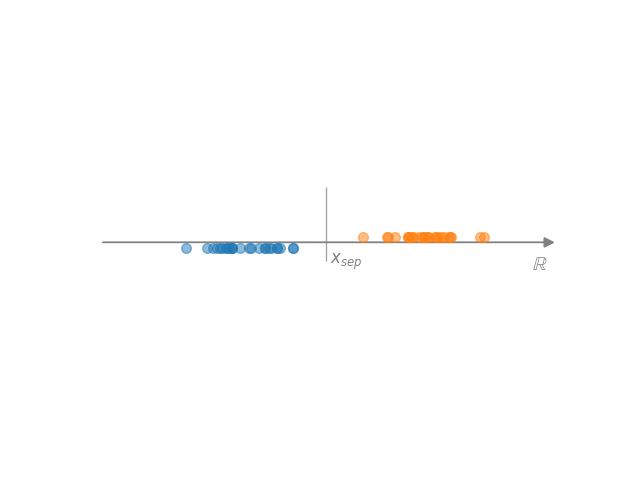
    - **soft margin problem**: overlapping regions, not exact separation, not unique choice, result will depend on the separation condition (measure) 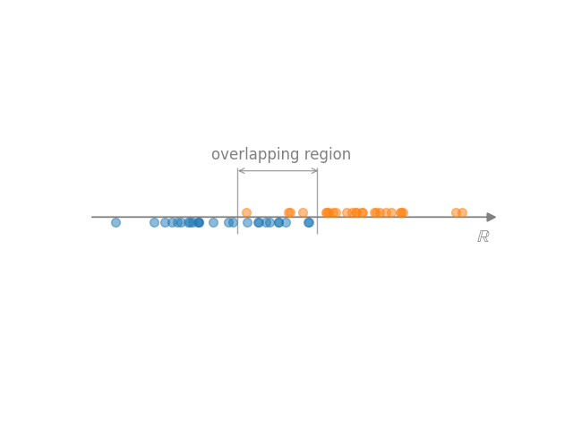
    - **use heuristics**: e.g. midpoint of the overlapping regime
    - **use loss to determine separation point**
        - $p$-norm loss function $L(x_{sep}) = \sum_{x\in\text{overlap}} |x-x_{sep}|^p$
        - $p=1$ __hinge loss minimum__, minimum corresponds to median
        - $p=2$ __quadratic loss minimum__ corresponds to mean
        - __classification via regression__, using softmax normalization of $f(x)=ax+b$; $f(x)>0$ for $x\in A$
        - 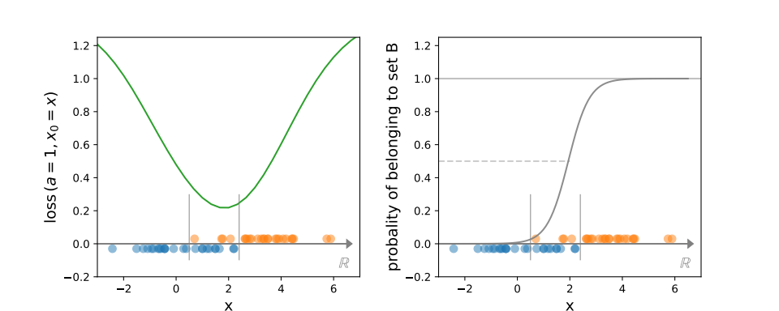
    - **impurity of the sample**
    - **impurity of the sample**: __impurity__

- **impurity**
    - **measures the homogeneity of a sample**
        - $p_i = N_i/N$ the ratio of elements belonging to a given class
        - impurity is zero if $p_i=1$ for some $i$ and $p_j=0$ for other $j\neq i$
        - impurity measures $\to$ entropy: __Shannon entropy__,  Gini impurity (from __other entropy formulea__)

- **hinge loss minimum**
    > piecewise linear convex loss
    - **definition**: $L(x_{sep}) = \sum_{x\in\text{overlap}} |x-x_{sep}|$
    - **corresponds to the median of the overlapping region**
        - proof $$
        \begin{aligned}
            & \sum_{i=1}^N |x_i-x_{sep}| = \sum_{x_i>x_{sep}} (x_i-x_{sep}) + \sum_{x_i < x_{sep}}(x_{sep}-x_i) = \\
            & =(N_<-N_>) x_{sep} + \sum_{x_i>x_{sep}} x_i - \sum_{x_i < x_{sep}} x_i = \text{minimum}\\
            & \Rightarrow N_<=N_>
        \end{aligned}$$

    
    
- **quadratic loss minimum**:
    > quardatic loss function
    - **definition**: $L(x_{sep}) = \sum_{x\in\text{overlap}} (x-x_{sep})^2$
    - **corresponds to the mean of the overlapping region**
        - proof: $$ 0 = \dfrac d{dx_{sep}} \sum_{i=1}^N ( x_i-x_{sep} )^2 = 2 \sum_{i=1}^N ( x_{sep} - x_i)\quad \Rightarrow\quad x_{sep} = \frac 1N \sum_{i=1}^N x_i$$

- **decision tree**
    > separate the classes using series of one dimensional classifications in the coordinate directions
    - **task** 
        - base set $\mathbb R^d$ ($d>1$)
        - target context $\{c_1,c_2\}$
        - data pair set $S=\{(x_i, y_i) \mid x_i=(x_{i1},\dots, x_{id}), x_i\in c_{y_i}\}$
    - **algorithm** 
        - start with step number $n_{step}=0$
        - $n_{step}\to n_{step}+1$
        - if $n_{step}>n_{max}$, or $|S|=1$, <b>END</b>
        - project data on coordinate $a$, having $s = \{(x_a, y_a)\mid (x,y)\in S\}$
        - use one dimensional classification of $s$ to split into $s_1$ and $s_2$
        - use that direction $a$, where the total __impurity__ is the smallest $$\text{total impurity} = \text{impurity}(s_1) + \text{impurity}(s_2)$$
        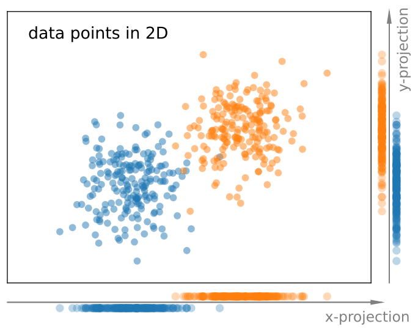
        - go back to point 1, using $s_1\to S$ and $s_2\to S$
        - 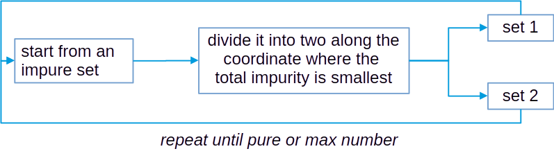
        - 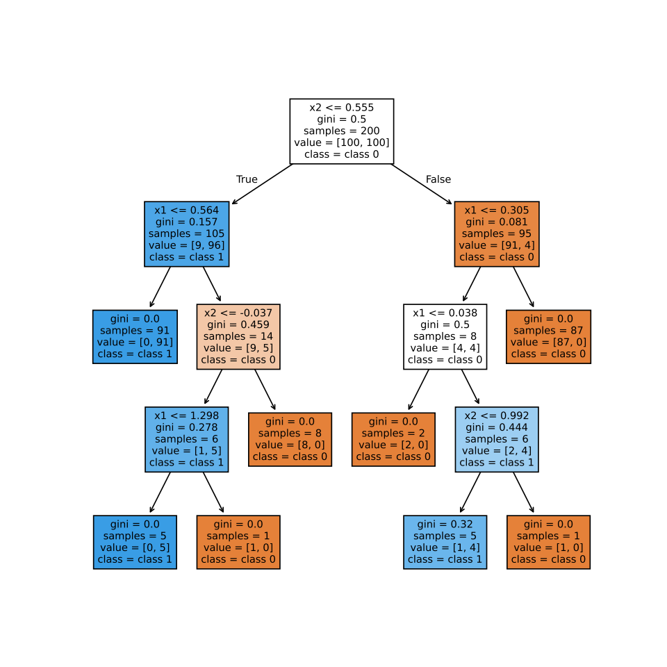
        - 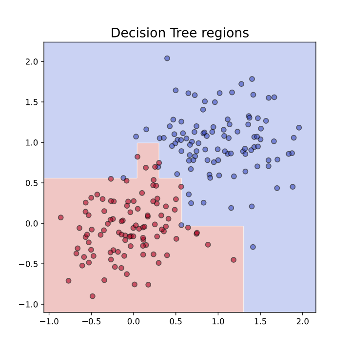
    - **advantages**
        - simple
        - interpretable
    - **disdvantages**
        - prone to overfitting (especiall for deep trees)

- **bagging**
    > collect several models trained on different data to improve decision accuracy
    - **idea**
        - train several models on slightly different datasets (some data missing, some munltiple times)
        - combine the results (average for regression, majority vote for classification)
    - **benefits**
        - lowers variance
        - increases robustness

- **random forest**
    > use a lot of decision trees (forest) using different coordinates and different data
    - **idea** 
        - train several models with selected data (c.f. bagging) and selected parameters
        - combine the results (regression: average, classification: majority vote)
    - **benefits**
        - more robust than simple bagging
        - can be used to rank parameters by their significance, i.e. which contributed more to the final decision
    - **relevance measure**: __feature importance__

- **feature importance**
    > estimates the relevance of individual features based on their role in a decision
    - works with __decision tree__ based methods
    - **in decision tree**
        - measure impurity (e.g. Gini-impurity) before and after a decision based on $f$ coordinate (feature)
        - feature importance: $$\text{Importance}(f) = \sum_\text{nodes using $f$} \text{impurity decrese of the node}$$
    - **in random forest**: average over the trees $$\text{Importance}_{tree}(f) = \frac1{N_{tree}} \sum_{t=1}^{N_{tree}} \text{Importance}_t(f)$$
    - **example**
        - create a 20 dimensional dataset with 2000 elements
        - train a random forest classifier
        - evaluate the result
        - get feature importance
        - visualize it: 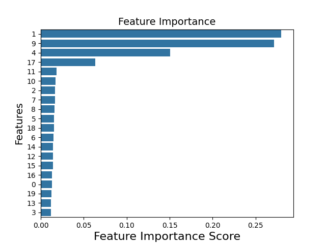
 
- **boosting**
    - **idea**
        - calculate a series of __decision tree__
        - each focuses on the points where the previous one fails
        - combine weighted sum of all of these models
    - **adaptations**: AdaBoost, Gradient Boosting (GBM), XGBoost, etc.

- **KNN model**
    >  assumption: points of a given class are close to each other in the coordinate space, thus it can be used to guess class
    - **meaning**: k-nearest-neighbor 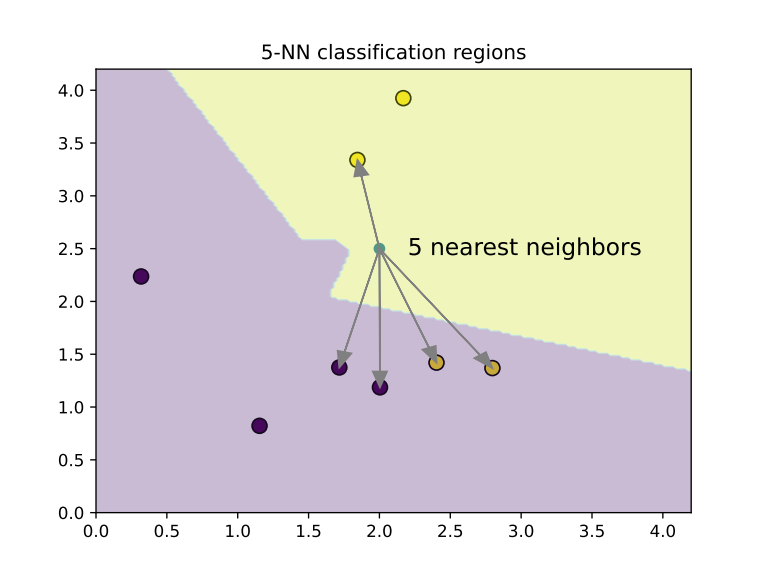
    - **algorithm**
        - keep all points of the training set (samples)
        - for a new point calculate distance from all sample points
        - keep the $k$ smallest
        - the estimated class is the class appears the most among the closest points
    - **advantages**
        - simple
        - naturally multiclass
    - **cons**
        - slow evaluation
        - sensitive to irrelevant features and scaling
        - struggles in high dimensions (curse of dimensionality)
    - **in high dimensions**
        - nearest neighbor is not much closer than the distant neighbors!
        - samples are sparse (almost all points lie near the boundary)

- **perceptron**
    > classification algorithm with a linear data model
    - **history**
        - Rosenblatt 1958
        - newspaper: "the electronic brain that can walk, talk, see, write, reproduce itself, and be conscious of its existence"
    - **method**: __classification via regression__
    - **data model**: linear $y=w\cdot x+b$, two classes correspond different sign of $y$
    - **Rosenblatt algorithm**
        - reward $L=\sum_n y_n (w\cdot x_n+b)$
        - for a misclassified point update $w$ and $b$ with $\eta$ parameter as $$w\to w+\eta y_n x_n, \quad b\to b+\eta y_n$$ (always increases reward)
    - **results**
        - 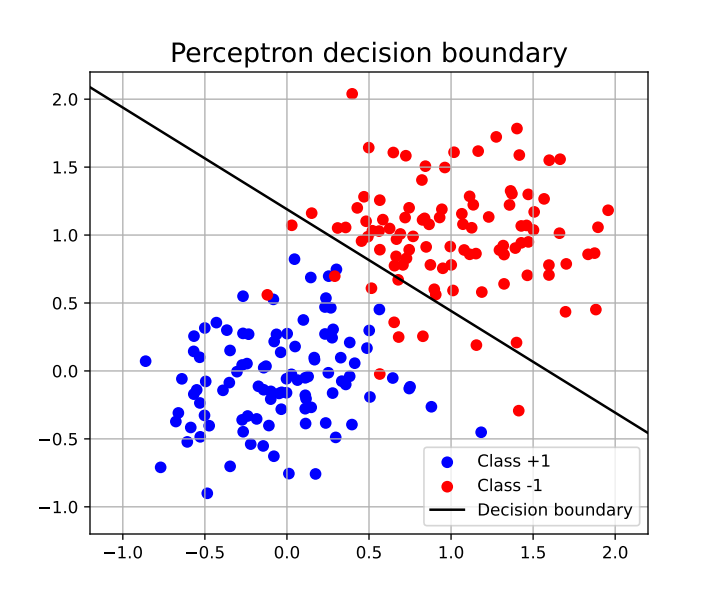

- **Support Vector Machine**
    > classification algorithm with a linear or linearly parametrized data model
    - **alternative name**: SVM
    - **method**: __classification via regression__
    - **linear version**
        - data model: $y = w\cdot x$
        - 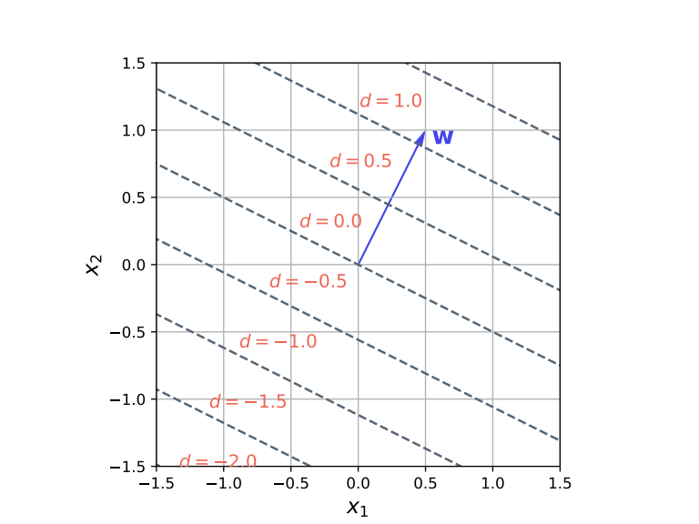
        - maps to one dimensional classification
        - loss function: hinge loss in the overlapping region
        - optimal $w$ minimize total impurity
        - 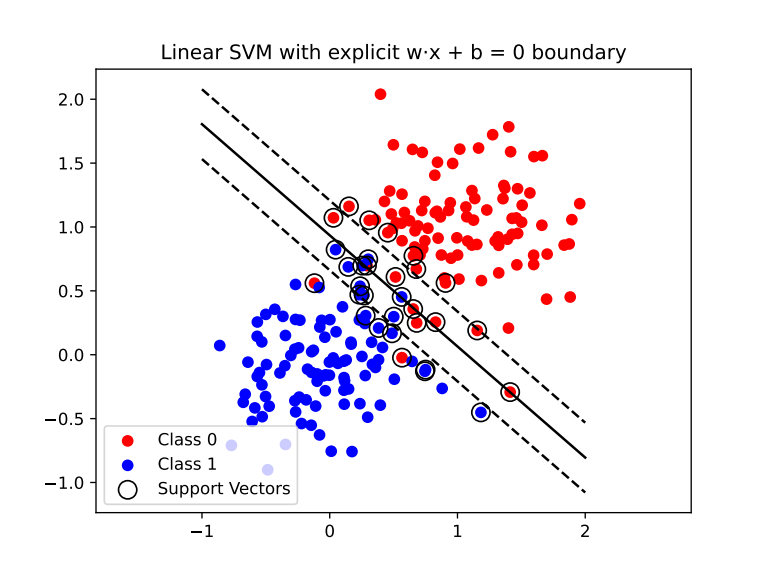
    - **nonlinear version**
        - support vectors: $x_s$ points in the overlapping region
        - data model: linear combination of basis functions (kernels) $$y = \sum_s \alpha_s y_s K(x-x_s,\gamma) + b,$$
        where $\gamma$ denotes paramters of the kernel
        - mostly used fixed width Gaussians (RBF=Radial Basis Function): $K(x,\gamma) = e^{-\gamma x^2}$ $\to$ 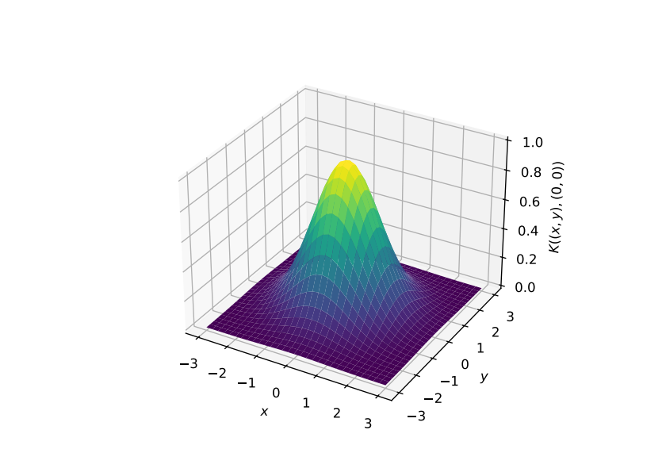
        - linear optimization problem with $(b,\alpha_s)$
        - $\gamma$ is fixed, or treated as meta-parameter
        - 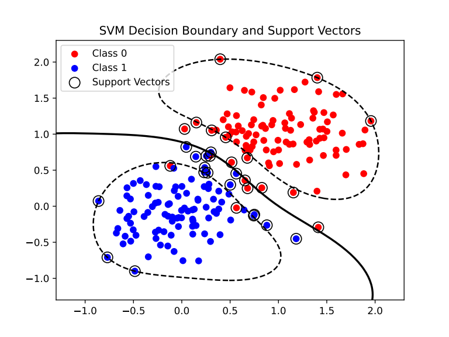
        - 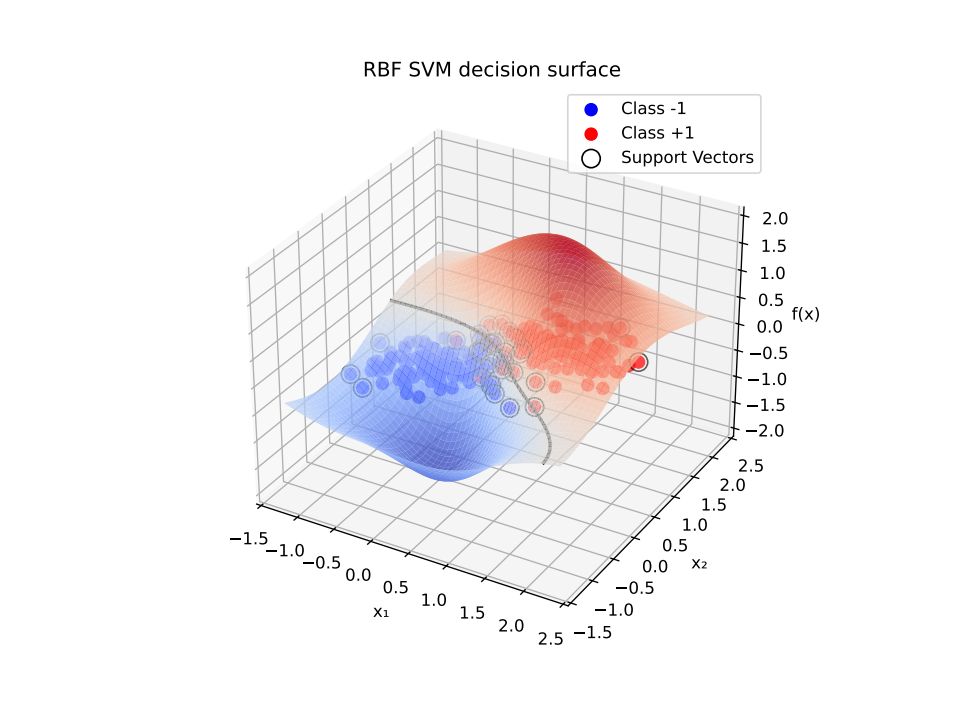

- **Extreme Learning Machine**
    > classification with a data model built from linearly parametrized random basis
    - **alternative name**: ELM
    - **method**: __classification via regression__
    - **data model**
        - $y = \sum_{n=1}^{N_{basis}} \alpha_n \sigma(w_n\cdot x + b_n),$ where $\sigma$ is a nonlinear function
        - $w_n, b_n$ are fixed (random) $\Rightarrow$ random basis
        - $\alpha_n$ are trained by linear regression
        - fitting in a random basis
    - **note**: same as one-hidden layer neural network, but only the last layer's weights are trained 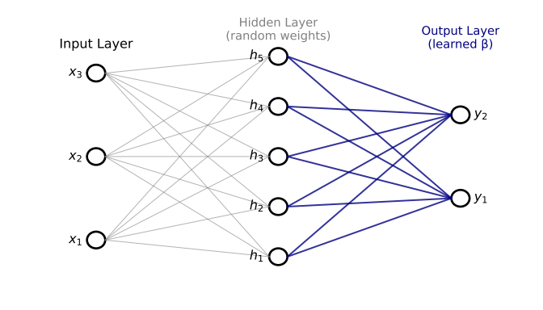

- **Naive Bayes models**
    > assume that the data come from a single Gaussian distribution
    - **assumed distribution**
        - Gaussian $p\sim e^{-\frac12 (x-\mu)^TC^{-1}(x-\mu)}$
        - then $\mathbb E[x] =\mu$ and $\mathbb E[(x-\mu)\otimes(x-\mu)]=C$
        - faithful estimators, assuming independent measurements
            $$\begin{aligned} 
            &\mathbb E[\frac1N \sum_{n=1}^N x_n] = \mu\\
            &\mathbb E[\frac1{N-1}\sum_{n=1}^N x_n\otimes x_n] =C
            \end{aligned}$$

- **Gaussian Mixture Model**
    > assume that the data are coming from a sum of Gaussians
    - **alternative name**: GMM
    - **assumed distribution**
        - $$p(x) \sim \sum_{k=1}^K \pi_k \mathcal N(x; \mu_k, C_k),\qquad \pi_k\in[0,1],\;\sum_{k=1}^K \pi_k=1$$
        - $K$ is the number of clusters, a parameter to be given
    - **parameter estimation**: Expectation-Maximization method
    - **Expectation-Maximization method**
        - start from an initial guess $\pi,\mu,C$
        - the responsibilities $$r_{ik} = \dfrac{\pi_k \mathcal N(x_i;\mu_k, C_k)}{\sum_{k=1}^K \pi_k \mathcal N(x_i;\mu_k, C_k)},$$
        determine the probabilities of belonging to a cluster for each points
        - redefine parameters to be attracted to fit the points belonging to a given cluster the best
        $$\begin{aligned}
        &N_k=\sum_i r_{ik},\;\pi_k = \frac{N_k}N,\\
        &\mu_k = \frac1{N_k}\sum_i x_i r_{ik},\\ 
        & C_k = \frac1{N_k}\sum_i (x_i-\mu_k)\otimes(x_i-\mu_k) r_{ik}
        \end{aligned}$$
        - repeat from 2. until converges

- **PCA**, 
    > assume data come from a single Gaussian distribution, but influenced by noise
    - **full name**: Principal Component Analysis
    - **geometrically an ellipsoid**
        - large width: the real data (dimensional reduction)
        - small width: noise
    - **denoising**: represent the date without noise $\to$ use zero instead of small width
    - **technically** 
        - determine the directions where data vary the most
        - find $w$ where $w\cdot x_n$ has the largest variance
        $$\sum_n (w\cdot (x_n-\mu))^2 = \text{maximal, while } |w^2|=1$$
        - matrix form with $X_{ni}= (x_n)_i$, using Lagrange multiplicator
        $$ w^T X^T X w - \lambda w^T w=\text{maximal}$$
        - solution
        $$ X^T X w = \lambda w $$
        - writing back $$ w^T X^T X w = \lambda w^T w = \lambda,$$ so we need the largest eigenvalues
    - **linear data compression**: store projection to the largest eigenvalues: $$Y_n = v_n^T (x-\mu),$$ where $\dfrac{\lambda_n}{\lambda_{max}}>r$
    - **restore data**: (without noise) $$ x\to \sum_n Y_n v_n + \mu,$$ because the exact representation $x=\sum_n (v_n\otimes v_n^T) (x-\mu) + \mu$