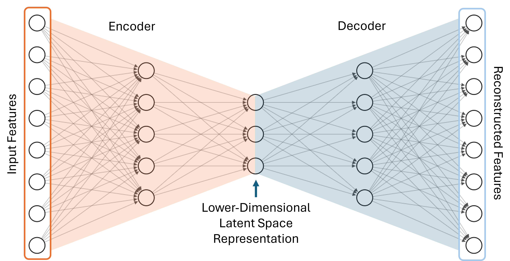
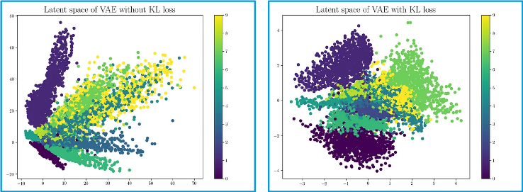
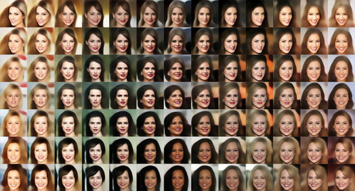
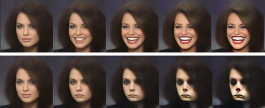

- **Compression**
    > A typical AI task is to compress data belonging to a given class. Aso known as dimensional reduction
    - **crossover from a fine context to a coarser one**
        - take $C$ class, and a fine context $\mathcal C_0=\{ \{c\} \mid c\in C\}$
        - single out a $\mathcal C$ subcontext $\to$ numerically defined by its __feature__s
        - create a coordination of $\mathcal C_0$ in the form $\mathcal C\wedge \mathcal D$
        - $\mathcal D$ are the __descriptive coordinates__

- **descriptive coordinates**
    > these can tell apart elements of a context
    - the context $\mathcal D$ is the descriptive context, its values tell apart the elements of $\mathcal C$
    - **examples**
        - __x=0 hyperplane__
        - __linear data compression__, __PCA__
        - nonlinear compression, __autoencoders__
        - __smile vector__

- **x=0 hyperplane**
    > these coordaintes tell apart the $y$ coordinates
    - $C=\mathbb R^2$
    - $C_{data}=\{x=0\;\text{plane}\}$, $\mathcal C = \{C_{data}, \bar C_{data}\}$
    - $\mathcal D=\bigwedge_Y \{ y=Y \text{plane}\}$
    - coordinates are the $(x=0,Y) \to Y$ values

- **linear data compression**
    > assume data are in an ellipsoid, describe data without noise
    - $C = \mathbb R^N$
    - $C_{data}=$ plane, $\mathcal C = \{C_{data}, \bar C_{data}\}$
    - **task**: find the vectors that span the hyperplane $\to$ __PCA__
    - **compression data**: principal components of __PCA__

- **autoencoders**
    > represent the data with a smaller number of parameters
    - **alternative names**: nonlinear compression, dimensional reduction, AE
    - **task**: represent the data with a smaller subset of parameters
    - **autoencoder logic**
        - use __DNNs__
        - encoder: less and less sites per layer
        - decoder: more and more sites per layer
        - goal: reconstruct the input
        - loss: distance of input and output
    - **variants**:
        - __denoising autoencoders__
        - variational autoencoders, __VAE__
    - image: 

- **denoising autoencoders**
    > learn what is noise and omit it
    - **strategy**
        - for more robust result add noise to the first layer (input) and train to recover the clean input
        - benefit: learns features stable to corruption and small perturbations
        - benefit: acts as regularization, reducing overfitting to exact inputs
    - **loss**
        - reconstruction of clean input from noisy input (often MSE or cross-entropy)
        - optional noise/weight regularization terms (dropout, weight decay)

- **VAE**
    - **alternative name**: variational autoencoders
    - **idea**: instead of mapping an input to a single latent vector, the encoder outputs
      a *distribution* over latent variables
      $$
      q_\phi(z \mid x) = \mathcal N\!\big(z \mid \mu_\phi(x), \operatorname{diag}(\sigma_\phi^2(x))\big)
      $$
    - **benefit**: 
        - smooth, continuous latent space that supports sampling and interpolation
        - **generative model** that can synthesize new data by sampling
      $$
      z \sim p(z), \quad x \sim p_\theta(x \mid z)
      $$

    - **loss function (negative ELBO)**: $$
      \mathcal L(x)
      = \underbrace{\mathbb E_{q_\phi(z \mid x)}\!\left[-\log p_\theta(x \mid z)\right]}_{\text{reconstruction loss}}
      \;+\;
      \underbrace{\mathrm{KL}\!\left(q_\phi(z \mid x)\,\|\,p(z)\right)}_{\text{regularization term}}
      $$

    - **reconstruction term**
        - encourages the decoder to accurately reconstruct the input
        - corresponds to maximum likelihood under the assumed data model
        - typical choices are binary cross-entropy (Bernoulli likelihood) or mean squared error (Gaussian likelihood)

    - **KL divergence term**:
        - measures how far the learned latent distribution deviates from the prior
        - for a standard normal prior $ p(z) = \mathcal N(0, I) $:
          $$
          \mathrm{KL}\big(\mathcal N(\mu,\sigma^2)\,\|\,\mathcal N(0,1)\big)
          = \tfrac12 \sum_i \big(\mu_i^2 + \sigma_i^2 - \log \sigma_i^2 - 1\big)
          $$
        - enforces a well-structured, compact latent space

    - **β-VAE variant**: $$
      \mathcal L_\beta
      = \mathbb E_{q_\phi(z \mid x)}[-\log p_\theta(x \mid z)]
      + \beta\,\mathrm{KL}(q_\phi(z \mid x)\,\|\,p(z))
      $$
        - $ \beta > 1 $: stronger regularization → more disentanglement, lower fidelity
        - $ \beta < 1 $: better reconstruction, weaker latent structure

    - links: [book](https://gaussian37.github.io/deep-learning-chollet-8-4/), [paper](https://www.semanticscholar.org/paper/Generating-Diverse-High-Fidelity-Images-with-Razavi-Oord/6be216d93421bf19c1659e7721241ae73d483baf)

    - **pros**
        - principled probabilistic model; training is usually stable
        - smooth latent space → interpolation, attribute vectors, controllable edits
        - explicit objective connected to likelihood / compression (ELBO)

    - **cons**
        - samples can be “blurry” for images if decoder likelihood is too simple (e.g. Gaussian pixels)
        - KL term may cause **posterior collapse** (decoder ignores $z$, common in text VAEs)
        - strong disentanglement often costs fidelity (esp. $\beta>1$)

    - **example**: 

- **smile vector**
    > in the latent space belonging to the same person we can single out directions corresponding to change of some internal property (e.g. smile)
    - **idea**: a *semantic direction* in a learned representation space that corresponds to the concept “smiling”
    - **typically defined as a difference of latent vectors**: $$
      v_{\text{smile}}
      \;=\;
      \mathbb E[z \mid \text{smile}]
      \;-\;
      \mathbb E[z \mid \text{neutral}]
      $$
      where $ z $ is the latent code (e.g. from an autoencoder or VAE)

    - **interpretation**
        - adding the vector increases the presence of a smile
        - subtracting the vector removes or weakens the smile
        - the vector captures *what changes* when a face starts smiling

    - **manipulation in latent space**: $$
      z_{\text{smiling}}
      \;=\;
      z_{\text{neutral}} + \alpha\, v_{\text{smile}}
      $$
        - $ \alpha > 0 $: stronger smile
        - $ \alpha < 0 $: frown / smile suppression

    - **assumptions**
        - the representation space is approximately linear locally
        - semantic attributes are (partly) disentangled
        - encoder produces consistent representations

    - **typical sources**
        - autoencoders / variational autoencoders
        - GAN latent spaces
        - CLIP-style multimodal embeddings

    - **relation to disentanglement**
        - well-disentangled representations yield cleaner smile vectors
        - entangled features mix smile with pose, lighting, or identity

    - **interpretation as a concept vector**
        - smile vector acts as a *basis direction* for an abstract concept
        - analogous to word embedding analogies:
          $$
          \text{king} - \text{man} + \text{woman} \approx \text{queen}
          $$

    - **failure modes**
        - dataset bias (smiling correlated with age, gender, lighting)
        - nonlinearity of the latent manifold
        - over-regularization collapsing expressive dimensions

