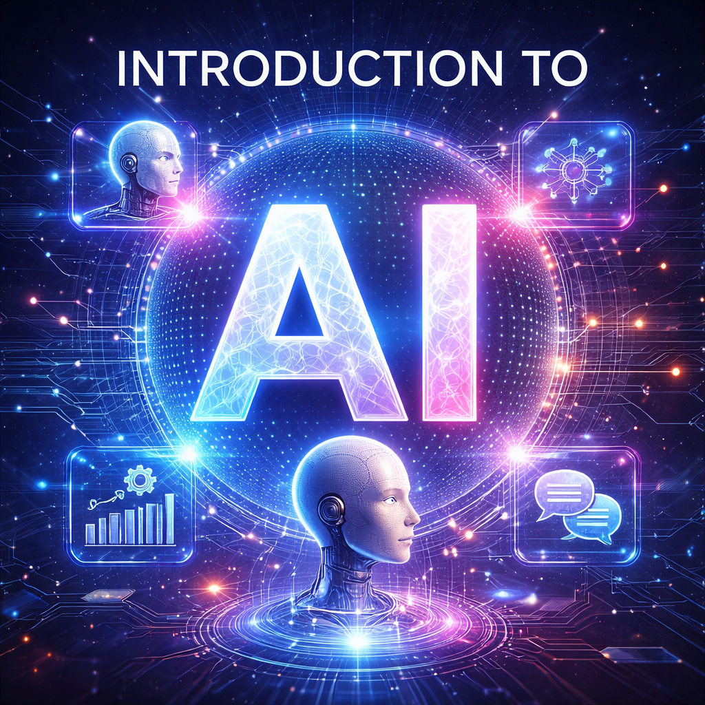

- **Lecture Contents**
    - **Lecture 1**: __Lecture 1__
    - **Lecture 2**: __Lecture 2__
    - **Lecture 3**: __Lecture 3__
    - **Lecture 4**: __Lecture 4__
    - **Technical background**: __Technical background__

- **Lecture 1**
    - **topics**
        - __about the Introduction to AI course__  
        - __learning in the AI era__
        - introduction: __general facts about AI__
        - __social and ethical aspects of artificial intelligence__
        - __a brief history of Artificial Intelligence__

- **Lecture 2**
    - **topics**
        - __changes in problem solving__
        - __human intelligence: a psychological perspective__

- **Lecture 3**
    - **topics**
        - __intelligence and AI__
        - __conceptual foundations__

- **Lecture 4**
    - **topics**
        - __AI learning paradigms__

- **Technical background**
    - **topics**
        - __Probability and information theory basics__

__END__
- [general-AI-facts.md](general-AI-facts.md) 
- [history-of-AI.md](history-of-AI.md) 
- [ethical-issues-and-regulations.md](ethical-issues-and-regulations.md) 
- [risks-and-benefits-of-AI.md](risks-and-benefits-of-AI.md) 
- [worldviews.md](worldviews.md) 
- [intelligence.md](intelligence.md) 
- [contexts.md](contexts.md) 
- [supervised-learning.md](supervised-learning.md) 
- [databases.md](databases.md) 
- [data-driven-approach.md](data-driven-approach.md) 
- [optimization-methods.md](optimization-methods.md) 
- [evaluation.md](evaluation.md) 
- [classification-models.md](classification-models.md) 
- [deep-neural-networks.md](deep-neural-networks.md) 
- [compression.md](compression.md) 
- [finding-features.md](finding-features.md) 
- [time-series.md](time-series.md)
- [natural-language-processing.md](natural-language-processing.md) 
- [attention-and-transformers.md](attention-and-transformers.md) 
- [reasoning.md](reasoning.md) 
- [generative-networks.md](generative-networks.md) 
- [reinforcement-learning.md](reinforcement-learning.md) 
- [RAG-systems.md](RAG-systems.md) 

## Auxiliary material

- [math_tricks.md](math_tricks.md) 
- [math-basics.md](math-basics.md) 
- [probability-information-theory.md](probability-information-theory.md) 

## Other links

[representation.md](representation.md) 

