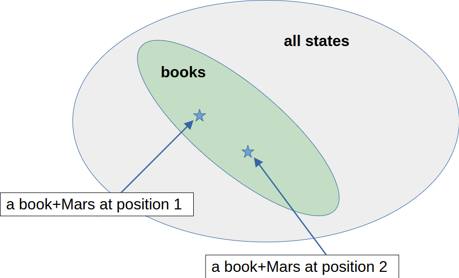
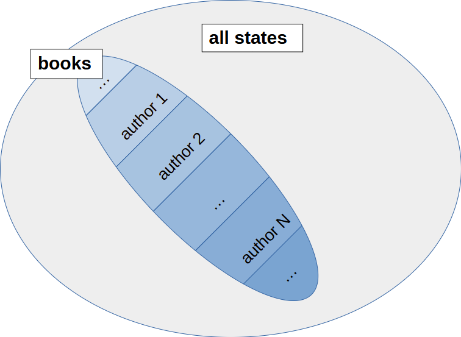

- **Conceptual foundations**
    > This section introduces the basic definitions that serve as the foundational layer for the development of the cognitive algebra. It is difficult to determine where to start the whole descritpion. In human thinking the roots go deep into the unconscious. We adopt a deliberately physical viewpoint, centered on the states of the world and their evolution in time. As will become clear later, this choice is not restrictive: the resulting formalism is sufficiently general to support a wide range of cognitive and representational interpretations.

    - **Universe**: scene of all actions, containing all information

    - **observer** (agent): intelligent agent describing the world
        - can be a living being, a human, AI
        - splits Universe into space (hypersurface) and time

    - **space**: hypersurface of the Universe
        - observer dependent
        - in general relativity: Cauchy surfaces, positive definite spatial metric tensor

    - **time**: the label of the space instances
        - arrow of time: goes ahaed
        - observer dependent
        - time is an additive label of the spatial hypersurface: for the times between spacial instances $a$, $b$ and $c$ we have $$t_{ab}+t_{bc}=t_{ac}$$

    - **states**: the possible configurations of the Universe on a spacial instance
        - contains all information to be able to predict the future
        - can be the complete world's state in a hyper (Cauchy) surface
        - a theoretical construct assuming that the future is deterministic if we fully fix a state
        - all decision of an agent in the world must depend on the states of the world

    - **observed world**: full description is not possible/necessary
        - a single observer has finite observation capabilities
        - can not process the information
        - many details don't play role for the agent' purpose (maintain life, or other goals)
        - example: to describe the fate of a book, the position of Mars is irrelevant
        - a collection of states, differing in irrelevant details, are the real object that matter for an observer
    
    - **representation**: 
        - __(object) class__
        - __context__

- **(object) class**
    - **definition**: $C \subset \Omega$
    - **interpretation**
        - collects states differing only in irrelevant details
        - corresponds to a concept (e.g. pen, red color, living being)
    - **examples**
        - a book is collection of states where for example Mars has different position, and the exact matter content of the book itself is different: 
        - computer images
        - images where a given pixel is red
        - all living beings in the animal kingdom
    - we can speak about **subclasses**, **nested classes**, etc. just like in case of sets

- **context**
    - partition of the underlying class: ${\cal C} = {\cal P}(C)$
    - elements are called **classes of the context** or **cells of the context**
    - **examples**
        - dog breeds in the class of dogs
        - a bookshop owner, a reader, a book collector and a mover uses different contexts of the class of books.
        - people groupped by their living place
    - **Contexts instead of states**
        - The states of the world is an abstraction, an assumption that the time evolution can be ultimately completely casual. However, all systems we get in connection are just contexts, whose elements are sets of states.
        - no ultimate description of the world! but any refinement is possible
        - From now on we will forget about the states of the world, and we speak exclusively about contexts. 
        - There is usually a fine context that serves as a basis of different subcontexts.
        - For example to the set of images we can define a fine partition where two images are in different class if at least one pixel is different.
    - **We can define a bunch of functions operating on the context**
        - __definitions in a context__
        - corasening of a context: __subcontext__
        - __refinement of a context__
    - **Characterization of contexts**
        - __characterization of contexts__

- **definitions in a context**

    - **underlying class**: $\mathcal C\mapsto C$

    - **class (cell) of the context** : $c\in \mathcal C$

    - **projector onto a context**: $\Pi_{\mathcal C}: \omega \mapsto c\in \mathcal C$ where $\omega\in c$ or $\Pi_\mathcal{C}(\omega)=\emptyset$

- **subcontext**
    > a coarser resolution of the world
    - $\mathcal C'\preceq \mathcal C$ if $\forall c\in\mathcal C \exists c'\in C': c\subset c'$
    - partial ordering
    - **examples**
        - instead of detailed apple varieties (Gala, Jonathan, etc.) we refer them as apple
        - from individual images we collect the cat images
        - mammals, birds, reptiles, amphibians and fish are called vertebrate

- **refinement of a context**
    > provides a finer (more detailed) description of the world.
    - **examples**
        - instead of "dogs" we specify the breed
        - basic colors and shades and hues of blue
    - **local refinement**:
        - refining of an element of a context
        - definition $(\mathcal C, \mathcal C') \mapsto \text{true}$
        iff $\exists c \in \mathcal C:\;\mathcal C'$ is a partition of $c$
    - **global refinement**
        - a context where one of the context of the parent is refined locally
        - definition $\mathcal C^+ = (\mathcal C\setminus \{c\}) \cup \mathcal C'$, where $\mathcal C'$ is a local refinement of $c$
        - note: $\mathcal C \preceq C^+$
    - **common refinement**
        - all classes of the domain contexts are union of the elements of the common refinement context
        - definition: $\mathcal C_1\vee \mathcal C_2 = \{ c_1 \cap c_2 \mid c_1 \in \mathcal C_1,\; c_2 \in \mathcal C_2,\; c_1 \cap c_2 \neq \emptyset \}$
        - note: several coarse contexts can lead to a fine description of the world (coordination)

- **Characterization of contexts**
    - **approaches**
        - __direct representation__
        - __global coordinates__
        - __local coordinates__
    - **numerical representation**
        - __property__ (or measurement, observation)
        - __feature__ (selective property)
        - __irrelevant feature__ (descriptive property)

- **direct representation**: 
    > all relevant, independent object classes are collected to a common context
    - alternative name: **System-1** representation, or one-hot-encoding
    - the class can result in an action in case of a living being
    - **properties**
        - __advantages of the direct representation__
        - __disadvantages of the direct representation__
        - __usage scope__

- **advantages of the direct representation**
    - **natural**: this is the most natural approach for a living being
    - **fast, cheap**: it requires a single, albeit complicated context evaluation
    - **parallelizable**:  because of the small effort for the evaluation, different System-1 applications can run parallel in the same time (e.g. walking and chewing gum).
    - **accurate**: the context can be refined for the actual task

- **disadvantages of the direct representation**
    - **storage efficiency**: all cells are named one-by-one (c.f. one-hot encoding)
    - **analyticity**: in numerical implementation all concepts are results of analytic calculation. This requires that the probability of performing a possible action is approximately the same (balanced classes). For example, this approach is not useful for tell apart cat images and non-cat images, because non cat images form a vastly larger set. In such a space, distinguishing one element from all others by direct enumeration is combinatorially prohibitive.
    - **specific**: these concepts are very special, and so the the generalizability is very tedious. For example the concept that separates dog and cat images can not be used for other purposes. For a different task a different specific concept has to be created (catastrophic forgetting). For the same reason, System-1 concepts are hard to train, we need a lot of sepcific examples to do that.
    - **fragile**: if we forget the concept, there is no way to recreate is from other knowledge. We have to restart the creation of it, and we can just hope that we arrive to the same good result. Professional athletes can have the experience that suddenly they "forget" how to do the given sport effectively.

- **usage scope**:
    - **frequently used tasks**: if a task is very important, then we can set up a context exclusively for doing it
    - **limited number of classes**: it cannot be used to tell apart an astronomical number of classes
    - **balanced classes**: the classes must be comparable in size
    - **main stream applications in AI**: present day AI applications set up a single context to represent the classes.

- **global coordinates**
    > the elementary object classes are approached by the intersection of cells of several coarse contexts
    - **coordination**
        - $(\mathcal C_1,\dots,\mathcal C_n) \blacktriangleright \mathcal C$, iff $\mathcal C_1\vee \dots \vee \mathcal C_n = \mathcal C$
        - the contexts $\mathcal C_i$ are coarse views whose joint distinctions fully characterize $\mathcal C$
    - **examples**
        - coordination of a vector space: $\mathcal C = V$, the $\mathcal C_i = \{ c^{(i)}_s \mid s \in \mathbb R\}$ where $c^{(i)}_s = \{ x\in \mathbb{R}^d \mid e_i\cdot x = s\}$ are collections of hyperplanes with fixed orientation
        - pixelize images: $\mathcal C=$ images, $\mathcal C_i = \{$ images with $i$-th pixel fixed $\}$
        - token embeddings in LLMs:
          $\mathcal C =$ partition of embedding space by semantic equivalence, $\mathcal C_i =$ partitions induced by coordinate projections (or low-dimensional feature functions), with similarity measured by cosine distance

- **local coordinates**
    >  the domains of the characterizing contexts is not the complete basic object class
    - **hierarchical approach**
        - start with a simple coarsening
        - apply local refinement (c.f. __refinement of a context__)
        - repeating this process yields a hierarchical structure, called a __refinement tree__, whose leaves are exactly the classes of the fine context.
    - **properties**
        - a refinement tree represents a context by **successive, conditional partitions**
        - can lead to __optimal coding__
    - **examples**
        - barchoba (twenty questions)
        - taxonomy
        - this is the way we represent the world in our mental models

- **refinement tree**
    > hierarchical structure for represent elements of a set
    - **definition**:
        - a mapping $\mathcal C \mapsto \mathcal T$,  where $\mathcal T$ is a rooted tree whose nodes are labeled by subsets of $\mathcal C$, satisfying conditions
    - **conditions**
        - the root is labeled by the full context $\mathcal C$
        - for each internal node labeled by $C' \subseteq \mathcal C$, its children form a context (partition) of $C'$
        - the leaves (nodes with no children) are singleton sets $\{c\}$ with $c \in \mathcal C$
    - **notes**
        - every refinement tree induces a unique fine context (its leaves)
        - different refinement trees may induce the same context
        - generic coordination is a special case, where all local refinements are identical at every node
        - System 1 corresponds to a refinement tree of depth 1
        - local coordinates correspond to paths from the root to a leaf

    - **examples**
        - using *display size* to refine the class of displays and *fat content* to refine the class of foods, even though these refinements are not meaningful outside their respective domains

    - **prefix code**: path from the root to a leaf uniquely identifies an element by a sequence of refinement choices.

- **optimal coding**
    > assign a code to each element of a set that allows to get to them with a shortest line of questions
    - **theoretical result**: if the relevance (or probability of occurrence) of the elements is known, one can construct an optimal refinement tree that minimizes the expected path length, in direct analogy with __Huffmann coding__

- **property**
    > a numerical value assigned to an element of a set
    - **definition**: $\Omega \to B$ function
    - **alternative names**: measurement, observation
    - **probability theory**: random variable
    - **examples**
        - measuring temperature with a thermometer
        - recording the color of a pixel with a camera

- **feature**
    > a numerical value assigned to a class
    - **definition**
        - $(f:\Omega\to B, \mathcal C) \mapsto\text{true}$, if $f(\omega)=f(\omega')$ if $\omega,\omega'\in c\in \mathcal C$
    - **measure theory**: $f$ is measurable with respect to $(\Omega,\sigma({\cal C)})$
    - **properties**
        - domain of $f$ is the underlying class of $\mathcal C$
        - function defined on the elements of a context
        - range can be a finite set or real numbers
    - **alternative names**
        - random variable in the context
        - relevant property (with respect to a class)
        - selective property (of a class)
    - **examples**
        - features of a cat: furry, four legged, cat-eye animal, etc.
        - features of a laptop: producer, vendor, type of CPU, type of GPU, display size, etc

- **induced context**
    > a context defined by given vallues of a function (feature)
    - **definition**: $f\mapsto \mathcal \{ f^{-1}(\{y\}) \mid y \in \operatorname{Ran}(f) \}$

- **irrelevant feature**
    > a feature that is relevant for the underlying context, but not relevant for the present one
    - **example**
        - color is not a relevant feature of a car brand
        - identity of the expermineter is not relevant with respect of the outcome of the experiemnt
        - position of Mars with respect to the outcome of a computer game   
    - **alternative name**: descriptive function
