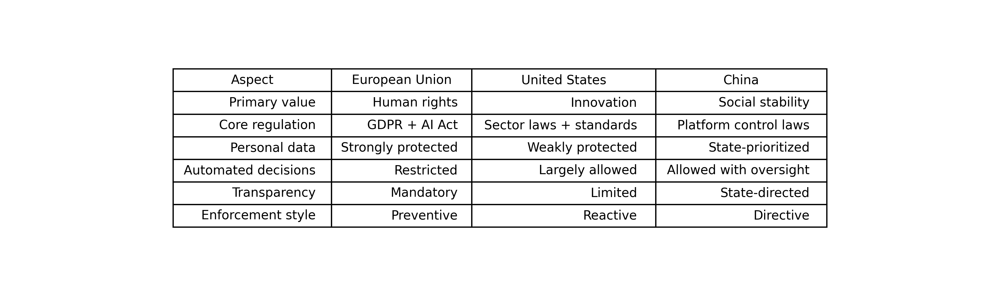

- **Ethical issues and AI regulations**
  - **regulation areas**
    - regulate AI systems (risk-based rules)
    - regulate sectors (health, finance)
    - instead binding laws jurisdictions may emphasize platform responsibilities, or publish guidelines/standards
  - **approaches**
    - The EU, US, and China are not just choosing different laws — they are choosing different values 
    - Europe: How do we protect individual rights?
    - United States: How do we enable innovation and competition?
    - China: How do we maintain social stability and state control?
    - __What this means for AI developers__
  - **European Union: GDPR**
    - value: How do we protect individual rights?
    - General Data Protection Regulation (GDPR) since 2018, applies to any processing of personal data, including AI systems.
    - __Core GDPR principles__: strongly constrain AI systems in practice (e.g. medical research)
    - __EU AI Act__ complements GDPR by regulating AI systems themselves
  - **United States**
    - The US prioritizes innovation, competition, and market leadership
    - Regulate outcomes and risks — not the technology itself.
    - __US AI regulation principles__
  - **China**
    - China treats AI as a strategic infrastructure that must support social stability, state goals, and public order.
    - __Chinese AI regulation principles__

- **Core GDPR principles**
  - Personal data belongs to the individual
  - A lawful basis is required for processing
  - Data may only be used for specific purposes
  - Data collection must be minimized
  - Transparency is mandatory
  - Automated decision-making is limited
  - Individuals have correction and deletion rights
  - Organizations must prove compliance

- **The EU AI Act**
  - Key ideas:
    - AI systems are classified by **risk**
    - Some uses are **prohibited**
  - High-risk systems require:
    - documentation
    - testing
    - human oversight
    - accountability

- **US AI regulation principles**
  - No single, comprehensive AI law
  - **Regulation happens through**
    - sector-specific laws (health, finance, education)
    - standards and guidelines (e.g. NIST)
    - executive orders
  - **Strong reliance on**
    - self-regulation
    - voluntary frameworks
    - post-hoc enforcement: authorities intervene only after harm has occurred,
  rather than requiring approval or control beforehand.
  - **Implications for AI**
    - Training data is less restricted
    - Automated decision-making is more common
    - Transparency requirements are weaker
    - Companies have more freedom — and more responsibility
  - **Trade-off**
    - Faster innovation
    - Higher risk of bias, opaque systems, uneven protection of individuals

- **Chinese AI regulation principles**

  - Strong regulation of public-facing AI services
  - Data use is regulated differently for citizens and state actors
  - Rapid deployment is possible if aligned with policy goals

  - **Mandatory compliance with**
    - content controls
    - security assessments
    - platform responsibilities
  - **Generative AI systems must**
    - align with “core socialist values”
    - prevent harmful or destabilizing outputs
  - **Close cooperation between**
    - government
    - platform providers
  - **Individual privacy is secondary to**
    - state security
    - social control

- **What this means for AI developers**

  - **In the EU**
    - Legal compliance must be designed from the start
    - Data governance is as important as model performance

  - **In the US**
    - Speed and scale are rewarded
    - Legal risks often appear after deployment

  - **In China**
    - Alignment with regulation is mandatory
    - Technical excellence alone is insufficient

__END__

---

## 2) Regulations and governance by country/region (selected highlights)

### European Union (EU) — **EU AI Act (binding, risk-based)**
- The EU AI Act **entered into force on 1 Aug 2024** and becomes **fully applicable on 2 Aug 2026**, with staged obligations:
  - **Prohibited AI practices** + **AI literacy** obligations apply from **2 Feb 2025**
  - **General-purpose AI (GPAI) model obligations** apply from **2 Aug 2025**
  - Some **high-risk rules for regulated products** have transition until **2 Aug 2027**  
  Source: EU “Shaping Europe’s digital future” AI Act timeline. https://digital-strategy.ec.europa.eu/en/policies/regulatory-framework-ai 
- The legal text is **Regulation (EU) 2024/1689** (Official Journal / EUR-Lex). https://eur-lex.europa.eu/eli/reg/2024/1689/oj/eng 
- Ethical framing often referenced in EU policy: **“Trustworthy AI”** requirements (human agency/oversight, technical robustness, privacy, transparency, fairness, etc.). https://digital-strategy.ec.europa.eu/en/library/ethics-guidelines-trustworthy-ai 

---

### United States (US) — **Executive Order + sectoral / state approach**
- A major federal driver in 2024 was **Executive Order 14110** (“Safe, Secure, and Trustworthy Development and Use of AI”, issued 30 Oct 2023; published in the Federal Register).  
  https://www.federalregister.gov/documents/2023/11/01/2023-24283/safe-secure-and-trustworthy-development-and-use-of-artificial-intelligence 
- The **NIST AI Risk Management Framework** and its **Generative AI profile** were positioned as key implementation tools for risk management and safety evaluation.  
  https://nvlpubs.nist.gov/nistpubs/ai/NIST.AI.600-1.pdf 
- A helpful neutral summary of EO 14110’s thrust (federal coordination, standards, reporting/safety focus) is in the US Congressional Research Service brief.  
  https://www.congress.gov/crs-product/R47843 

---

### United Kingdom (UK) — **“pro-innovation” regulator-led framework + safety summits**
- The UK emphasizes a **pro-innovation approach**: using existing regulators and guidance rather than a single AI law (as of 2024).  
  https://assets.publishing.service.gov.uk/media/65c1e399c43191000d1a45f4/a-pro-innovation-approach-to-ai-regulation-amended-governement-response-web-ready.pdf 
- The UK hosted the **AI Safety Summit** (Bletchley Park), producing the **Bletchley Declaration** (updated Feb 2025), focusing on shared understanding of frontier risks and international cooperation.  
  https://www.gov.uk/government/publications/ai-safety-summit-2023-the-bletchley-declaration/the-bletchley-declaration-by-countries-attending-the-ai-safety-summit-1-2-november-2023 

---

### China (PRC) — **Generative AI services regulation + security/filing regime**
- China issued the **Interim Measures for the Management of Generative AI Services** (effective 2023), applying to public-facing generative AI services (text/images/audio/video, etc.).  
  https://www.chinalawtranslate.com/en/generative-ai-interim/ 
- Summaries and comparisons note requirements around governance, content obligations, and oversight mechanisms (e.g., platform responsibilities and compliance expectations).  
  https://fpf.org/blog/chinas-interim-measures-for-the-management-of-generative-ai-services-a-comparison-between-the-final-and-draft-versions-of-the-text/ 

---

### Canada — **AIDA (proposed, tied to Bill C-27)**
- Canada’s **Artificial Intelligence and Data Act (AIDA)** is part of **Bill C-27** (Digital Charter Implementation Act, 2022), aiming to regulate “high-impact” AI systems and business accountability (status has evolved via the legislative process).  
  https://www.parl.ca/legisinfo/en/bill/44-1/c-27 
- Government background/companion material explains intended scope and timelines (proposal-level guidance).  
  https://ised-isde.canada.ca/site/innovation-better-canada/en/artificial-intelligence-and-data-act-aida-companion-document 

---

### Japan — **Guidelines + Hiroshima AI Process**
- Japan published **AI Guidelines for Business** (Dec 2024, METI), presenting unified guiding principles for AI governance in business use.  
  https://www.meti.go.jp/shingikai/mono_info_service/ai_shakai_jisso/pdf/20241226_1.pdf 
- Japan also drove the **Hiroshima AI Process** (G7) focusing on principles such as transparency, privacy, misuse prevention, and international coordination (policy process framing).  
  https://grjapan.com/sites/default/files/content/articles/files/20241115%20GR%20Japan%20Industry%20Insight%20AI%20in%20Japan_5.pdf 

---

### Singapore — **Model governance frameworks (practical, widely cited)**
- Singapore’s **Model AI Governance Framework for Generative AI** (2024) provides best practices for responsible GenAI development/deployment (testing, safety evaluation practices, governance processes, etc.).  
  https://aiverifyfoundation.sg/wp-content/uploads/2024/06/Model-AI-Governance-Framework-for-Generative-AI-19-June-2024.pdf 
- Official IMDA communications describe its intent and how it updates earlier governance approaches for GenAI.  
  https://www.imda.gov.sg/resources/press-releases-factsheets-and-speeches/press-releases/2024/public-consult-model-ai-governance-framework-genai 

---

### Australia — **Voluntary AI Safety Standard (10 guardrails)**
- Australia released a **Voluntary AI Safety Standard** (Sept 2024) with **10 AI guardrails** to guide safe and responsible AI across development and deployment.  
  https://www.industry.gov.au/publications/voluntary-ai-safety-standard 
- The detailed guardrails are listed here:  
  https://www.industry.gov.au/publications/voluntary-ai-safety-standard/10-guardrails 

---

### India — **Platform/intermediary advisories + synthetic media focus**
- India’s Ministry of Electronics and Information Technology (MeitY) issued advisories (2024) addressing responsibilities for intermediaries/platforms around AI/LLMs/GenAI usage and compliance expectations.  
  (PDF) https://regmedia.co.uk/2024/03/04/meity_ai_advisory_1_march.pdf 

---

### Brazil — **AI bill progressing (Senate-approved; further steps pending)**
- Brazil’s Senate approved **Bill 2338/2023** in **Dec 2024**; subsequent steps require action in the Chamber of Deputies before becoming law (status subject to change).  
  https://www.whitecase.com/insight-our-thinking/ai-watch-global-regulatory-tracker-brazil 
- Additional Senate-passage reporting/trackers:  
  https://digitalpolicyalert.org/event/25132-passed-bill-no-2338-of-2023-regulating-the-use-of-artificial-intelligence-including-data-protection-measures 

---

## 3) International “baseline” ethics standards (useful for lectures)

- **OECD AI Principles (2019; updated 2024):** first intergovernmental AI standard; promotes trustworthy AI aligned with human rights and democratic values.  
  https://www.oecd.org/en/topics/sub-issues/ai-principles.html 
- **UNESCO Recommendation on the Ethics of AI (adopted 2021; widely referenced):** human rights + dignity, transparency, fairness, human oversight; applies across UNESCO member states.  
  https://www.unesco.org/en/artificial-intelligence/recommendation-ethics 

---

## 4) “One-slide” takeaway

- **EU:** binding, risk-based AI Act with phased compliance (2025–2027 milestones).
- **US/UK:** more **standards + regulator/sector** approach (as of 2024), plus safety initiatives.
- **China:** specific GenAI services measures + security/oversight expectations.
- **Japan/Singapore/Australia:** strong emphasis on **guidelines/guardrails** and practical governance frameworks.
- **Canada/Brazil:** legislation has been in motion; check latest parliamentary status when teaching.
