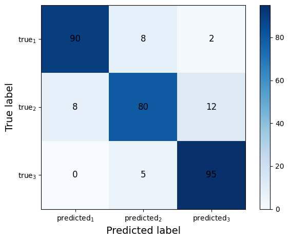
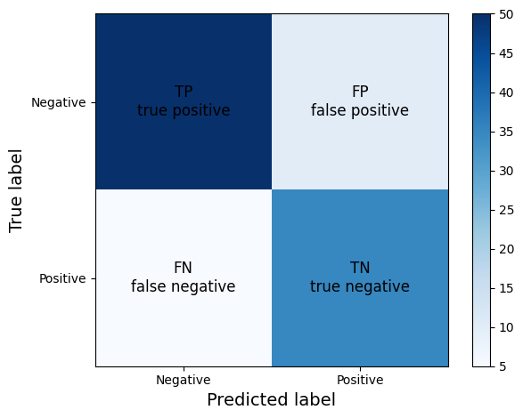
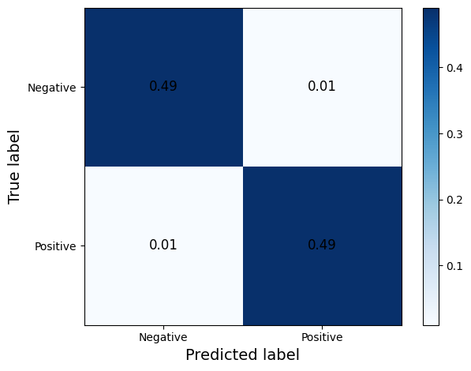
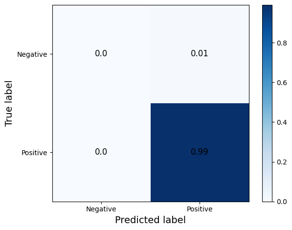
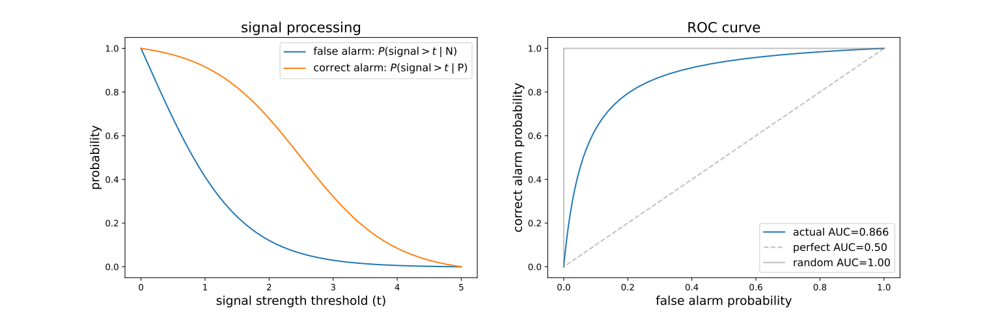

- **Evaluation of results of a classification**
    > give a numerical mean to assess the success of the prediction
    - not unique, depends on the problem
    - **examples**
        - percentage of correctly classified images is a good measure of classification accuracy for balanced datasets
        - if 0.1% of data are in class B, the prediction that all data in class A is 99.9% accurate!
    - **approaches**
        - __baseline model__
        - __confusion matrix__
        - __2-class performance metrics__
        - __ROC curve__

- **baseline model**
    > a model that should be improved
    - **use the simplest approach for prediction**
        - predict always class A
        - predict randomly (accuracy is $1/N$)
        - in time series predict the previous element
        - use simple heuristics
    - **human experts' result**: if available, use the human baseline, too.

- **confusion matrix**
    > measure how well the true labels are guessed correctly
    - **contruction**: tabulate predicted class vs. actual class results
    - **as probability**
        - $C_{ij} = P(\text{predicted}_i, \text{actual}_i)$ or $C_{ij} = P(\text{predicted}_i | \text{actual}_i)$
        - 
- **2-class performance metrics**
    - in case of 2 classes (positive/negative) the confusion matrix is 
    - **constraints**: $$\begin{aligned}&\text{true P, N} + \text{false P, N} = \text{prediced P, N}\\
    &\text{true, false P} + \text{false, true N} = \text{actual P, N}\\
    &\text{actual, predicted P} + \text{actual, predicted N} =\text{all measured} \end{aligned}$$
    - **measures**
        - accuracy: $P(\text{correct class}) = \dfrac{\text{true P}+\text{true N}}{\text{all measured}}$
        - precision: $P(\text{true P}\mid \text{predicted P}) = \dfrac{\text{true P}}{\text{predicted P}}$
        - recall (true alarm probability): $P(\text{true P} \mid \text{actual P}) = \dfrac{\text{true P}}{\text{actual P}}$
        - type-I error (false alarm probability): $P(\text{false P} \mid \text{actual N}) = \dfrac{\text{false P}}{\text{actual N}}$
        - type-II error (unobserved signal): $P(\text{false N} \mid \text{actual P}) = \dfrac{\text{false N}}{\text{actual P}}$
    - **example**: balanced datasets, 
        $$\begin{aligned}
            & \text{accuracy} = \text{precision} = \text{recall} = 98\%\\
            & \text{type-I} = \text{type-II} = 2\%\\
        \end{aligned}$$

    - **example**: inbalanced classes, classify everything to class A; confusion matrix. Problem can be seen only on type-I error! 
        $$\begin{aligned}
            & \text{accuracy} = \text{precision} = 99\%, \;\text{recall} = 100\%\\
            & \text{type-I} = 100\% (!),\; \text{type-II} = 0\%\\
        \end{aligned}$$

- **ROC curve**
    - ROC = receiver operating characteristics
    - AUC = Area under curve
    - the decicion often depends on a parameter, e.g. signal threshold
    - **construction**
        - plot (x,y) where x=recall (true alarm rate) and y=type-I (false alarm rate)
        - very low threshold: all signals are classified positive: false positive=1.0 , recall=1.0
        - very restrictive threshold: all signals are classified negative: false positive=0.0, recall=0.0
        - ROC curve connects (0,0) to (1,1)
    - **for random choice**: x=y: ROC curve is diagonal, AUC=0.5
    - **property**: in a sensible method an alarm true positive rate > false negative rate, ROC is above diagonal, AUC>0.5
    - AUC >0.8 is "good", AUC>0.9 is "very good"
    - **example**: 

