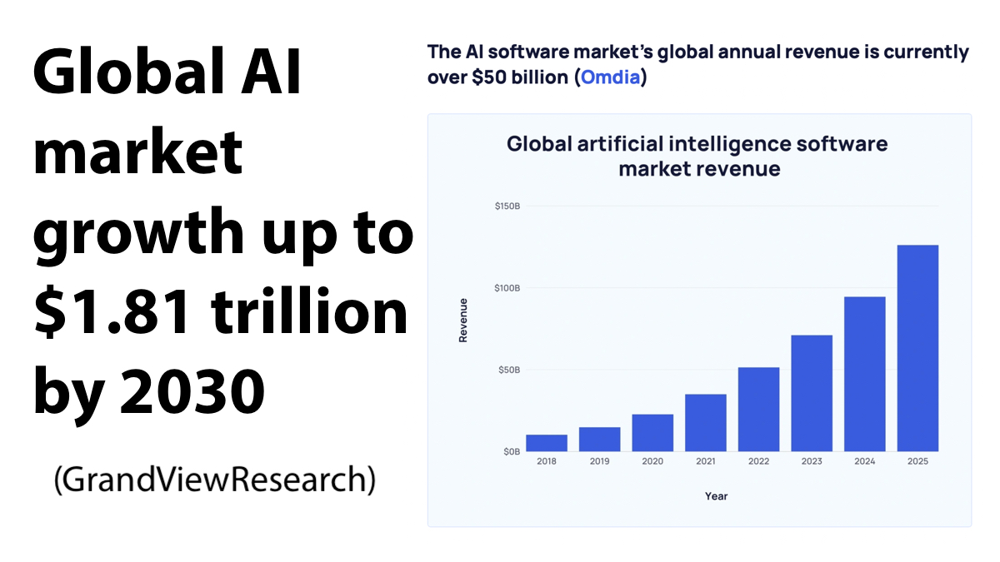
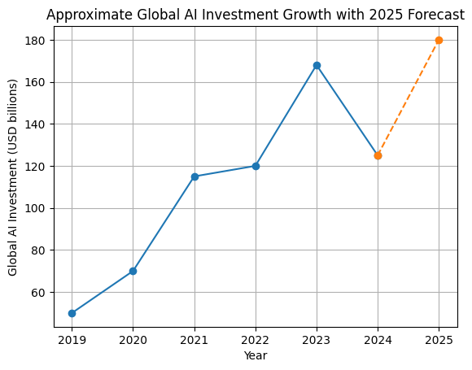
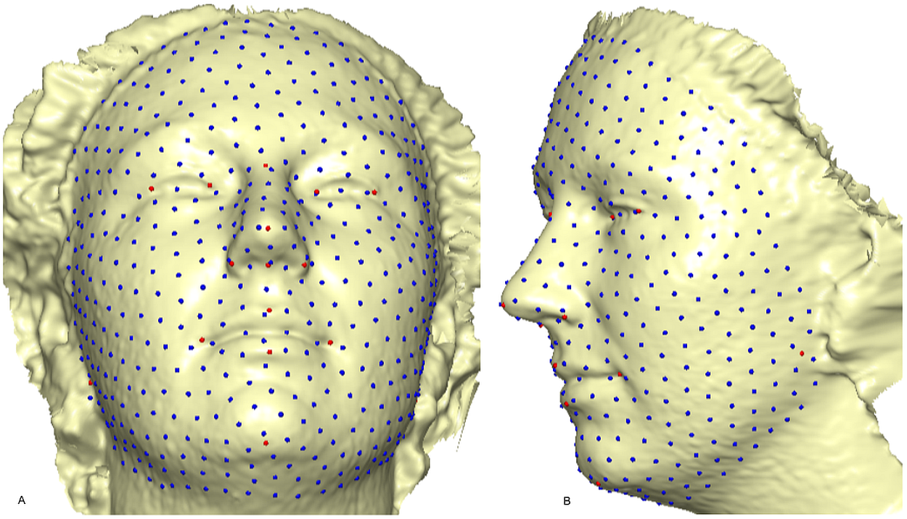
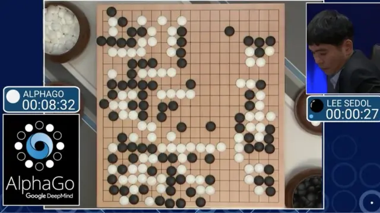
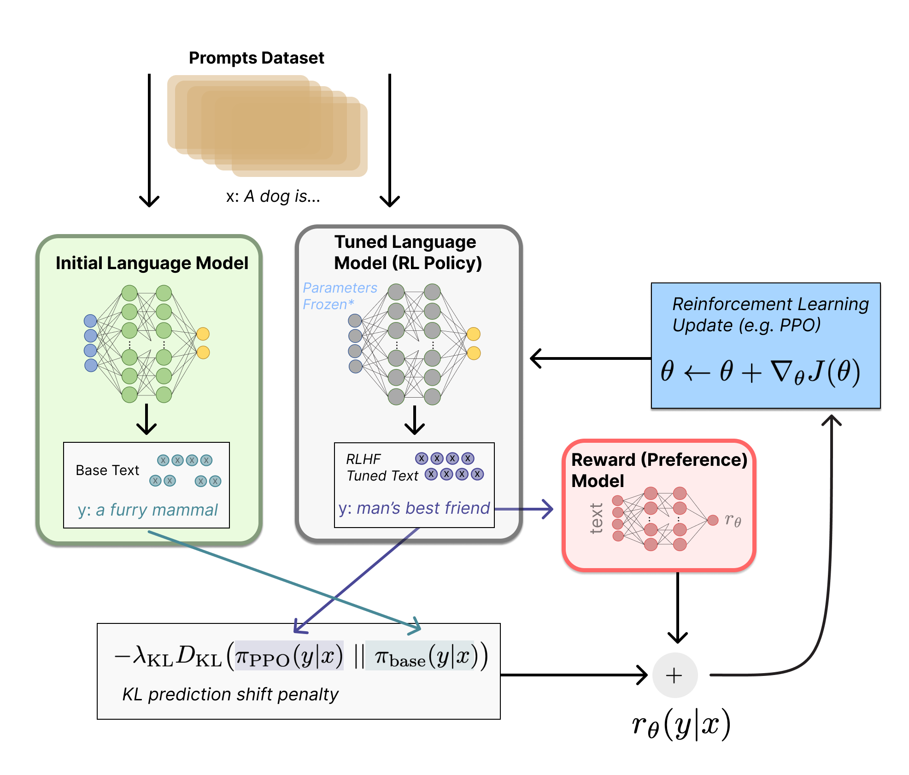
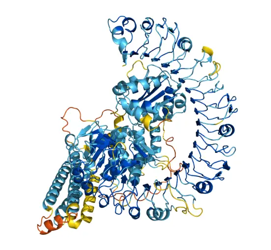
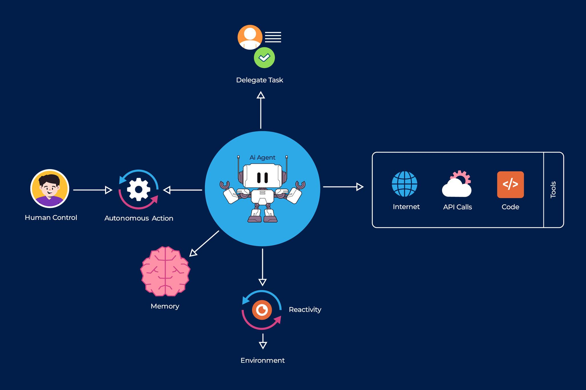
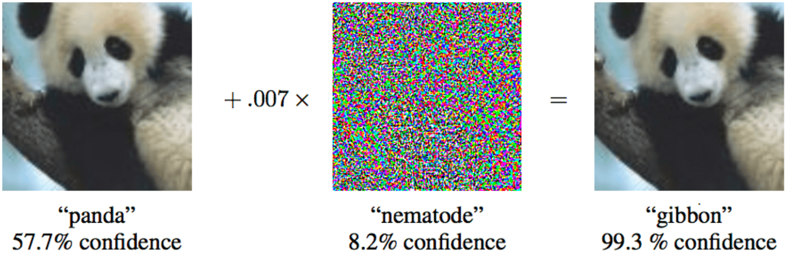
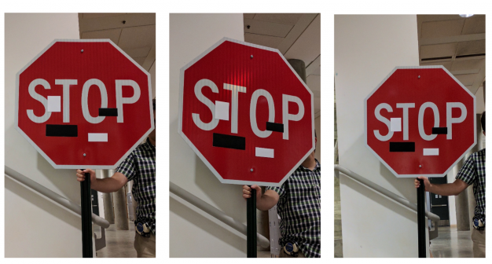
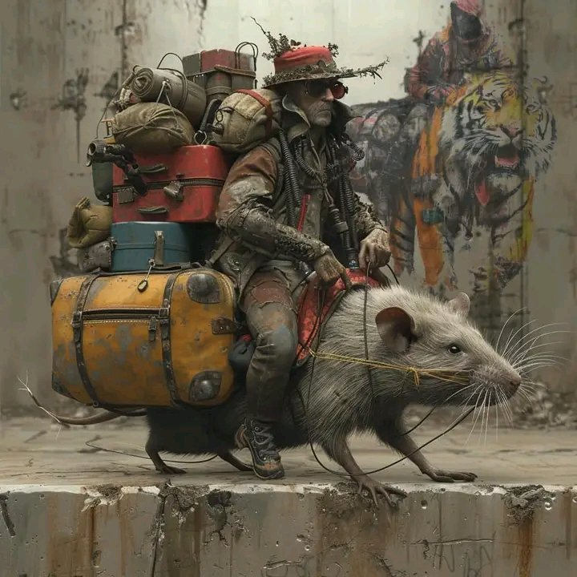

- **General facts about AI**
    > AI has played a crucial role for about 10 years.
    - **Market share and revenue**
        - link: [market statistics](https://blog.biocomm.ai/2024/01/03/ai-market-statistics-jan-2024/)
        - 
        - 
    - **Milestones**
        - __AI milestones__
    - **Challenges**
        - __AI challenges__
    - **Applications**
        - __Most popular AI chatbots__
        - __AI image generators__
        - __AI code helper applications__

- **AI milestones**
    > selected landmark developments
    - **Deep Blue (IBM)**
        - chess bot
        - 1997: beats the actual world champion (G. Kasparov)
    - **DeepFace (Meta)**
        - face recognition, CNN
        - achieved 97%+ accuracy on LFW ([Labeled Faces in the Wild](https://www.kaggle.com/datasets/jessicali9530/lfw-dataset)) benchmark in 2014, (80-90% was before) 
        - image recognition, ResNet 2015
    - **AlphaGo (DeepMind-Google)**
        - go program
        - Beat Lee Sedol in 2016 
    - **LLMs, large language models**
        - NLP
        - transformer 2017
        - GPT models 2017-2022 
        - chatGPT 2022, added reinforcement learning and human feedback
    - **AlphaFold**
        - protein structure prediction 
    - **image generation models**
        - 2021: DALL-E
        - 2023: Stable Diffusion
        - generative revolution
    - **multimodal systems and agentic coding**
        - 2024-2025: GPT-4 class multimodal systems 
        - RAG (retrieval-augmented generation) systems

- **AI challenges**
    > Today, AI applications face serious challenges.
    - What does it mean to be intelligent?
    - No explicit “I do not know” category.
    - **Failures**
        - Unpredictable failures  
        - Hallucinations  
        - Vulnerability to adversarial attacks  

- **🗣️ Most Popular AI Chatbots & Where to Find Them**

    - **ChatGPT (OpenAI)**
        - A widely used conversational AI with support for text, tasks, and plugins
        [https://chat.openai.com/](https://chat.openai.com/)

    - **Google Gemini (Chat by Google)**
        - Google’s advanced chatbot with deep search and reasoning capabilities
        [https://gemini.google/](https://gemini.google/)

    - **Bard (Google AI)**
        - Google’s experimental conversational AI platform
        [https://bard.google.com/](https://bard.google.com/)

    - **Microsoft Copilot (AI in Bing)**
        - AI assistant integrated into Bing search and Microsoft products
        [https://www.bing.com/chat](https://www.bing.com/chat)

    - **Anthropic Claude**
        - Conversational AI with a focus on safety and controlled responses
        [https://www.anthropic.com/claude](https://www.anthropic.com/claude)

    - **Perplexity AI**
        - Research-oriented AI assistant that cites sources and summarizes info
        [https://www.perplexity.ai/](https://www.perplexity.ai/)

    - **Jasper Chat**
        - AI chatbot built into the Jasper writing platform (creative/copywriting)
        [https://www.jasper.ai/chat](https://www.jasper.ai/chat)

    - **YouChat**
        - AI assistant integrated into You.com search
        [https://you.com/chat](https://you.com/chat)

    - **Replika**
        - Conversational companion AI focused on emotional interaction
        [https://replika.com/](https://replika.com/)

    - **Character.ai**
        - Chatbot platform where users can create and interact with “characters”
        [https://beta.character.ai/](https://beta.character.ai/)

- **🖼️ Popular AI Image Generators**

    - **DALL·E 3**
        - Text-to-image generator by OpenAI
        [https://openai.com/dall-e-3](https://openai.com/dall-e-3)

    - **Midjourney**
        - Artistic and stylistic AI image creation tool
        [https://www.midjourney.com/](https://www.midjourney.com/)

    - **Adobe Firefly**
        - Creative-focused AI image suite by Adobe
        [https://firefly.adobe.com/](https://firefly.adobe.com/)

    - **Canva AI Image Generator**
        - Integrated into Canva for easy online use
        [https://www.canva.com/ai-image-generator/](https://www.canva.com/ai-image-generator/)

    - **Leonardo AI**
        - AI art and design tool popular with creatives
        [https://leonardo.ai/](https://leonardo.ai/)
        - 

    - **Nano Banana (Gemini Image)**
        - Google Gemini’s AI image generator
        [https://gemini.google/overview/image-generation/](https://gemini.google/overview/image-generation/)

    - **Freepik AI Image Generator**
        - Uses multiple models, user-friendly
        [https://www.freepik.com/ai/image-generator](https://www.freepik.com/ai/image-generator)

    - **QuillBot AI Image Generator**
        - Simple online text → image tool
        [https://quillbot.com/image-tools/ai-image-generator](https://quillbot.com/image-tools/ai-image-generator)

    - **DeepAI Text-to-Image** 
        - Basic, free AI image generator
        [https://deepai.org/machine-learning-model/text2img](https://deepai.org/machine-learning-model/text2img)

    - **Getimg.ai** 
        - All-in-one creative AI toolkit with image generation
        [https://getimg.ai/](https://getimg.ai/)

- **💻 Popular AI Code Helper Applications & Web Links**

    - **GitHub Copilot**
        - AI pair programmer integrated with editors like VS Code
        [https://github.com/features/copilot](https://github.com/features/copilot)

    - **OpenAI ChatGPT (Code capabilities)**
        - General AI chat with strong code understanding and generation
        [https://chat.openai.com/](https://chat.openai.com/)

    - **Google Gemini (Coding + Code Interpreter)**
        - AI with coding support, logic reasoning, and code generation
        [https://gemini.google/](https://gemini.google/)

    - **Tabnine**
        - AI code completion assistant that works across many languages
        [https://www.tabnine.com/](https://www.tabnine.com/)

    - **Replit Ghostwriter**
        - Integrated AI assistant inside Replit for coding help
        [https://replit.com/site/ghostwriter](https://replit.com/site/ghostwriter)

    - **Amazon CodeWhisperer**
        - AI coding assistant for AWS and IDEs
        [https://aws.amazon.com/codewhisperer/](https://aws.amazon.com/codewhisperer/)

    - **Kite (Historical reference)**
        - AI code helper focused on completions (less active in 2025)
        [https://www.kite.com/](https://www.kite.com/)
     (note: service status may vary)

    - **Sourcegraph Cody**
        - AI assistant for searching and understanding large codebases
        [https://sourcegraph.com/cody](https://sourcegraph.com/cody)

    - **MutableAI (Mutable)**
        - AI tool for code navigation, refactoring, and understanding
        [https://mutable.ai/](https://mutable.ai/)

    - **Codeium**
        - Free AI code completion and assistant
        [https://codeium.com/](https://codeium.com/)