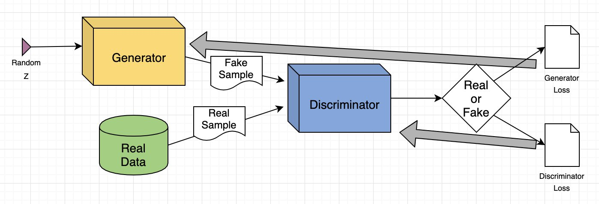
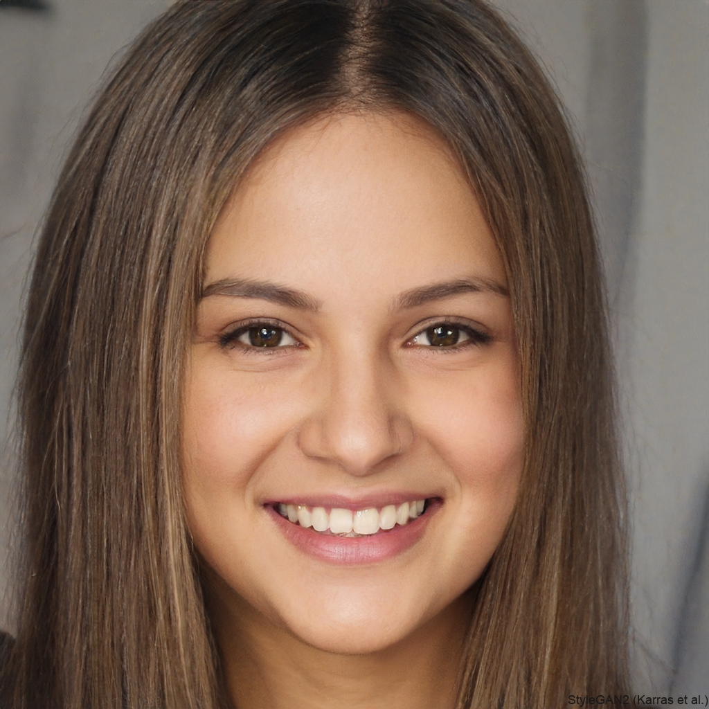
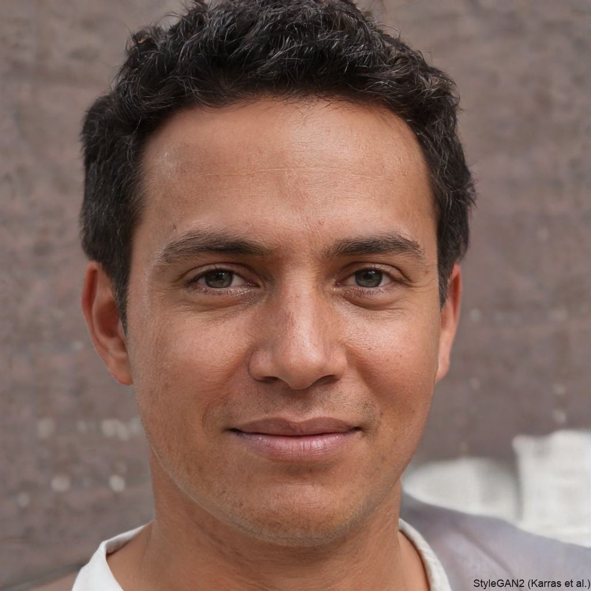
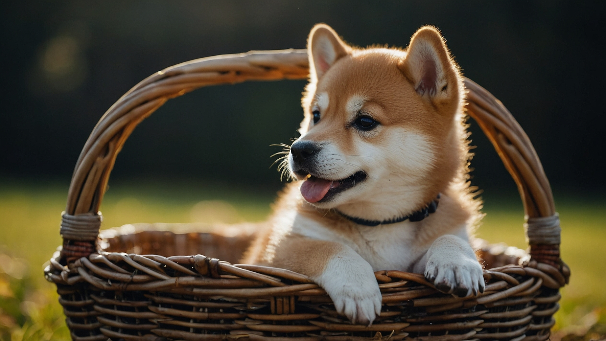

- **generative networks**
    > generate realistic content
    - **goal**: learn a distribution over data $x$ (images, text, audio, …) so we can *sample new* realistic examples
    $$
    x \sim p_\theta(x) \quad \text{or} \quad x \sim p_\theta(x\mid c) \ \ (\text{conditional generation})
    $$
    where $c$ can be a class label, text prompt, another image, etc.

    - **three major families**:
        - __VAE__: latent-variable model trained by variational inference (explicit likelihood / ELBO)
        - __GAN__: implicit model trained by a discriminator-adversary game (no explicit likelihood)
        - __Diffusion models__: denoising / score-matching approach trained by reversing a noise process (strong likelihood connection, very stable)

- **GAN**
    > consists of two competing parts, a generator and a discriminator
    - **alternative name**: generative adversarial networks
    - **idea**
        - two competing part: generator and dsicriminator
        - generator tries to generate the most realistic results:
      $$
      z\sim p(z),\quad x=G_\theta(z)
      $$
        - discriminator $D_\psi(x)\in(0,1)$ tries to distinguish real vs generated
        - 
    - **mathematics (minimax game)**
        - classical objective: $$
      \min_\theta\max_\psi\ 
      \mathbb E_{x\sim p_{\text{data}}}\![\log D_\psi(x)]
      +\mathbb E_{z\sim p(z)}\![\log(1-D_\psi(G_\theta(z)))]
      $$
        - common “non-saturating” generator loss: $$
      \min_\theta\ \mathbb E_{z\sim p(z)}[-\log D_\psi(G_\theta(z))]
      $$
        - Wasserstein GAN (WGAN): $D_\psi$ is real valued, and the objective is $$
      \min_\theta\max_\psi\ 
      \mathbb E_{x\sim p_{\text{data}}}\![D_\psi(x)]-\mathbb E_{z\sim p(z)}\![D_\psi(G_\theta(z))] $$
        - interpretation: training pushes $p_\theta$ toward $p_{\text{data}}$ via a learned divergence; variants use
      Wasserstein distance (WGAN), hinge loss, spectral normalization, etc.

    - **pros**
        - can produce very sharp, high-frequency details (photorealistic images)
        - fast sampling at inference (one forward pass)
        - latent space often supports semantic directions (e.g., “smile vector”)

    - **cons**
        - training can be unstable; requires careful architecture + regularization
        - mode collapse: generator may ignore parts of the data distribution $\to$ generates the same image
        - vanishing gradient: discriminator is too good, finds all fake images
        - no natural likelihood → harder to evaluate/calibrate density
        - sensitive to dataset biases; may amplify them strongly
        - unexpected errors
    - **link**: [thispersondoesnotexitst](https://www.thispersondoesnotexist.com/)
    - **examples**:
        - 
        - 
    - **typical use cases**
        - high-fidelity image synthesis
        - style transfer
        - domain translation (with care)

- **diffusion models**
    - **diffusion in physics**: differential equation for spreading particles
        - $n(x,t)$ is the number density
        - $J(x,t)$ is the current density
        - particle number is conserved: $\nabla J + \partial_t n = 0$
        - current is driven by particle number gradient: $J=-D\nabla n$
        - results: $\partial_t n = D\triangle n $
        - solution in Fourier space $n(k,t) = n(k,t=0) e^{-Dk^2 t}$, all modes are smoothing out except the constant
        - any initial conditions $\to$ thermal equilibrium
        - can be used in diffusion, thermal conduction, etc.
    - **backward diffusion**: thermal equilibrium $\to$ any initial conditions$
        - we can generate any result from the noise (denoising)
        - instable: we have to control is with conditioning
    - **idea**
        - define a *forward* noising process that gradually destroys structure:
        $$
        q(x_t\mid x_{t-1})=\mathcal N\!\big(\sqrt{1-\beta_t}\,x_{t-1},\ \beta_t I\big),\quad t=1,\dots,T
        $$
        - learn a neural network to reverse it (denoise step-by-step), generating from noise:
        $$
        x_T\sim\mathcal N(0,I)\ \rightarrow\ x_{T-1}\rightarrow\cdots\rightarrow x_0
        $$
    - **equivalent viewpoints**:
        - predict noise $\varepsilon$ (common in practice)
        - predict clean data $x_0$
        - learn score $\nabla_x \log p_t(x)$ (score matching)

    - **key closed form**
        - the forward process admits:
        $$
        q(x_t\mid x_0)=\mathcal N\!\big(\sqrt{\bar\alpha_t}\,x_0,\ (1-\bar\alpha_t)I\big)
        $$
        where $\alpha_t=1-\beta_t$ and $\bar\alpha_t=\prod_{s=1}^t\alpha_s$.
        - thus we can sample in one step during training:
        $$
        x_t=\sqrt{\bar\alpha_t}\,x_0+\sqrt{1-\bar\alpha_t}\,\varepsilon,\quad \varepsilon\sim\mathcal N(0,I)
        $$

    - **mathematics (training loss)**
        - common DDPM objective (noise prediction):
        $$
        \mathcal L_{\text{diff}}=
        \mathbb E_{t,x_0,\varepsilon}\left[\ \|\varepsilon-\varepsilon_\theta(x_t,t)\|^2\ \right]
        $$
        - interpretation: a denoiser that learns how to remove Gaussian noise at different noise levels
        - conditioning (text/image guidance) enters as extra input:
        $$
        \varepsilon_\theta(x_t,t,c)
        $$

    - **pros**
        - very stable training (no adversarial game)
        - excellent sample quality and diversity; strong coverage of modes
        - supports powerful conditioning (text-to-image, inpainting, editing)
        - has likelihood connections (via variational bounds)

    - **cons**
        - sampling can be slow (many denoising steps), though accelerated samplers exist
        - memory/compute heavy for high-res generation
        - stochastic generation may be harder to control without guidance mechanisms
        - makes unpredictable errors [Daily Mail paper](https://www.dailymail.co.uk/lifestyle/article-12295877/AI-art-fails-prove-machines-not-taking-over.html)
    
    - **example**: prompt=”a cute shiba inu puppy chows on a bone in his basket”
        
    - **typical use cases**
        - state-of-the-art text-to-image
        - image editing
        - inpainting
        - audio generation
        - video generation
