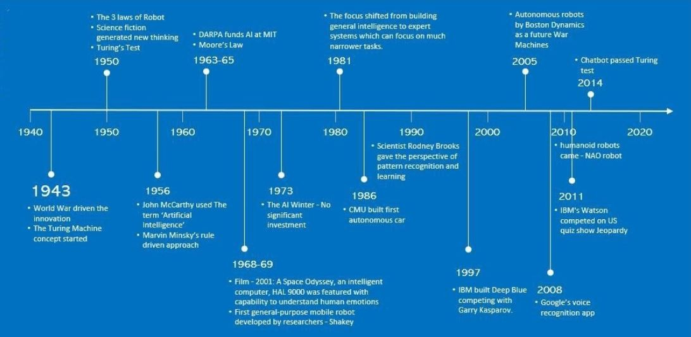

- **A Brief History of Artificial Intelligence**
    - __Pre-scientific origins of Artificial Intelligence__
    - __Mathematical and Scientific Foundations (1930s–1940s)__
    - __The Birth of Artificial Intelligence (1940s–1956)__
    - __Symbolic Artificial Intelligence (GOFAI) (late 1950s–1960s)__
    - __The First AI Boom (1956–1973)__
    - __The First AI Winter (1974–1980)__
    - __Expert Systems and the Second AI Boom (1980–1987)__
      -__Renewed investments and national programs__
      - __Theoretical advances__
      - __Early practical successes: OCR__
    - __The Second AI Winter (1987–1993)__
      - __Limits of expert systems__
      - __Unfulfilled national ambitions__
      - __Conceptual lesson of the second AI winter__
    - __Probabilistic AI, Statistical Learning, and the Data-Driven Revival (1993-2014)__
    - __Deep Learning and the Representation Revolution (2014-present)__
    - summary image: 

- **Pre-scientific origins of Artificial Intelligence**

  > *Before AI became a science, it was already a human dream.*

  - **early ideas of thinking machines**
    - mythology and literature (automatons, the golem, Frankenstein)
    - mechanical constructions in historical times (clockwork mechanisms)
    - early demonstrations of apparent intelligence, such as
      Kempelen Farkas’s chess-playing “Turk”.
    - These constructions did not implement intelligence in a modern sense,
    but they externalized aspects of human cognition and agency.

  - **programmable machines**
    - Key milestones include:
    - Jacquard’s loom with punched cards,
    - Charles Babbage’s Analytical Engine,
    - Ada Lovelace’s insight that machines could manipulate symbols,
      not only numbers.
    - This marks the transition from mechanical automation to abstract computation

  - **early fear of machine dominance**
    - Even at this early stage, the idea of intelligent machines
    was accompanied by the concern that machines might escape human control or
    replace human roles.
    - This fear remains a recurring theme throughout the history of AI
    and resurfaces with every major technological breakthrough.

- **Mathematical and Scientific Foundations (1930s–1940s)**

  > *Intelligence becomes a formal object.*

  - **Mid-20th century scientific breakthroughs**
    - mathematics
    - neuroscience
    - control theory
    - communication theory

  - **Alan Turing and the theory of computation**
    - Alan Turing introduced the concept of the Turing machine
    providing a precise mathematical definition of computation.
    - reasoning can be formalized
    - symbols can be manipulated mechanically
    - a single abstract machine can implement any algorithm

  - **Cybernetics: control, feedback, and self-regulation**
    -  cybernetics (Wiener, McCulloch, Pitts) the study of self-regulating and goal-directed systems.
    - feedback loops
    - control mechanisms
    - early neuron-like models
    - the first scientific attempt to understand intelligence
    as a dynamic interaction between system and environment.

  - **Information theory and entropy**
    - information theory (Shannon): entropy, mutual information, and fundamental limits of communication and compression.
    - a quantitative measure of uncertainty
    - limits on representation efficiency
    - a bridge between probability, coding, and learning
    - Information theory later became central to
    learning theory, neural networks, and modern AI.

  - **World War II as a catalyst**
    - World War II played a decisive role in accelerating these developments.
    - Practical needs such as cryptography, radar, and control systems
    demanded new mathematical tools.
    - landmark example is the breaking of the Enigma cipher (Turing’s "the Bombe")

- **The Birth of Artificial Intelligence (1940s–1956)**

  > *Intelligence becomes an explicit research goal.*

  - **Post-war electronics and “electronic brains”**
    - Advances in electronics led to the first digital computers,
    often referred to as *“electronic brains”*.
    - Science fiction flourished in parallel,
    shaping public imagination and raising both hope and fear
    about thinking machines.

  - **Alan Turing and the imitation game**
    - Turing proposed an operational definition of intelligence: imitate human behavior (the imitation game) convincingly.
    - The *Turing Test* evaluates intelligence through indistinguishability
    from human conversational behavior,
    shifting the focus from internal mechanisms
    to observable performance.

  - **Early neural models: McCulloch–Pitts**
    - McCulloch and Pitts introduced a simplified mathematical model
    of biological neurons,
    showing that networks of such units can implement logical functions.
    - This work formed the first formal bridge
    between neuroscience and computation.

  - **The Dartmouth Workshop (1956)**
    - The Dartmouth Summer Research Project officially coined the term
    *Artificial Intelligence*.
    - This event marked the birth of AI as an independent scientific discipline,
    driven by the belief that every aspect of intelligence
    could, in principle, be described precisely
    and implemented by a machine.

- **Symbolic Artificial Intelligence (GOFAI) (late 1950s–1960s)**

  > *Intelligence as logic and symbols.*

  - **GOFAI (Good Old-Fashioned Artificial Intelligence)**
    - The first dominant AI paradigm viewed intelligence as
    **explicit symbol manipulation governed by formal rules**.

    - intelligence is reasoning,
    - reasoning is logical inference,
    - knowledge can be written down explicitly.

  - **Canonical symbolic systems**
    - *Logic Theorist* (Newell \& Simon),
    - *General Problem Solver (GPS)*,
    - early expert systems,
    - logic programming languages such as Prolog.

    - These systems demonstrated high-level reasoning
    in restricted, well-defined domains.

  - **GOFAI provided**
    - transparency,
    - interpretability,
    - formal correctness guarantees.

  - **However, it struggled with**
    - knowledge acquisition,
    - uncertainty and noise,
    - perception,
    - scalability.

    > These limits revealed that
    explicit reasoning alone is insufficient
    for general intelligence.

- **The First AI Boom (1956–1973)**

  > *Optimism, funding, and diversification.*

  - **Institutional and financial expansion**
    - Following Dartmouth, AI research expanded rapidly.
    - Substantial funding—especially through DARPA (Defense Advanced Research Projects Agency) —
    supported AI institutes in the United States and the United Kingdom.
    - Public discourse, influenced by science fiction,
    predicted human-level intelligence within decades.

  - **Reasoning as search**
    - Problem solving was framed as search in symbolic state spaces,
    using trial-and-error, backtracking, and heuristics.
    - While effective in small domains,
    these methods suffered from **combinatorial explosion**
    in problems such as chess, planning,
    and mathematical theorem proving.

  - **Early neural networks: perceptrons**
    - Frank Rosenblatt developed the perceptron,
    an electrically inspired learning machine.
    - were linear classifiers,
    - implemented as electrical circuits,
    - typically had on the order of $10^3$ parameters.
    - Their limited expressive power
    constrained practical applicability.

  - **Game theory and strategic reasoning**

    - game theory provided a mathematical framework
    for reasoning about strategic interaction among multiple agents.
    - Developed by von Neumann and Morgenstern
    and formalized by Nash (1950),
    it introduced concepts such as strategies, payoffs,
    and Nash equilibrium.
    - Unlike search-based reasoning,
    game theory addresses intelligence
    in the presence of other intelligent agents.

  - **Natural language and the ELIZA effect**
    - Natural language understanding was seen
    as a key test of intelligence.
    - Joseph Weizenbaum’s *ELIZA* program showed that
    simple pattern matching could produce
    a strong *illusion of understanding*.
    - This phenomenon highlighted the gap
    between apparent and genuine intelligence.

  - **Microworlds**
    - Researchers such as Minsky and Papert
    advocated studying intelligence
    in simplified, idealized environments (*microworlds*),
    enabling controlled experimentation.

  - **Early robotics**
    - Robotics emerged as an embodied AI application,
    particularly in Japan.
    - At Waseda University,
    early humanoid robots combined perception,
    control, and mechanical embodiment.

- **The First AI Winter (1974–1980)**

  > *Reality catches up.*

  - **Unmet expectations**
    - By the mid-1970s,
    AI systems had failed to meet optimistic predictions.
    - Funding agencies withdrew support,
    leading to the first *AI winter*.

  - **Limits of linear neural networks**
    - Theoretical results exposed fundamental limitations
    of perceptron-based models,
    which could not represent even simple nonlinear functions.

  - **Insufficient computational power**
    - Many AI methods were computationally infeasible
    with available hardware.
    - Estimates suggested that meaningful AI
    required $\sim 1$ GFLOP,
    - while even the most powerful machines of the time
    achieved only $\sim 100$ MFLOPS.

  - **Computational complexity**
    - Core AI problems were shown to be NP-hard,
    implying exponential growth in computational requirements.
    - As a result,
    even seemingly simple problems
    proved extremely difficult for machines.

  - **Conceptual lesson of the first AI winter**
    - intelligence cannot be reduced to search alone,
    - symbolic reasoning does not scale automatically,
    - learning requires expressive models,
      sufficient data, and adequate computation.
    - These insights set the stage
    for later probabilistic and learning-based approaches.

- **Expert Systems and the Second AI Boom (1980–1987)**

  > *Intelligence as encoded expertise.*

  - **Return of optimism: expert systems**
    - In the early 1980s, Artificial Intelligence experienced a renewed surge,
    driven by the success of *expert systems*.
    - These systems aimed to capture the decision-making ability
    of human experts within narrowly defined domains.
    - Instead of general intelligence,
    the focus shifted to small, well-delimited problem areas and provided deep, domain-specific knowledge.

  - **Expert systems as decision-support tools**
    - Expert systems were primarily used as
    **decision-support programs**.
    - encoding expert knowledge as rules,
    - applying logical inference to reach conclusions.
    - Their promise was practical:
    replacing or assisting human experts
    in specialized professional contexts.

  - **Medical applications and MYCIN**
    - One of the most influential expert systems was *MYCIN*,
    developed in the early 1970s under the leadership of
    Edward Feigenbaum.
    - MYCIN assisted physicians
    in diagnosing bacterial infections
    and recommending antibiotic treatments.
    - Although never deployed clinically,
    it demonstrated that AI could outperform
    non-specialist humans in narrow expert tasks.

  - **Knowledge-based systems and knowledge engineering**
    - The success of expert systems led to the rise of
    *knowledge-based systems* and the discipline of
    *knowledge engineering*.
    - how to extract tacit knowledge from experts?
    - how to formalize it into rules?
    - how to maintain and update large rule bases?
    - This bottleneck revealed that
    **knowledge acquisition is often harder than inference**.

  - **Ambitious knowledge projects: Cyc**
    - The Cyc project aimed to encode
    large portions of common-sense human knowledge
    into a formal, machine-readable form.
    - It represented the most ambitious attempt
    to overcome the knowledge bottleneck,
    but also illustrated the immense difficulty
    of explicitly representing everyday understanding.

  - **High-performance game-playing systems**
    - During this period,
    AI systems achieved master-level performance in games.
    - chess: *HiTech* -- Won the 1988 U.S. Open Chess Championship, *Deep Thought* (a predecessor of Deep Blue).
    - symbolic reasoning,
    - heuristics,
    - and increasing computational power.

- **Renewed investments and national programs**

  > The success of expert systems triggered major investments.

  - **Japan** launched the *Fifth Generation Computer Systems* project,
    aiming to build massively parallel computers
    based on logic programming and AI principles (1982 to 1992)

  - **United States** the government supported
    collaborative industrial research through organizations such as
    MCC (Microelectronics and Computer Technology Corporation).

  > AI was again perceived as a strategic technology.

- **Theoretical advances**

  > This era also saw important theoretical developments,
  including:
  - the Hopfield model (recurrent neural networks),
  - the rediscovery and popularization of backpropagation.

  - These advances quietly laid the groundwork
  for later neural network revolutions.

- **Early practical successes: OCR**

  - Optical Character Recognition (OCR)
  emerged as one of the first commercially successful AI applications.

  - OCR systems demonstrated that
  pattern recognition tasks could be automated effectively,
  foreshadowing the later dominance of data-driven learning.

- **The Second AI Winter (1987–1993)**

  > *Engineering reality meets economic limits.*

  - **Collapse of the AI market**

    - Between 1987 and 1993,
    Artificial Intelligence entered its second major downturn.

    - Approximately 300 AI-related companies went bankrupt,
    and both private and public investments sharply declined.

  - **Failure of specialized AI hardware**

    - The market for specialized AI machines collapsed.
   -  Rapid advances in general-purpose personal computers
    (notably from IBM and Apple)
    made dedicated AI hardware economically unattractive.

  - **Limits of expert systems**
    - extremely costly to train and maintain,
    - brittle behavior outside narrow domains,
    - unexpected and hard-to-debug failures.

    - Maintaining large rule bases
    required continuous expert involvement,
    making long-term deployment unsustainable.

  - **Unfulfilled national ambitions**

    - The Japanese *Fifth Generation Computer Systems* project
    failed to meet its ambitious goals.

    - Logic programming and symbolic AI
    did not deliver the expected breakthroughs
    in scalability or performance.

  - **Conceptual lesson of the second AI winter**
    - hand-crafted intelligence does not scale,
    - knowledge cannot be exhaustively encoded,
    - intelligence requires learning, adaptation,
      and robustness to uncertainty.

    - These lessons directly motivated the transition toward
    statistical learning, probabilistic models,
    and data-driven approaches in the 1990s.

- **Probabilistic AI, Statistical Learning, and the Data-Driven Revival (1993-2014)**

  > *Intelligence as inference from data.*

  - **Slow recovery after the second AI winter**

    - After 1993, Artificial Intelligence began a gradual and cautious recovery.
    Grand claims about human-level intelligence disappeared,
    replaced by a pragmatic focus on **performance, robustness, and utility**.

    - The field shifted away from hand-crafted knowledge
    toward models that could **learn from data**.

  - **Probabilistic AI and uncertainty**

    - A central insight of this period was that
    real-world intelligence must operate under uncertainty.

    - Bayesian networks,
    - Hidden Markov Models,
    - probabilistic graphical models.

    - These frameworks treated intelligence as **inference**:
    computing the most likely explanations or decisions
    given incomplete and noisy observations.

  - **Statistical learning theory**

    - In parallel, statistical learning theory provided
    a mathematical foundation for learning from finite data.

    - generalization error,
    - bias–variance tradeoff,
    - VC (Vapnik–Chervonenkis) dimension to measure model capacity
    - regularization.

    - Learning was no longer judged by training performance alone,
    but by its ability to generalize to unseen data.

  - **No conceptual revolution — but more computation**

    - This era introduced **few fundamentally new paradigms**.
    - faster processors (Moore’s law),
    - larger memory,
    - cheaper storage,
    - growing datasets.

    - The same algorithms that had existed earlier
    became practical at scale.

  - **Milestone: Deep Blue defeats Kasparov (1997)**

    - In 1997, IBM’s *Deep Blue* defeated world chess champion

    - Deep Blue evaluated roughly **200 million moves per second**,
    - brute-force search,
    - expert-crafted evaluation functions,
    - massive computational power.

    - This victory demonstrated that
    *engineering scale* could substitute for human intuition
    in narrowly defined tasks.

  - **Autonomous vehicles and embodied AI**

    - The DARPA Grand Challenge marked a turning point
    for robotics and autonomous systems.

    - In 2005, a Stanford robot completed a **150-mile desert course** autonomously.
    - In 2007, a CMU robot navigated **55 miles of urban traffic**.

    - probabilistic perception,
    - sensor fusion,
    - real-time decision making.

  - **Question answering and Watson (2011)**

    - In 2011, IBM’s *Watson* defeated human champions
    in the quiz show *Jeopardy!*.

    - natural language processing,
    - large-scale information retrieval,
    - probabilistic reasoning.

    - The system illustrated the power of
    **combining many weak signals at massive scale**.

  - **Practical AI everywhere**

    - While “general AI” remained elusive,
    AI quietly penetrated many industries:

    - data mining and recommendation systems,
    - industrial robotics,
    - logistics and scheduling,
    - speech recognition,
    - banking and fraud detection,
    - medical diagnosis,
    - search engines (notably Google).

  - **Conceptual lesson**
    - learning from data beats hand-coded intelligence,
    - uncertainty must be modeled explicitly,
    - performance matters more than philosophical purity.

    - This period laid the **essential groundwork**
    for the deep learning revolution that followed.

  > Once data and computation became abundant, representation became the bottleneck.

- **Deep Learning and the Representation Revolution (2014-present)**

  > *Intelligence as learned representation.*

  - **The deep learning breakthrough (from 2014)**

    - Around 2014, Artificial Intelligence entered a decisive new phase.
    - Advances in __DNNs__,
    combined with large datasets and GPU acceleration,
    enabled systems to learn **hierarchical representations**
    directly from raw data.

    - This marked a qualitative shift:
    features were no longer engineered by humans,
    but **learned automatically** from examples.

  - **Face recognition milestones**

    - Systems such as *DeepFace* (Facebook / Meta)
    and *FaceNet* (Google) achieved
    near-human or superhuman performance
    in face recognition benchmarks.

    - deep neural networks can outperform humans
      in well-defined perceptual tasks,
    - representation learning is the key limiting factor,
      not classification itself.

  - **Human-level performance in classification**

    - Following these successes,
    __DNNs__ (deep neural networks),
    especially convolutional neural networks (CNNs),
    became the standard solution
    for classification problems in vision, speech, and perception.

    - In many benchmark tasks,
    performance reached or exceeded human accuracy.

  - **Games and reinforcement learning**

    - Deep learning combined with reinforcement learning
    achieved remarkable success in games:

    - chess and Go,
    - Atari games,
    - complex environments such as Doom.

    - These systems learned strategies
    through interaction and self-play,
    without explicit human rules.

    - Games once again served as controlled testbeds
    for increasingly general intelligence.

  - **Stability and scalability of deep learning systems**

    - more stable behavior,
    - graceful degradation,
    - robustness to noise and variation.

    - Intelligence became less brittle
    and more statistically grounded.

  - **Transformers and the language revolution (2017–)**

    - The introduction of the *Transformer* architecture in 2017
    triggered a revolution in natural language processing.

    - efficient modeling of long-range dependencies,
    - scalable training on massive text corpora,
    - unified architectures for understanding and generation.

    - This led to the rise of **Large Language Models (LLMs)**.

  - **Foundation models and ChatGPT (2022)**

    - By 2022, foundation models trained on vast datasets
    demonstrated unprecedented capabilities.

    - The public release of *ChatGPT* in November 2022
    marked a turning point:
    AI systems became widely accessible,
    interactive, and economically transformative.

    - general-purpose reasoning engines,
    - interfaces to knowledge,
    - tools for creativity and programming.

  - **Generative models beyond text**

    - Deep generative models expanded rapidly beyond language.

    - Image generation systems,
    such as diffusion-based models,
    enabled high-quality synthesis of visual content
    from natural language descriptions.

    - Generation became a central capability,
    not a side effect of modeling.

    - 2013: VAE
    - 2014: GANs $\to$ sharp images
    - 2017: transformer $\to$ generation by prompts
    - 2021: diffusion models

  - **The contemporary AI boom**

    - massive investments,
    - rapid industrial adoption,
    - profound societal impact.

    - AI shifted from a specialized technology
    to a **general-purpose infrastructure**.

  - **Conceptual lesson of the deep learning era**
    - representation is more important than rules,
    - scale transforms capability,
    - intelligence emerges from data, computation,
      and inductive bias working together.

    - This era reframed intelligence
    not as explicit reasoning,
    but as **learned, contextual representation**.
