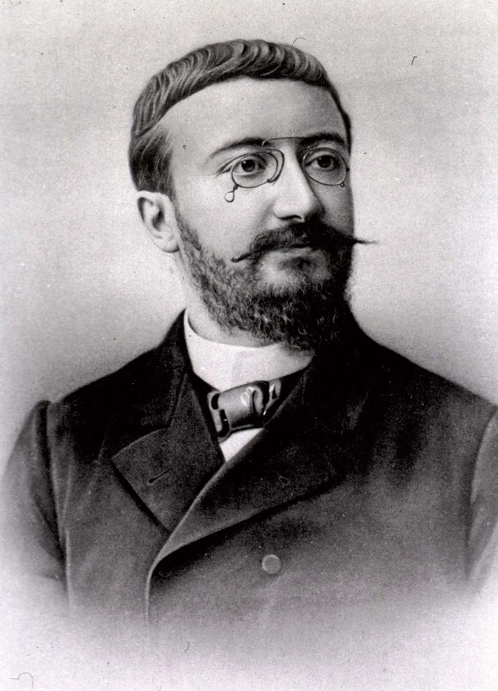
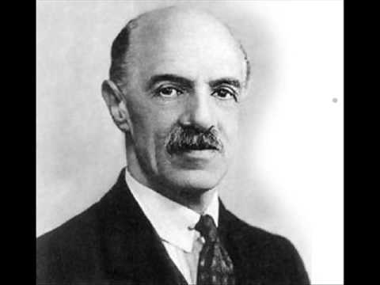
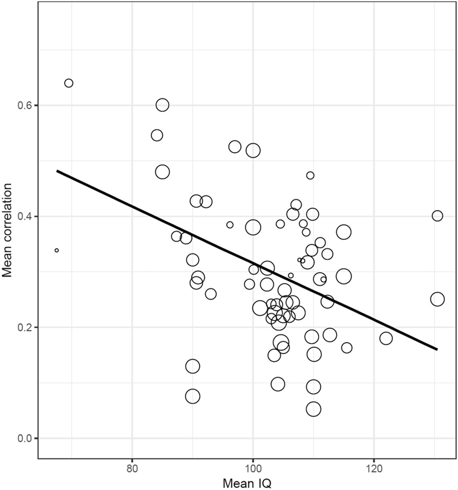
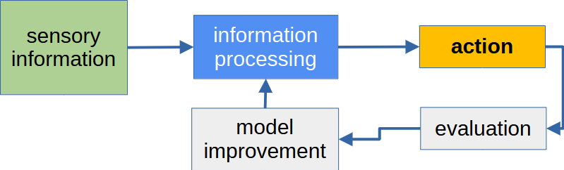
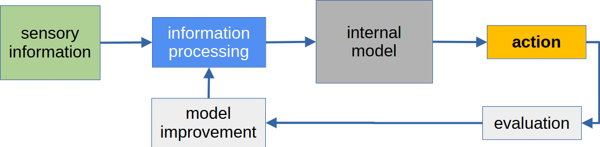
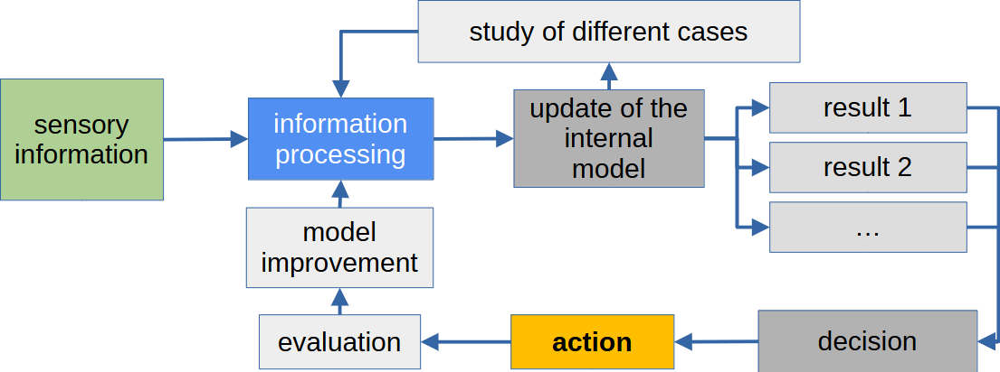
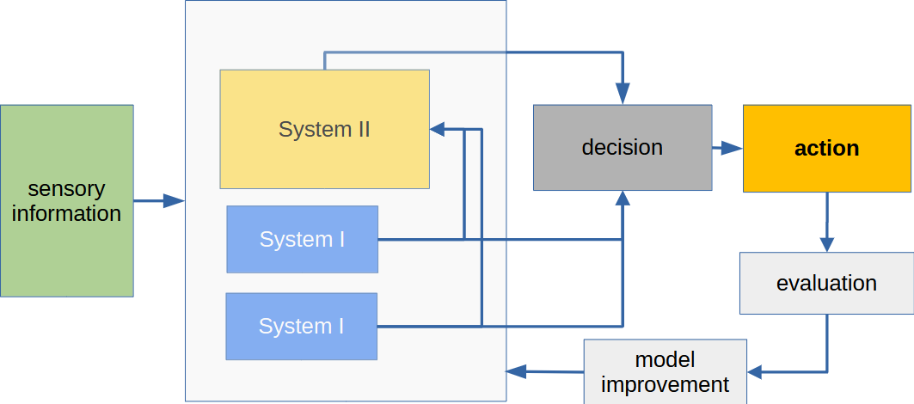

- **Human Intelligence: A Psychological Perspective**

  > *Before we ask whether machines are intelligent, we must ask what intelligence means for humans.*

  - __Spearman and the definition of intelligence__
  - __Intelligence as a non-monolithic construct__
  - __The Cattell–Horn–Carroll (CHC) theory of intelligence__
  - __Law of Diminishing Returns__
  - __Kahneman and his System I and System II__

- **Spearman and the definition of intelligence**
  - **Everyday experience and consensus**
    - Everyday experience suggests that intelligence is a meaningful concept.
    - People tend to agree, at least approximately,
      on relative judgments of intelligence:
      there is a broad, though imperfect,
      consensus about who is “more” or “less” intelligent.
    - This pragmatic agreement motivates attempts
      to measure intelligence quantitatively.

  - **First intelligence measurements**
    - A. Binet's intelligence test (1905) 
    - Mental age: comparing a child’s performance to age norms.
    - Practical goal: identify students needing educational support.
    - Not intended as a measurement of a fixed, innate general intelligence.

  - **Spearman's g-factor**
    -  was one of the founders of modern psychometrics.
    - Scores on very different cognitive tests are positively correlated
      (vocabulary and reasoning, memory and spatial ability, arithmetic and verbal skills) → **positive manifold**.
    - Spearman (1904): intelligence has an underlying structure —
      a **General Intelligence Factor (g)**.
    - Factor-analytic model:
      $X_i = \lambda_i g + \epsilon_i$
      where $\lambda_i$ is the loading of test $i$ on $g$,
      and $\epsilon_i$ represents test-specific variance and measurement error.

  - **Psychometric intelligence and IQ**
    - Modern IQ tests are constructed using factor-analytic methods
      to approximate general intelligence ($g$).
    - Full Scale IQ is an estimate of general ability.
    - Standardized: mean = 100, standard deviation = 15.
    - Widely used batteries: Wechsler scales
      (adult, children, preschool versions).

- **Intelligence as a non-monolithic construct**

  - **Conceptual evolution**
    - From unitary intelligence (__Spearman and the definition of intelligence__),
    - to multifactor models (Thurstone),
    - to the modern view

  - **Louis L. Thurstone (1930s) — Primary Mental Abilities**
    - Challenged the dominance of a single general factor.
    - Proposed several relatively independent abilities:
      verbal, numerical, spatial, memory, reasoning, etc.
    - Developed multiple-factor analytic methods.
    - Emphasized differentiation of cognitive abilities.

  - **Modern view**
    - Modern psychology views intelligence as hierarchically structured.
    - A general factor ($g$) sits at the top,
      beneath which lie broad abilities
      (e.g., verbal, spatial, memory, processing speed).
    - These components may develop at different rates
      and manifest differently across individuals.
    - A single numerical score cannot fully capture this complexity.
      intelligence is structured and multidimensional,
      yet shows a robust general factor.

- **The Cattell–Horn–Carroll (CHC) theory of intelligence**
  > *A widely influential integrative framework in contemporary psychometrics, synthesizing decades of factor-analytic research
  into a hierarchical model of cognitive abilities.*
  - **A three-stratum structure**
    - The defining feature of the CHC model is its three-stratum hierarchy: 
    - Stratum I – Narrow abilities: highly specific cognitive skills measured by individual test items
    (e.g. particular memory tasks, visual discriminations, arithmetic operations).
    - __Stratum II – Broad abilities__: general cognitive domains that organize and explain correlations
    among narrow abilities.
    - Stratum III – General intelligence: 
    A single, overarching factor (*g*),
    capturing the shared variance across all broad abilities.
  - **Relation to psychometric testing**
    - The CHC framework underlies many modern standardized intelligence tests.
    - Individual subtests are designed to measure **narrow abilities**,
    - which aggregate into **broad ability scores**,
    - and ultimately contribute to an estimate of **general intelligence**.
    - As such, the CHC theory serves as a **bridge**
  between empirical testing, cognitive structure,
  and theoretical models of intelligence.

- **Stratum II – Broad abilities**

  > The core explanatory level of the CHC theory lies in **broad abilities**,
  which represent major functional components of human intelligence:

  - **Comprehension–Knowledge (Gc)**  
    - The ability to use acquired knowledge for communication, reasoning,
    and understanding of culturally transmitted information.
    Strongly associated with language, education, and expertise.

  - **Fluid Reasoning (Gf)**  
    - Capacity for reasoning, abstraction, and concept formation
    in novel situations where prior knowledge is insufficient.

  - **Quantitative Knowledge (Gq)**  
    - Understanding of numerical concepts, quantities, and mathematical relations,
    shaped by both schooling and practice.

  - **Reading and Writing Ability (Grw)**  
    - Skills related to decoding, comprehension, and production of written language.

  - **Short-Term Memory (Gsm)**  
    - Ability to maintain and manipulate information
    over a time span of a few seconds.

  - **Long-Term Storage and Retrieval (Glr)**  
    - Capacity for storing information in long-term memory
    and retrieving it efficiently, including associative fluency and creativity.

  - **Visual Processing (Gv)**  
    - Ability to perceive, analyze, and mentally manipulate visual information,
    such as spatial relations and patterns.

  - **Auditory Processing (Ga)**  
    - Sensitivity to auditory information, including speech perception,
    phonological processing, and sound discrimination.

  - **Processing Speed (Gs)**  
    - Efficiency in performing automatic or well-learned cognitive tasks,
    particularly under time pressure,
    typically on a scale of several minutes.

  - **Decision / Reaction Time / Speed (Gt)**  
    - Speed of making simple decisions or responses,
    operating on sub-second time scales.

- **Law of Diminishing Returns**
  - **Core Claim**
    - As general cognitive ability increases,
      correlations between different cognitive tests decrease.
    - The proportion of shared variance explained by $g$
      declines at higher ability levels.

  - **Lower ability**
    - Stronger inter-test correlations
    - Higher $g$-saturation → larger loadings on $g$
    - Performance more strongly driven by general intelligence

  - **Higher ability**
    - Weaker inter-test correlations
    - Lower $g$-saturation → smaller loadings on $g$
    - Greater differentiation of specific abilities

  - **Paper**
    - Blum \& Holling (2017):
      *Spearman’s Law of Diminishing Returns. A Meta-Analysis*
    - Plot: relation between subgroup mean IQ (x-axis)
      and average inter-test correlation (y-axis),
      with regression line illustrating decreasing trend.
      

  - **Book in Hungarian**
    - [Mérő László: *Az érzelmek logikája*](https://www.scribd.com/document/811514880/Mer%C5%91-Laszlo-Az-Erzelmek-Logikaja)

  - **Goodhart's law**
    - economics origin
    - When a measure becomes a target, it ceases to be a good measure
    - mechanism: actors optimize for that metric
    - consequence: measures corrupt systems to follow artificial goals
  
  - **Campbell's law**
    - The more a quantitative social indicator is used for decision-making,
the more it will be subject to corruption pressures
and distort the processes it is intended to monitor.
    - Campbell’s Law is essentially the sociological formulation of Goodhart’s Law.

  - **examples for Goodhart's and Campbell’s law**
    - University rankings
    - Citation metrics
    - Standardized exams
    - Academic performance factors (impact factors, h-index, performance assessment)
    - Hiring

  - **Barabási's work**
    - [The Formula: The Universal Laws of Success](https://ia600709.us.archive.org/11/items/psicology/The%20Formula_%20The%20Universal%20Laws%20of%20Success%20-%20Albert-Laszlo%20Barabasi.pdf)
    - Performance (result) → what you objectively produce
    - Success → how the network perceives and rewards that performance
    - Performance is individual; success is collective.
    - Success follows network laws.
    - Cumulative advantage (“the rich get richer”).
    - Early recognition amplifies later success.
    - In creative fields, performance variance may be small, but success variance is huge.

  - **Take home message**
    - Very low IQ significantly constrains educational
      and occupational opportunities.
    - High IQ (or other success factor) does not measure the value of the work, and does not guarantee sensible work.
    - [Jim Collins: Good to Great](https://www.perlego.com/paid/book/3577811/book-review-good-to-great-by-jim-collins-learn-how-companies-achieve-excellence-pdf)

- **Kahneman and his System I and System II**

  > *Kahneman distinguishes between two fundamentally different
  modes of thinking. These are not separate brain regions,
  but descriptive labels for characteristic cognitive processes.*

  - **D. Kahneman**
    - 1934-2024
    - cognitive psychologist who fundamentally changed how we understand decision making under uncertainty.
    - Nobel Prize in Economics (2002) for integrating psychological insights into economic theory (behavioral economics)
    - [Thinking, Fast and Slow (2011)](https://drive.google.com/file/d/0B7y91D08k6X8RkRranBfd05fTEU/view?resourcekey=0-dYgxzjaJ0yMVuRZ1PMdP3A)

  - **System I**
    - fast, intuitive thinking
    - __System I__
  - **System II**
    - slow, deliberative thinking
    - __System II__
  - **working together**:
    - __interaction between the systems__
    - __decision making__

- **System I**
  - **mental model**
    - __action focused decision__: change in environment $\to$ immediate action
    - 
  - **properties**
    - fast and automatic,
    - intuitive and heuristic-based,
    - largely unconscious,
    - effortless in terms of mental energy
    - inherently error-prone, especially in complex or unfamiliar contexts: __Characteristic errors of System I__
  - **it is responsible for**
    - rapid judgments,
    - pattern recognition,
    - emotional reactions,
    - __decision making__ based on gut feelings
  - **resource requirements**
    - requires few resources
    - allows parallel operation
  - **examples**
    - driving a car after sufficient practice,
    - riding a bicycle,
    - walking at a habitual pace
  - **training**
    - repetitive movements form __System I__ (sports, martial arts, pingpong, etc)
    - slow training, fast action

- **System II**
  - **mental model**
    - environment is too complex to react to each change
    - __representation of reality__ (model) is needed
    - sensory information updates the model
    - scenarios are evaluated
    - decision
    - 
    - 
  - **properties**
    - slow and effortful,
    - conscious and intentional,
    - capable of abstract and logical reasoning,
    - associated with self-control and critical evaluation.
  - **resources**
    - System II requires significantly more mental resources
    - uses model of reality
    - only one problem can be analized or contemplated about (self)
  - **this system is engaged in**
    - thinking
    - explicit problem solving,
    - mathematical reasoning,
    - careful __decision making__,
    - consistency checking and error correction.

- **Decision making and argumentation**

  - **System I**
    - Based on intuition, heuristics
    - Operates effectively under time pressure and scarce information.
    - Dominates many real-world economic and social decisions.
    - Can produce systematic biases, especially in rare, high-impact events
      (c.f. __characteristic errors of System I__, "Black Swan" misjudgments, [Black Swan book](https://dn720004.ca.archive.org/0/items/english-collections-1/Black%20Swan_%20The%20Impact%20of%20the%20Highly%20Improbable%2C%20The%20-%20Nassim%20Nicholas%20Taleb.pdf)).

  - **System II**
    - Based on analysing scenarions in mental world model (contemplation, thinking)
    - Operates on explicit internal representations (mental models) $\to$ unique, personal
    - Often influenced by __System I__ intuitions and may rationalize them post hoc.

  - **Negotiation**
    - Traditional view: opinions change through logical argumentation.
    - Empirical observation: beliefs are often resistant to change.
    - Reason: reasoning is strongly shaped by intuitive (__System I__) processes.
    - __Post-hoc rationalization__: people construct explanations for decisions
      that were intuitively driven
    - Effective negotiation often involves emotional regulation,
      rapport, and reframing rather than purely logical persuasion [Chris Voss: Never Split the Difference](https://ia801801.us.archive.org/27/items/never-split-the-difference-negotiating-as-if-your-life-depended-on-it_202101/Never_Split_the_Difference_Negotiating_As_If_Your_Life_Depended.pdf)

- **Post-hoc rationalization**
  >  The tendency to construct explanations for decisions or actions
    *after* they have already been made.
  - Often occurs when behavior is driven by intuitive (__System I__)
    or unconscious processes, while conscious reasoning (__System II__)
    generates a coherent justification afterward.
  - The explanation feels sincere and convincing,
    even if it does not reflect the true causal mechanism.

  - **Classic demonstrations**: in the following some experimental evidence is shown for post-hoc rationalization

  - **Post-hypnotic suggestion** 
    - [Hilgard: Divided Consciousness](https://www.cambridge.org/core/journals/the-british-journal-of-psychiatry/article/abs/divided-consciousness-multiple-controls-in-human-thoughts-and-actions-expanded-edition-by-ernest-r-hilgard-chichester-john-wiley-sons-1986-pp-313-1850/4E828BA48D262446C537DBE61CC06192)
    - Subjects perform an instructed action and later invent a reason for it.
    - A subject under hypnosis is instructed to perform an action later (e.g., open a window, move a book, cough).
    - After waking, the cue is given.
    - The subject performs the action.
    - When asked why, they give a plausible but false explanation (“The room felt stuffy.”,   “I just needed some air.”)

  - **Split-brain experiments** 
    - [Gazzaniga, M. (1985). The Social Brain](https://www.scribd.com/document/341262624/Michael-S-Gazzaniga-the-Social-Brain)
    - Split brain patients act on information unavailable to conscious awareness, yet confidently explain their behavior.
    - The right hemisphere sees a command (“Walk”).
    - The patient stands up and walks.
    - When asked why, the left hemisphere (which did not see the instruction) invents an explanation (“I’m going to get a Coke.”)
  
  - **Choice blindness** 
    - [Johansson, P. et al. (2005). Failure to detect mismatches between intention and outcome in a simple decision task.](https://www.lucs.lu.se/fileadmin/user_upload/lucs/2011/01/Johansson-et-al.-2005-Failure-to-Detect-Mismatches-Between-Intention-and-Outcome-in-a-Simple-Decision-Task.pdf)
    - Participants chose which face they found more attractive.
    - Researchers secretly swapped the image.
    - Participants then explained in detail why they preferred the face they did not actually choose.
    - They gave elaborate reasons.

  - **Psychological mechanisms**
    - Desire for internal coherence
    - Cognitive dissonance reduction
    - Identity protection
    - Narrative construction of the self

  - **Implications**
    - Logical argumentation may often defend prior intuitions
      rather than generate them.
    - Belief revision is difficult when reasoning serves
      to justify, not to evaluate.
    - Important in politics, negotiation, moral reasoning,
      and everyday decision making.

- **Interaction between the systems**
  - **normal cognition**
    - __System I__ continuously generates impressions, intuitions, and tentative judgments
    - __System II__ monitor, endorse, modify, or override them.
    - the two systems can change to each other (see below)
    - new tasks always start with __System II__
    - 
  - **Understanding and Bringing to Awareness**
    - the same method we understand our environment or the world as a whole, we can analyze and understand our internal mechanisms
    - __System I__ $\to$ __System II__
    - Paralysis by analysis: excessive conscious control can disrupt automatized performance (explicit monitoring)
    - But later it can lead to more conscious and more effective performance
  - **Internalization and Automatization**
    - building effective but complex concepts while releasing less imporant details
    - rely more and more the relevant concepts $\to$ decrease mental effort
    - __System II__ $\to$ __System I__
    - other names: Habitualization, Proceduralization
    - training: conscious process to build effective concepts (excersizing car driving, riding a bike, making sports, etc.)

  - **Neuroplasticity experiments**
    - what happens in the brain during these processes?
    - “Fused Fingers” experiment [Merzenich, M. M., & Kaas, J. H. (1983)](https://pubmed.ncbi.nlm.nih.gov/6646426/), [Mogilner et al. (1993)](https://europepmc.org/article/pmc/pmc46347?utm_source=chatgpt.com)
    - two fingers were fused/taped together, and after a while they were released
    - they observed the areas in primary somatosensory cortex (S1) corresponding to the two fingers
    - after fusion the two areas started to merge (neuroplasitcity, brain treats them as a single unit), the boundaries blur
    - after separation the there is a transient expansion of representation.
    - Later → pruning and refinement.

- **Characteristic errors of System I**
  > Heuristics can be misleading
  - The reliance on heuristics makes __System I__ vulnerable to systematic cognitive biases, including:

  - **Anchoring**  
    - Judgments are unduly influenced by an initial value or reference point  
      (e.g. estimating a quantity after being exposed to an arbitrary number).  
    - *Example:* After seeing a jacket originally priced at €400 “discounted” to €180, people tend to perceive €180 as a bargain—even if the true market value is only around €150.

  - **Availability heuristic**  
    - Events that are easier to recall are perceived as more important or probable,  
      a mechanism often exploited in propaganda and media framing.  
    - *Example:* After watching several news reports about airplane accidents, a person may overestimate the danger of flying, despite statistical evidence that air travel is safer than driving.

  - **Conjunction fallacy**  
    - The tendency to judge a specific conjunction of events  
      as more probable than a single general event  
      (e.g. the classic “Linda problem”).  
    - *Example:* People may judge “Linda is a bank teller and active in the feminist movement” as more probable than “Linda is a bank teller,” even though logically the conjunction cannot be more likely than one of its parts.

  - **Optimism bias**  
    - Systematic underestimation of negative outcomes  
      and overestimation of positive ones.  
    - *Example:* A startup founder may believe their company is far less likely to fail than other similar startups, despite knowing that most new businesses do not survive beyond a few years.

  - **Framing effects**  
    - Preferences change depending on whether outcomes  
      are presented in terms of gains or losses  
      (e.g. “99% survival” versus “1% mortality”).  
    - *Example:* Patients are more likely to choose a medical treatment described as having a “90% survival rate” than one described as having a “10% mortality rate,” even though the information is statistically identical.

  - **Sunk cost fallacy**  
    - Continuing an endeavor because of past investments,  
      even when future costs outweigh expected benefits.  
    - *Example:* Someone continues watching a long, boring movie simply because they already paid for the ticket, even though leaving would maximize their remaining time and satisfaction.

  - **Overconfidence**  
    - Excessive trust in one’s own judgments and abilities,  
      often leading to underestimated risks.  
    - *Example:* An investor may believe they can consistently “beat the market” through personal intuition, ignoring statistical evidence that even professional fund managers rarely outperform index funds in the long run.

__END__

## Piaget's works

> *Intelligence is not a fixed quantity, but a developing structure*

  Rather than treating intelligence as a static trait,
  Piaget studied **how cognitive structures emerge and transform during childhood**.
  A key methodological insight of this work is the analysis of *systematic errors*:
  characteristic mistakes made by children at different ages,
  revealing the structure of their current mode of thinking.

---

- **Sensorimotor stage (0–2 years)**

  In the sensorimotor stage, intelligence is grounded in direct sensory experience
  and physical interaction with the environment.

  A central achievement of this stage is the acquisition of **object permanence**:
  the understanding that objects continue to exist even when they are not perceived.

  Typical errors include:
  - assuming that what is not visible does not exist,
  - searching for an object where it was previously found,
    rather than where it was last moved.

---

- **Pre-operational stage (2–7 years)**

  During the pre-operational stage, children begin to use **symbols and language**
  to represent the world and to ask explanatory questions such as “why”.

  However, thinking at this stage is still limited by:
  - egocentrism (difficulty understanding that others may perceive differently),
  - centration (focusing on a single salient feature),
  - confusion between appearance and reality  
    (e.g. assuming that a change in shape implies a change in quantity).

---

- **Concrete operational stage (7–11 years)**

  In the concrete operational stage, children acquire the ability
  to perform **logical operations** on concrete objects and situations.

  They become capable of:
  - conservation of quantity,
  - considering multiple relevant properties simultaneously,
  - understanding that different observers may hold different perspectives.

  At the same time, thinking remains tied to concrete contexts;
  purely abstract or hypothetical reasoning is still difficult.

---

- **Formal operational stage (11–16 years)**

  The formal operational stage marks the emergence of **abstract, hypothetical,
  and formal reasoning**.

  Adolescents become capable of:
  - reasoning about possibilities rather than only actualities,
  - constructing and testing abstract hypotheses,
  - using formal logical principles independent of concrete content.

  Characteristic limitations of this stage may include:
  - prioritizing abstract principles over practical constraints,
  - idealism and overgeneralization,
  - gaps or inconsistencies in abstract argumentation.

---

- **Implications for the concept of intelligence**

  Piaget’s theory reinforces the view that intelligence is **structured, staged,
  and context-dependent**.

  Intelligent behavior cannot be reduced to performance on isolated tasks,
  but must be understood in relation to developmental stage,
  available cognitive tools, and the structure of the environment in which reasoning occurs.

---

## Gardner’s theory of multiple intelligences

> *Building on the idea that intelligence is not monolithic, Gardner proposed the theory of multiple intelligences*

  Gardner challenged the dominant psychometric view,
  arguing that a single general intelligence factor (*g*)
  cannot adequately explain the diversity of human cognitive abilities.

- **Core idea**

  According to Gardner, intelligence should be defined as:

  > the ability to solve problems or create products that are valued in one or more cultural contexts.

  This definition shifts the focus:
  - from abstract test performance  
  - to *functional competence* in real-world settings.

  Intelligence, in this view, is inherently **contextual and plural**.

---

- **The main types of intelligence**

  Gardner originally identified several relatively independent intelligences, including:

  - **Linguistic intelligence**  
    Sensitivity to language, meaning, and verbal expression.

  - **Logical–mathematical intelligence**  
    Capacity for formal reasoning, abstraction, and numerical problem solving.

  - **Spatial intelligence**  
    Ability to perceive, manipulate, and reason about spatial relations.

  - **Musical intelligence**  
    Sensitivity to rhythm, pitch, timbre, and musical structure.

  - **Bodily–kinesthetic intelligence**  
    Skillful control of body movements and physical interaction with the environment.

  - **Interpersonal intelligence**  
    Ability to understand, interpret, and respond to the emotions and intentions of others.

  - **Intrapersonal intelligence**  
    Capacity for self-awareness, introspection, and regulation of one’s own mental states.

  Later discussions also included **naturalistic intelligence**,
  related to the recognition and classification of patterns in nature.

---

- **Independence and interaction**

  A key claim of the theory is that these intelligences are **partially independent**:
  strong performance in one domain does not guarantee strength in others.

  At the same time, real-world activities typically require **coordination**
  among multiple intelligences.
  For example, scientific work may combine logical–mathematical,
  linguistic, and intrapersonal components.

---

- **Relation to IQ testing**

  From Gardner’s perspective, traditional IQ tests primarily assess:
  - linguistic intelligence,
  - logical–mathematical intelligence.

  As a consequence, many forms of human competence—
  such as social insight, musical creativity, or bodily skill—
  are systematically underrepresented or ignored.

  IQ is therefore not rejected as meaningless,
  but reinterpreted as a **narrow measure of specific cognitive abilities**,
  rather than a comprehensive index of intelligence.

---

- **Educational implications**

  Gardner’s theory had a major impact on educational thinking.
  It suggests that:
  - learners may excel through different cognitive pathways,
  - effective teaching should employ multiple representational forms,
  - failure in traditional academic settings does not imply low intelligence per se.

  This view supports a more differentiated and inclusive understanding
  of cognitive potential.

---

- **Critiques and status**

  While widely influential, the theory of multiple intelligences
  remains controversial in empirical psychology.

  Critics argue that:
  - some proposed intelligences resemble talents or personality traits,
  - clear psychometric separation between intelligences is difficult to demonstrate.

  Nevertheless, the theory plays a crucial conceptual role:
  it reinforces the idea that **human intelligence is structured, diverse,
  and not exhaustively captured by a single numerical score**.

---

- **Conceptual relevance**

  In the broader context of intelligence research,
  Gardner’s work complements developmental and computational perspectives.
  It emphasizes *what intelligence is for*,
  rather than how well it can be ranked along a single axis.

# References

- Gardner, H. (1983).  
*Frames of Mind: The Theory of Multiple Intelligences*.  
New York: Basic Books.

- Gardner, H. (1987).  
*Multiple Intelligences: The Theory in Practice*.  
New York: Basic Books.

- Gardner, H. (1995).  
Reflections on Multiple Intelligences: Myths and Messages.  
*Phi Delta Kappan*, 77(3), 200–209.

- Gardner, H. (1999).  
*Intelligence Reframed: Multiple Intelligences for the 21st Century*.  
New York: Basic Books.

- Gardner, H. (2006).  
*Multiple Intelligences: New Horizons*.  
New York: Basic Books.

---

