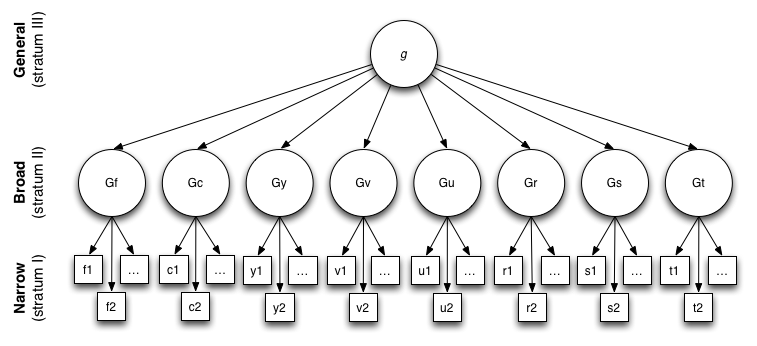

# Human Intelligence: A Psychological Perspective

> *Before we ask whether machines are intelligent, we must ask what intelligence means for humans.*

## General thoughts

- **The difficulty of definition**
  
  Despite its central role, intelligence is notoriously hard to define.
  It is commonly described through abilities such as:
  - abstraction,
  - learning,
  - reasoning,
  - planning,
  - problem solving.

  No single definition captures all aspects,
  and different psychological traditions emphasize different components.

---

- **Everyday experience and consensus**
  
  Although difficult to define formally,
  everyday experience suggests that intelligence is a meaningful concept.

  People tend to agree, at least approximately,
  on relative judgments of intelligence:
  there is a broad, though imperfect,
  consensus about who is “more” or “less” intelligent.

  This pragmatic agreement motivates attempts
  to measure intelligence quantitatively.

---

- **Psychometric intelligence and IQ**
  
  In psychology, intelligence is often operationalized
  through *psychometric IQ*:
  the result of standardized intelligence tests.

  IQ tests do not claim to measure intelligence directly,
  but rather performance on a carefully designed set of tasks
  assumed to reflect underlying cognitive abilities.

---

- **Correlation with life outcomes**
  
  Empirical studies show that IQ scores
  correlate with various life outcomes,
  including:
  - academic performance,
  - certain aspects of professional success,
  - problem-solving ability.

  These correlations are strongest at the lower end of the IQ scale:
  very low IQ significantly constrains
  educational and occupational opportunities.

  (See, for example, discussions in
  Mérő László: *Az érzelmek logikája*.)

---

- **Spearman’s Law of Diminishing Returns (SLODR)**
  
  The explanatory power of general intelligence decreases
  as overall ability increases.

  At low cognitive levels, performance across tasks
  is dominated by a single general factor (*g*).
  At higher levels, task-specific abilities,
  motivation, and context play a larger role.

  Above a certain threshold,
  increases in IQ yield diminishing returns:
  higher intelligence alone does not guarantee
  greater success, happiness, or social effectiveness.

  Other factors become dominant, such as:
  - motivation,
  - emotional intelligence,
  - creativity,
  - perseverance,
  - social skills,
  - opportunity and environment.

  Intelligence is therefore best understood
  as a *necessary but not sufficient* condition
  for success in complex human contexts.

---
---

- **Intelligence as a non-monolithic construct**

  A central insight of modern psychology is that **human intelligence is not a single, unified faculty**.
  Instead, it consists of multiple, partially independent components,
  which may develop at different rates and manifest differently across individuals.

  This perspective challenges the idea that intelligence can be fully captured
  by a single numerical score.

## Piaget's works

> *Intelligence is not a fixed quantity, but a developing structure*

  Rather than treating intelligence as a static trait,
  Piaget studied **how cognitive structures emerge and transform during childhood**.
  A key methodological insight of this work is the analysis of *systematic errors*:
  characteristic mistakes made by children at different ages,
  revealing the structure of their current mode of thinking.

---

- **Sensorimotor stage (0–2 years)**

  In the sensorimotor stage, intelligence is grounded in direct sensory experience
  and physical interaction with the environment.

  A central achievement of this stage is the acquisition of **object permanence**:
  the understanding that objects continue to exist even when they are not perceived.

  Typical errors include:
  - assuming that what is not visible does not exist,
  - searching for an object where it was previously found,
    rather than where it was last moved.

---

- **Pre-operational stage (2–7 years)**

  During the pre-operational stage, children begin to use **symbols and language**
  to represent the world and to ask explanatory questions such as “why”.

  However, thinking at this stage is still limited by:
  - egocentrism (difficulty understanding that others may perceive differently),
  - centration (focusing on a single salient feature),
  - confusion between appearance and reality  
    (e.g. assuming that a change in shape implies a change in quantity).

---

- **Concrete operational stage (7–11 years)**

  In the concrete operational stage, children acquire the ability
  to perform **logical operations** on concrete objects and situations.

  They become capable of:
  - conservation of quantity,
  - considering multiple relevant properties simultaneously,
  - understanding that different observers may hold different perspectives.

  At the same time, thinking remains tied to concrete contexts;
  purely abstract or hypothetical reasoning is still difficult.

---

- **Formal operational stage (11–16 years)**

  The formal operational stage marks the emergence of **abstract, hypothetical,
  and formal reasoning**.

  Adolescents become capable of:
  - reasoning about possibilities rather than only actualities,
  - constructing and testing abstract hypotheses,
  - using formal logical principles independent of concrete content.

  Characteristic limitations of this stage may include:
  - prioritizing abstract principles over practical constraints,
  - idealism and overgeneralization,
  - gaps or inconsistencies in abstract argumentation.

---

- **Implications for the concept of intelligence**

  Piaget’s theory reinforces the view that intelligence is **structured, staged,
  and context-dependent**.

  Intelligent behavior cannot be reduced to performance on isolated tasks,
  but must be understood in relation to developmental stage,
  available cognitive tools, and the structure of the environment in which reasoning occurs.

---

## Gardner’s theory of multiple intelligences

> *Building on the idea that intelligence is not monolithic, Gardner proposed the theory of multiple intelligences*

  Gardner challenged the dominant psychometric view,
  arguing that a single general intelligence factor (*g*)
  cannot adequately explain the diversity of human cognitive abilities.

- **Core idea**

  According to Gardner, intelligence should be defined as:

  > the ability to solve problems or create products that are valued in one or more cultural contexts.

  This definition shifts the focus:
  - from abstract test performance  
  - to *functional competence* in real-world settings.

  Intelligence, in this view, is inherently **contextual and plural**.

---

- **The main types of intelligence**

  Gardner originally identified several relatively independent intelligences, including:

  - **Linguistic intelligence**  
    Sensitivity to language, meaning, and verbal expression.

  - **Logical–mathematical intelligence**  
    Capacity for formal reasoning, abstraction, and numerical problem solving.

  - **Spatial intelligence**  
    Ability to perceive, manipulate, and reason about spatial relations.

  - **Musical intelligence**  
    Sensitivity to rhythm, pitch, timbre, and musical structure.

  - **Bodily–kinesthetic intelligence**  
    Skillful control of body movements and physical interaction with the environment.

  - **Interpersonal intelligence**  
    Ability to understand, interpret, and respond to the emotions and intentions of others.

  - **Intrapersonal intelligence**  
    Capacity for self-awareness, introspection, and regulation of one’s own mental states.

  Later discussions also included **naturalistic intelligence**,
  related to the recognition and classification of patterns in nature.

---

- **Independence and interaction**

  A key claim of the theory is that these intelligences are **partially independent**:
  strong performance in one domain does not guarantee strength in others.

  At the same time, real-world activities typically require **coordination**
  among multiple intelligences.
  For example, scientific work may combine logical–mathematical,
  linguistic, and intrapersonal components.

---

- **Relation to IQ testing**

  From Gardner’s perspective, traditional IQ tests primarily assess:
  - linguistic intelligence,
  - logical–mathematical intelligence.

  As a consequence, many forms of human competence—
  such as social insight, musical creativity, or bodily skill—
  are systematically underrepresented or ignored.

  IQ is therefore not rejected as meaningless,
  but reinterpreted as a **narrow measure of specific cognitive abilities**,
  rather than a comprehensive index of intelligence.

---

- **Educational implications**

  Gardner’s theory had a major impact on educational thinking.
  It suggests that:
  - learners may excel through different cognitive pathways,
  - effective teaching should employ multiple representational forms,
  - failure in traditional academic settings does not imply low intelligence per se.

  This view supports a more differentiated and inclusive understanding
  of cognitive potential.

---

- **Critiques and status**

  While widely influential, the theory of multiple intelligences
  remains controversial in empirical psychology.

  Critics argue that:
  - some proposed intelligences resemble talents or personality traits,
  - clear psychometric separation between intelligences is difficult to demonstrate.

  Nevertheless, the theory plays a crucial conceptual role:
  it reinforces the idea that **human intelligence is structured, diverse,
  and not exhaustively captured by a single numerical score**.

---

- **Conceptual relevance**

  In the broader context of intelligence research,
  Gardner’s work complements developmental and computational perspectives.
  It emphasizes *what intelligence is for*,
  rather than how well it can be ranked along a single axis.

# References

- Gardner, H. (1983).  
*Frames of Mind: The Theory of Multiple Intelligences*.  
New York: Basic Books.

- Gardner, H. (1987).  
*Multiple Intelligences: The Theory in Practice*.  
New York: Basic Books.

- Gardner, H. (1995).  
Reflections on Multiple Intelligences: Myths and Messages.  
*Phi Delta Kappan*, 77(3), 200–209.

- Gardner, H. (1999).  
*Intelligence Reframed: Multiple Intelligences for the 21st Century*.  
New York: Basic Books.

- Gardner, H. (2006).  
*Multiple Intelligences: New Horizons*.  
New York: Basic Books.

---

- **The Cattell–Horn–Carroll (CHC) theory of intelligence**

> *A widely influential integrative framework in contemporary psychometrics, synthesizing decades of factor-analytic research
  into a hierarchical model of cognitive abilities.*

- **A three-stratum structure**

  The defining feature of the CHC model is its **three-stratum hierarchy**:

  - **Stratum I – Narrow abilities**  
    Highly specific cognitive skills measured by individual test items
    (e.g. particular memory tasks, visual discriminations, arithmetic operations).

  - **Stratum II – Broad abilities**  
    General cognitive domains that organize and explain correlations
    among narrow abilities.

  - **Stratum III – General intelligence**  
    A single, overarching factor (*g*),
    capturing the shared variance across all broad abilities.

  This structure preserves the empirical success of general intelligence
  while explicitly recognizing the internal differentiation of cognition.

---

- **Broad abilities (Stratum II)**

  The core explanatory level of the CHC theory lies in **broad abilities**,
  which represent major functional components of human intelligence:

  - **Comprehension–Knowledge (Gc)**  
    The ability to use acquired knowledge for communication, reasoning,
    and understanding of culturally transmitted information.
    Strongly associated with language, education, and expertise.

  - **Fluid Reasoning (Gf)**  
    Capacity for reasoning, abstraction, and concept formation
    in novel situations where prior knowledge is insufficient.

  - **Quantitative Knowledge (Gq)**  
    Understanding of numerical concepts, quantities, and mathematical relations,
    shaped by both schooling and practice.

  - **Reading and Writing Ability (Grw)**  
    Skills related to decoding, comprehension, and production of written language.

  - **Short-Term Memory (Gsm)**  
    Ability to maintain and manipulate information
    over a time span of a few seconds.

  - **Long-Term Storage and Retrieval (Glr)**  
    Capacity for storing information in long-term memory
    and retrieving it efficiently, including associative fluency and creativity.

  - **Visual Processing (Gv)**  
    Ability to perceive, analyze, and mentally manipulate visual information,
    such as spatial relations and patterns.

  - **Auditory Processing (Ga)**  
    Sensitivity to auditory information, including speech perception,
    phonological processing, and sound discrimination.

  - **Processing Speed (Gs)**  
    Efficiency in performing automatic or well-learned cognitive tasks,
    particularly under time pressure,
    typically on a scale of several minutes.

  - **Decision / Reaction Time / Speed (Gt)**  
    Speed of making simple decisions or responses,
    operating on sub-second time scales.

---

- **Relation to psychometric testing**

  The CHC framework underlies many modern standardized intelligence tests.
  Individual subtests are designed to measure **narrow abilities**,
  which aggregate into **broad ability scores**,
  and ultimately contribute to an estimate of **general intelligence**.

  In this sense, CHC provides a principled explanation
  for why IQ tests can yield both:
  - a meaningful overall score, and
  - informative cognitive profiles.

---

- **Conceptual position**

  Compared to other theories of intelligence:

  - CHC retains a **general intelligence factor**, unlike Gardner’s theory,
    but embeds it within a richly structured cognitive architecture.
  - Unlike Piaget’s theory, CHC is not developmental in nature,
    but focuses on the *organization* of abilities in mature cognition.
  - In contrast to formal definitions such as Legg–Hutter intelligence,
    CHC is explicitly grounded in psychometric measurement and human testing.

  As such, the CHC theory serves as a **bridge**
  between empirical testing, cognitive structure,
  and theoretical models of intelligence.

---

- **Interpretative value**

  The CHC model supports the view that intelligence is:
  - hierarchical rather than flat,
  - differentiated rather than monolithic,
  - yet unified at a higher level of abstraction.

  This makes it particularly suitable
  for connecting psychological theories of intelligence
  with modern computational and AI-inspired perspectives.

## Kahneman and his System I and System II

> *Kahneman distinguishes between two fundamentally different
  modes of thinking. These are not separate brain regions,
  but descriptive labels for characteristic cognitive processes.*

- **System I: fast, intuitive thinking**

  **System I** is:
  - fast and automatic,
  - intuitive and heuristic-based,
  - largely unconscious,
  - effortless in terms of mental energy.

  It is responsible for:
  - rapid judgments,
  - pattern recognition,
  - emotional reactions,
  - so-called *gut feelings*.

  System I enables efficient functioning in everyday situations,
  but it is inherently **error-prone**,
  especially in complex or unfamiliar contexts.

  Many routine activities rely predominantly on System I,
  such as:
  - driving a car after sufficient practice,
  - riding a bicycle,
  - walking at a habitual pace.

---

- **System II: slow, deliberative thinking**

  **System II** is:
  - slow and effortful,
  - conscious and intentional,
  - capable of abstract and logical reasoning,
  - associated with self-control and critical evaluation.

  This system is engaged in:
  - explicit problem solving,
  - mathematical reasoning,
  - careful decision making,
  - consistency checking and error correction.

  System II requires significantly more mental energy
  and attentional resources,
  and is therefore used sparingly.

---

- **Interaction between the systems**

  In normal cognition, System I continuously generates impressions,
  intuitions, and tentative judgments,
  while System II may monitor, endorse, modify, or override them.

  However, System II is often *lazy*:
  it tends to accept System I outputs
  unless there is a clear reason to intervene.
  As a result, many judgments are effectively made by System I,
  even when they concern complex or high-stakes decisions.

---

- **Characteristic errors of System I**

  The reliance on heuristics makes System I vulnerable
  to systematic cognitive biases, including:

  - **Anchoring**  
    Judgments are unduly influenced by an initial value or reference point  
    (e.g. estimating a quantity after being exposed to an arbitrary number).

  - **Availability heuristic**  
    Events that are easier to recall are perceived as more important or probable,
    a mechanism often exploited in propaganda and media framing.

  - **Conjunction fallacy**  
    The tendency to judge a specific conjunction of events
    as more probable than a single general event
    (e.g. the classic “Linda problem”).

  - **Optimism bias**  
    Systematic underestimation of negative outcomes
    and overestimation of positive ones.

  - **Framing effects**  
    Preferences change depending on whether outcomes
    are presented in terms of gains or losses
    (e.g. “99% survival” versus “1% mortality”).

  - **Sunk cost fallacy**  
    Continuing an endeavor because of past investments,
    even when future costs outweigh expected benefits.

  - **Overconfidence**  
    Excessive trust in one’s own judgments and abilities,
    often leading to underestimated risks.

---

- **Economic decision making**

  Kahneman’s framework has profound implications
  for economic and financial behavior.
  Contrary to classical rational-agent models,
  real-world economic decisions are often dominated by **System I processes**.

  This insight aligns with observations in behavioral economics
  and risk theory, including those discussed by  
  :contentReference[oaicite:2]{index=2},
  particularly in relation to rare, high-impact events
  (*Black Swan* phenomena).

---

- **Conceptual position**

  Within the broader landscape of intelligence theories:

  - System I and System II describe **modes of operation**,
    not abilities or developmental stages.
  - They complement the CHC framework
    by characterizing *how* cognitive resources are deployed,
    rather than *what* abilities exist.
  - They bridge psychological theory and real-world behavior,
    highlighting why intelligent agents may nonetheless act irrationally.

  The dual-process model thus provides a crucial link
  between cognitive structure, decision making,
  and observed limitations of human rationality.
