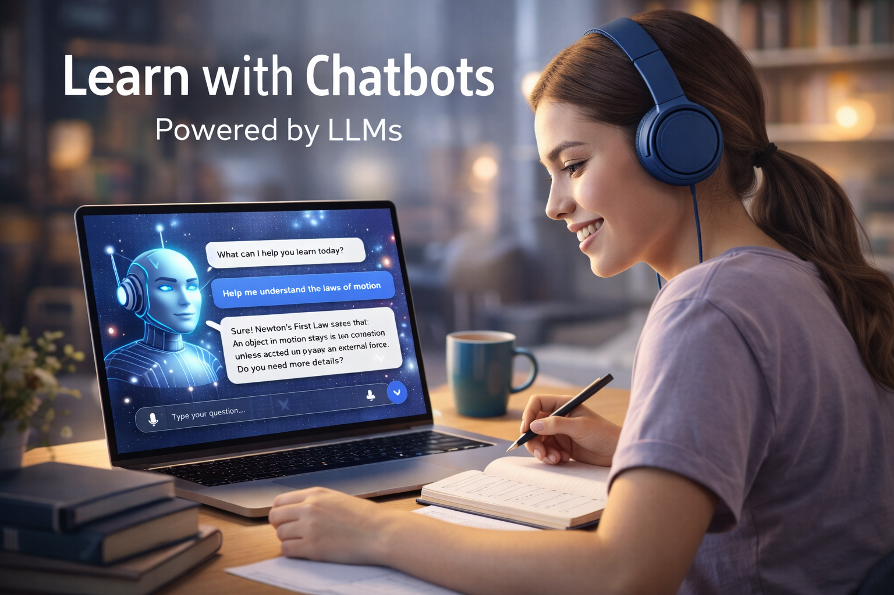

- **Learning in the AI era**
    > In the emerging AI era, it is no longer obvious how teaching and learning should be organized most effectively.
    - **traditional learning materials**
        - __contact lectures__
        - __exercises__
        - __books__
    - **modern learning materials**
        - videos, __podcasts__
        - __learning with chatbots__ (LLMs)
    - **learning dimensions**
        - hard __skills__ vs. soft __skills__
        - __structured vs. exploratory learning__
        - __facts vs. connections__
    - **knowledge graphs**
        - __knowledge graphs__
        - organizing knowledge beyond linear narratives
    - **proposal of this course**
        - __proposal of this course__
        - a hybrid, graph-based learning approach 
[modern learning](https://www.teachthought.com/the-future-of-learning-posts/principles-modern-learning/)

- **Learning from books and podcasts**
    - **pros**
        - self-paced, adaptable consumption
        - rewindable and revisitable
        - typically well structured
    - **cons**
        - information density can be too low (sometimes too high)
        - no direct possibility to ask follow-up questions

- **Contact lectures**
    > the traditional way of transferring knowledge; the goal is to acquire understanding through explanation
    - **pros**
        - usually well structured
        - the lecturer can answer questions (in principle)
    - **cons**
        - large amount (often overwhelming) of information in a short time
        - fixed pace, difficult to adapt to individual needs
        - missing a lecture makes catching up hard
        - often academically focused information
        - evaluation can be tedious (tests vs. oral exams)

- **Exercises**
    > high-school-like teaching practice; the goal is to gain knowledge through practice
    - **pros**
        - aim at usable knowledge and improved application skills
    - **cons**
        - assume prior understanding of basic concepts (little time for deeper explanation)
        - often simplified, artificial problems
        - limited exposure to real-life complexity
        - time-consuming and repetitive

- **Learning with chatbots (LLMs)**
    > a characteristic opportunity of the AI era
    - **pros**
        - access to an enormous body of knowledge 
        - provide on-demand explanations at varying levels of difficulty
        - act as personalized tutors adapting to a learner’s pace and background
        - support language learning, writing, and code comprehension
        - assist teachers in preparing materials, exercises, and feedback

    - **cons**
        - LLMs do not know what they do not know (may hallucinate)
        - LLMs do not know what they know (knowledge is not inherently structured)
        - answers can drift without clear guidance or goals
        - students may outsource thinking rather than develop it
        - overreliance can weaken problem-solving and writing skills
        - generated answers may be fluent but incorrect
        - assessment and academic integrity become harder to enforce.

    - **AI Tutor vs Traditional Active Learning** 
        - paper: [Nature](https://www.nature.com/articles/s41598-025-97652-6)
        - randomized controlled experiment comparing wtudents learning with an AI-powered tutor and (control group) students in in-class active learning
        - Students using the AI tutor learned significantly more in less time than those in the traditional active learning group.
        - AI-tutored students had higher post-test scores relative to pre-test baselines.
        - The effect sizes were large enough to show statistically meaningful learning gains with AI assistance.
    
    - **Generative AI Usage and Exam Performance**
        - paper in arXiV [General Economics](https://arxiv.org/abs/2404.19699)
        - Students who used generative AI tools such as ChatGPT scored on average lower on exam performance than non-users.
        - The negative correlation was particularly evident for students with higher learning potential, suggesting that reliance on AI could hinder deeper understanding and retention

    - **AI Meets the Classroom: When Do Large Language Models Harm Learning?**
        - paper in arXiV [Computers and Society](https://arxiv.org/abs/2409.09047)
        - AI access alone does not guarantee learning; how students use it matters
        - Students who used LLMs as direct problem-solvers without engaging with material had poorer learning outcomes.
        - Those who conversed with the model for explanations often benefited — but excessive reliance diminished actual learning.

- **Skills**
    - **hard skills**
        - well-defined, precise knowledge
        - mostly predictive
        - systematically learnable
        - typical domain: science and engineering

    - **soft skills**
        - context-dependent, non-unique solutions
        - not fully predictive
        - only partially teachable
        - require experience and reflection

- **Structured vs. exploratory learning**
    - **structured learning**
        - provides stability, terminology, and shared reference points  
        - *what should I learn next?*
    - **exploratory learning**
        -  enables adaptation, transfer, and deeper understanding  
        - *why does this matter here?*
    - AI tools support exploration; knowledge graphs provide structure

- **Facts vs. connections**
    - facts are abundant and easily accessible via AI
    - connections must be constructed by the learner
    - knowledge graphs externalize and support this process

- **Knowledge graphs**
    - knowledge is partially hierarchical but not strictly linear
    - concepts are connected across contexts and depths
    - emphasis on relations rather than isolated facts
    - support navigation, revisiting, and recombination of ideas

- **proposal of this course**
    - **bits of knowledge**
        - short, focused descriptions of narrow topics
    - **links**
        - explicit connections between concepts
        - form a knowledge graph rather than a linear syllabus
    - **usage**
        - during lectures: explore and circle around a topic
        - offline: identify relevant nodes and ask LLMs targeted questions
        - exploration: use core material to dig deeper
        - feedback: clarify unclear points with human experts
    > feedback of all kinds is very welcome!

