# Optimization methods

- **linear regression**:
    - data: sample data with $C\sim\mathbb R^N$, $\mathcal C\sim\mathbb R^M$
    - basis functions: $g_\alpha:C\to\mathcal C$ for $\alpha=1,\dots,N_{basis}$
    - data model: $\mathcal M(x; q) = \sum_\alpha q_\alpha g_\alpha(x_a)$
    - matrix notation: $X_{a\alpha} = g_\alpha(x_a)$
    - loss: Gaussian loss $$L(q) = \sum_{a=1}^{N_{data}} \dfrac{|\mathcal M(x_a; q)-y_a|^2} {\sigma_a^2} = (X\cdot q-y)^T C^{-1}(X\cdot q-y),$$ where $\sigma_a$ weights the importance of the given data and $C={\text{diag}}(\sigma^2)$.
    - parameter distribution $$L(q) = (q-\mu_q)^T C_q^{-1}(q-\mu_q)$$ Gaussian with  $$\begin{align}
     & C_q = (X^T C^{-1}X)^{-1}\\
     & \mu_q = (X^T C^{-1}X)^{-1}X^T C^{-1}y.\\
    \end{align}$$
    - optimal value of the parameter $q=\mu_q$
    - distribution of the variables in the target space, in vector notation $y = q\cdot g(x)$, thus it is also Gaussian with $$ \mu_y=\mu_q\cdot g(x),\quad C_y = g^T(x) C_q g(x) $$
    - examples:
        - line fitting
        - role of the weights
        - approximation of a random function
    - failure modes:
        - accuracy drop
        - overfitting
        - extrapolation
    - improvements:
        - pseudoinverse
        - regulators (LASSO, L2, MEM)

- **line fitting**
    - linear regression with $M=1$ (one dimensional output) and $g_0=1,\;g_1=x$
    - introduce notation: $\langle u\rangle = \dfrac{\sum_n u_n/\sigma_n^2}{\sum_n 1/\sigma_n^2}$ and $\dfrac1{\sigma^2} = \sum_n\dfrac1{\sigma_n^2}$
    - better representation: $\xi = x-\langle x\rangle, \eta = y-\langle y\rangle \Rightarrow \xi = a\eta +b$
    - from the general formula $$C_q^{-1} = X^T C^{-1} X =  \dfrac 1{\sigma^2}\left( \begin{matrix}1 & 0 \cr 0 & \langle \xi\xi\rangle\cr \end{matrix}\right),\quad X^TC^{-1}y = \dfrac 1{\sigma^2}\left( \begin{matrix}\langle \xi\eta \rangle \cr \langle \eta\eta\rangle \cr\end{matrix}\right)$$
    - relevant parameters:
        - $a_* = {\langle \xi\xi\rangle}^{-1}{\langle \eta\eta\rangle},\; b_* = \langle \xi\eta\rangle,\; C_y = \sigma^2(1 + \xi{\langle \xi\xi\rangle}^{-1}\xi)$
    - example:
        
        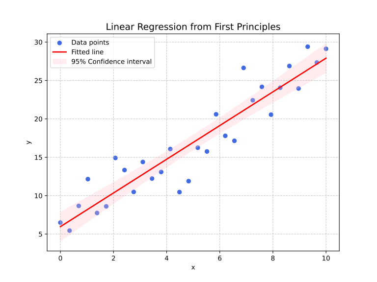

- **role of weights**
    - consider line fitting for uniform and variable weights
    
    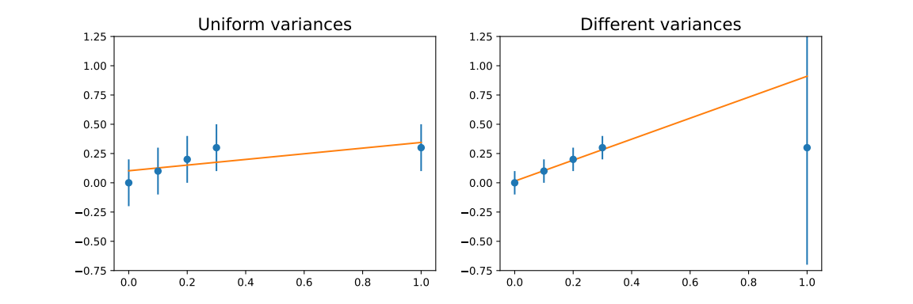

- **approximation of a random function**:
    - create random function, e.g. with recursion 
    - choose a functional basis, for example $g_\alpha(t)=(\sin \alpha t, \cos\alpha t)$
    - use fit formulae from linear regression
    - observe accuracy drop
    - apply regulator, with pseudoinverse

    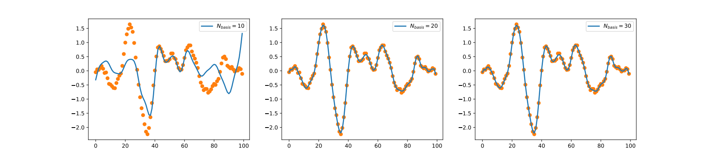
    
    - coefficients with different regulator

    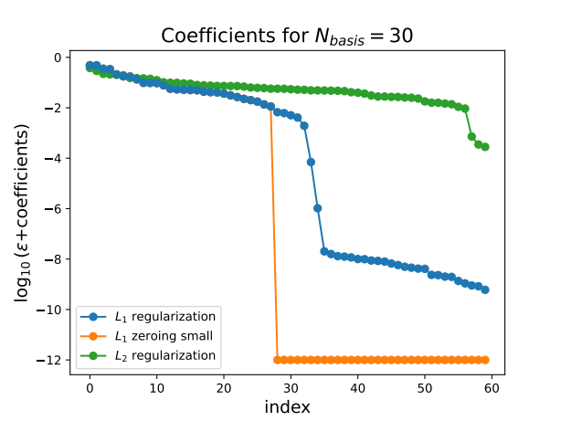

- **create a random function**:
    - with recursion: $x_{n+1} = K(2x_n-x_{n-1}+\sigma\xi)$ with $\xi$ uniform normal random variable. With $K=0.9, \sigma=0.1$ 
    
        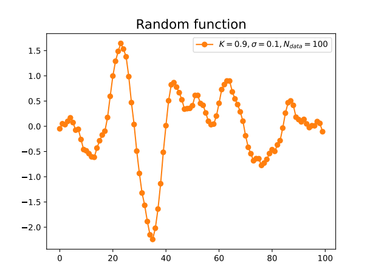

- **accuracy drop**:
    - symptom: while increasing the number of basis elements, accuracy drops 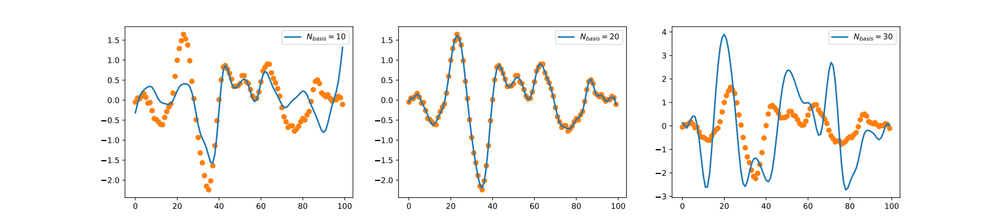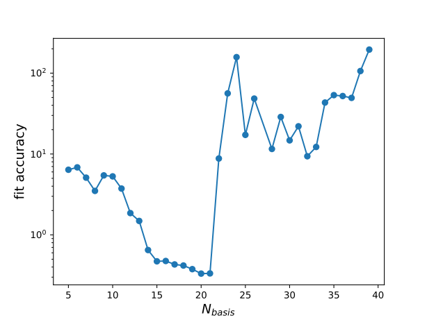
    - reason: ill-conditioned matrix in the solution
    - solution:
        - pseudoinverse
        - regulators

- **ill-conditioned matrix**
    - symptom: matrix inverse is numerically inaccurate
    - reason: 
        - near zero modes (flat direction) of the linear coefficient matrix
        - formally $A\cdot v_{min}=\lambda_{min} v_{min}$ for $\lambda_{min}$ (relatively) small
    - explanation
        - if the exact solution is $A\cdot x=y$, then $$A\cdot(x + cv_{min}) = y + c\lambda_{min} v_{min}.$$
        - for $c\lambda_{min}<\varepsilon$, where $\varepsilon$ is the numerical resolution, the difference is not observable.
    - example: numerical precision $\varepsilon =10^{-16}$, smallest eigenvalue $\lambda_{min}\sim 10^{-16}$, then solution is uncertain $x+cv_{min}$ with $|c|\sim1$.

- **pseudoinverse**
    - works for positive definite hermitian matrices
    - formula $\text{pinv}(A) = V \text{reg-inv}(\Lambda)V^{-1}$
        - $AV=V\Lambda$ is the eigenequation
        - $\text{reg-inv}(\Lambda) = \text{diag}\left(\Theta(\lambda_i>\varepsilon\lambda_{max}) \dfrac1{\lambda_i}\right)$, we keep only those eigenvalues that are larger than $\varepsilon$ times the largest eigenvalue
    - background: 
        - for small eigenvalue $\lambda_{small}$ the result of $Ax=y$ can be modified by $x\to x+cv_{small}$
        - seek $c$ where the length of the result is smallest $\Rightarrow c=0$
        - results in leaving out the contribution of $v_{small}$

- **regulators**
    - problem: minimum of the loss function is numerically problematic
    - solution: modify the loss by adding a regulator function of the parameter with some coefficient: $$L_{reg}(q) = L(q) + \lambda_{reg} R(q)$$
        - $\lambda_{reg}=0$ falls back to unregulated case
        - $\lambda_{reg}\to\infty$ regulator dominates
        - optimal $\lambda_{reg}$ does not spoil accuracy too much
    - result: resolves (nearly) flat directions in $q$s, makes solution unique
    - types: LASSO, L2, MEM

- **LASSO**:
    - L1 regulator: $R(q) = \sum_q|q|$
    - prefers $q=0$
    - prefers the possibly most number of small parameters (for at least quadratic losses) $\to$ approximation of a random function
    - reason: for 2d: $(q^2-1)^2 + \lambda_{reg}(|q_1|+|q_2|)$ has a minimum at $q=(\pm 1,0)$ or $q=(0,\pm1)$

    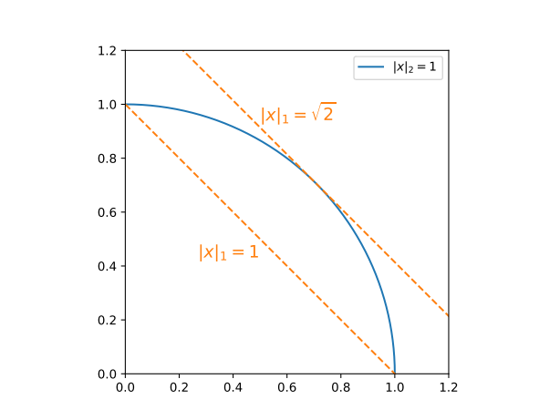

- **L2 regulator**
    - uses $R(q) = \sum_q q^2$ quadratic distance
    - prefers $q=0$
    - in linear regression exactly solvable $$q = (X^T C^{-1}X+\lambda_{reg})^{-1}X^T C^{-1}y$$

- **interpolation**
    - sample pairs are given inside a volume (interval) $D$
    - fit a function on $D$
    - predict values at $x\in D$ $\to$ interpolation 
    - danger: overfitting, learn the noise as data
    - solution: regularization

- **high order polynomial fit**
    - data in a domain
    - fit high order polynomial
    - interpolation: 
        - symptom: can produce large amplitudes, not smooth
        - problem: overfitting
        - example: original model $y=1-x^2+\text{noise}$, fit for $N_{data}=11$ a 10th order polynomial, or regularize with L2
    
        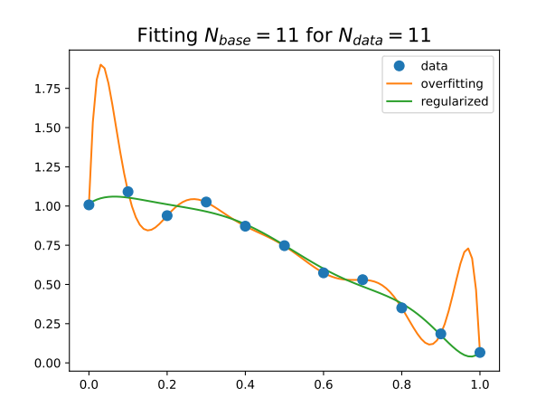
    - extrapolation:
        - symptom: good interpolation, but outside the data domain function value grows large
        - problem: bad asymptotic behaviour of polynomials
        - solution: control asymptotic behaviour
        - example: original model $y=1-x^2+\text{noise}$, fit different order polynomials with L2 regularization
        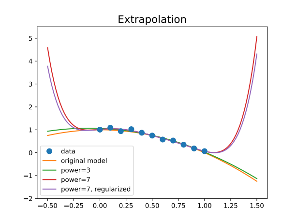

- **gradient descent**
    - recursive process to find minimum of $f(x)$
    - recursion: start from an appropriate $x_0$, and perform recursion $$x_{n+1} = x_n - r\nabla f,$$ where $r$ is the step size (learning rate)
    - stop if $|\nabla f|$ is small, or $r$ is small (if it is changed)
    - proof: $f(x_{n+1})= f(x_n- r\nabla f) = f(x_n)-r|\nabla f|^2 +\text{higher order terms}$
        - as long as linear approximation applies, the value decreases
    - advantages:
        - simple
        - robust
        - scalable
    - disadvantages:
        - local minima
        - nearly flat directions
    - improvements:
        - momentum (Nesteron momentum, ADAM)
        - change learning rate
        - conjugate gradient method
        - second-order methods

- **change learning rate**
    - use a recursion with $x_{n+1}=x_n + r\delta x_n$ to find minimum of $f(x)$, $r$ is learning rate
    - systematic change: $r\to \alpha r$ where $\alpha<1$
    - adaptive change:
        - if $f_{n+1}<f_n: \; r\to \alpha_{grow}r$, $\alpha_{grow}>1$, for example 1.2
        - if $f_{n+1}>f_n: \; r\to \alpha_{decr}r$, $\alpha_{decr}<1$, for example 0.5
    - propose stopping recursion if $r<r_{min}$
    - example: $f(x,y) =(x-2)^2+(y+1)^2 + \sin 3x \sin 3y$, use adaptive step size

    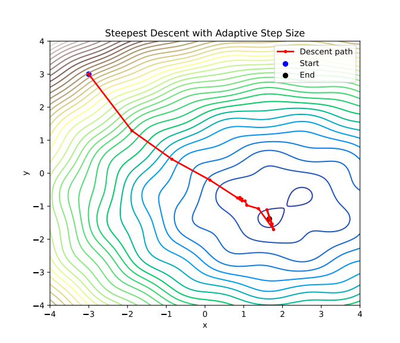

- **random algorithms**
    - find minimum of $f(x)$ using a path in the domain based on random elements
    - methods:
        - coordinate descend
        - simulated annealing
    - advantages:
        - no gradient is needed
        - can escape local minima
        - parallelizable
    - drawbacks:
        - slow convergence
        - difficult to use in batch methods $\Rightarrow$ rarely used in DNNs
    - example: $f(x,y) =(x-2)^2+(y+1)^2 + \sin 3x \sin 3y$, simulated annealing with $\alpha_{cooling}=0.98$:
    
    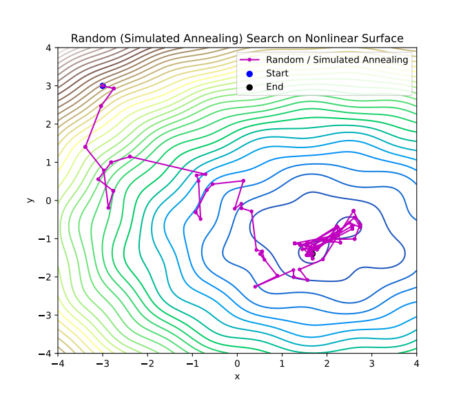

- **coordinate descend**
    - minimize function in a random direction (line search): $$x_{n+1} = \arg\min_t f(x_n+td_n),$$ where $d_n$ is a random direction
    - optionally: only make one step towards the minimum

- **simulated annealing**
    - create an ensemble according to probability distribution $P(x)\sim e^{-\beta f(x)}$ $\to$ e.g. Metropolis algorithm
    - $\beta=1/T$ is the inverse "temperature"
        - high temperature: minimum is blurred
        - low temperature: distribution concentrated around global minimum
    - decrease temperature (annealing) to get into a minimum: $T\to \alpha_{cooling}T$ (e.g. $\alpha_{cooling}=0.98$)
    - reheat + repeat annealing for exploring minima

- **Metropolis algorithm**
    - goal: produce an ensemble with probability distribution $P(x)\sim e^{-\beta f(x)}$
    - goal: generate a Markov process $x_n\to x_{n+1}$, the values will have the desired distribution
    - algorithm:
        - propose step $x_{n+1}=x_n+v$ where $v$ is a random vector
        - compute the change in the function $\Delta f=f(x_{n+1})-f(x-n)$
        - accept step with probability $p_{accept}=\min(1, e^{-\beta\Delta f})$
            - if $\Delta f<0$ surely accept
            - if $\Delta f>0$ may accept
    - termalization: distribution becomes stable after the first $n_{therm}$ step.

- **conjugate gradient descent method**
    - planned to effectively minimize a quadratic function $$f = x^TA x - b^T x + f_0,$$ where $x\in\mathbb R^N$ and $A$ is positive definite
    - gradient descend slow, if there are nearly flat directions (valleys)
    - idea:
        - recursion $x_k$
        - each step occurs in conjugate directions
        - converges in $N$ steps (if exact)
    - conjugate directions: $p$ and $q$ are called $A$-conjugate if $p^TAq=0$.
    - algorithm: uses auxiliary quantities $r$ (residual) and $p$ (conjugate directions)
        1. start with $x_0$, $r_0=b-Ax_0$, $p_0=r_0$
        1. step size: $\alpha_k = \dfrac{r_k^Tr_k}{p_k^TAp_k}$ (exact line minimization in direction $p_k$, using orthogonality)
        1. update position: $x_{k+1}=x_k+\alpha_k p_k$
        1. update residual: $r_{k+1}=b-Ax_{k+1} = r_k - \alpha_kAp_k$
        1. compute conjugacy coefficient: $\beta_k = \dfrac{r_{k+1}^Tr_{k+1}}{r_k^Tr_k}$
        1. update direction: $p_{k+1}=r_{k+1}+\beta_k p_k$
        1. **STOP** if $r_{k+1}<\varepsilon$ (in exact case after $N$ steps)
        1. **REPEAT** from 2.
    - theory:
        - $r_i^T r_j=0$ for $i\neq j$ orthogonal
        - $p_i^TAp_j=0$ for $i\neq j$: $A$-conjugate
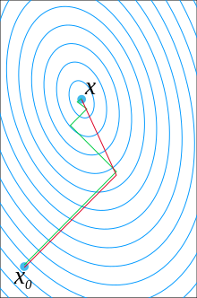

- **Newton-Raphson method**
    - minimize a function $f:\mathbb R^N\to\mathbb R$
    - use quadratic approximation $$f(x+p) = f(x) + p\nabla f(x)+\frac12 p^TH(x) p+\dots,$$ where $H(x)$ is the Hessian $H(x)=\nabla^2f(x)$.
    - for exact quadratic form $p=-H(x)^{-1}\nabla f(x)$
    - recursion: $x_{k+1} = x_k - \alpha_kH(x_k)^{-1}\nabla f(x_k)$
        - $\alpha_k\le1$ is the damping factor for numerical stability
    - advantage: fast convergence
    - disadvantage: needs second derivative

- **high dimensional optimization**
    - problems in high dimensional spaces: lot of critical points, where
        - saddle points (minimum in some direction, maximum in others)
        - flat regions with mixed curvature
        - wide valleys with many equivalent solutions
    - solution:
        - locally optimal direction $p(x)$ (e.g. $p(x)=-\nabla f(x)$ in gradient descend)
        - actual update $x_{k+1}=x_k+v_k$, not exactly toward the optimal direction
    - methods to find the actual direction
        - stochastic gradient: $v(x)=rp(x) + \xi$ with some noise
        - momentum methods

- **momentum methods**
    - locally optimal direction $p(x)$, actual direction $v_k$ recursively determined
    - classical momentum (Polyak): $v_{k+1} = \beta v_k + \eta p(x_k)$
        - slowly takes over new direction
        - effective in narrow valleys
    - Nesterov accelerated gradient (NAG):  $v_{k+1} = \beta v_k + \eta p(x_k+\beta v_k)$
        - anticipates future direction
    - ADAM: adaptive step size
        - most widely used
        - algorithm updates step size as well
    $$ 
    \begin{align*}
     & v_{k+1} = \beta_1 v_k + (1-\beta_1) p(x_k)\\
     & m_{k+1} = \beta_2 m_k + (1-\beta_2) p^2(x_k)\\
     & x_{k+1} = x_k + \eta \dfrac{v_k}{\sqrt{m_k}+\varepsilon}\\
    \end{align*}
    $$

