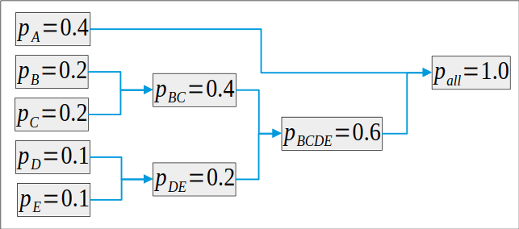
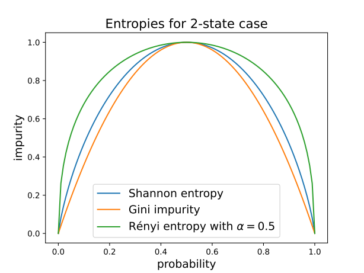

- **Probability and information theory basics**
    - **events**: $\Omega$ set
    - **ensemble**: __estimation of time series__
    - **random variable**
        - $\Omega\to V$ function, where $V$ is a vector space
        - __probability of a random variable__
    - **practical distributions**
        - __binomial distribution__
        - __Poisson distribution__
        - __Gaussian distribution__
        - __chi-squared distribution__
        - __gamma distribution__
    - **other concepts**
        - __marginal probability__
    - **information theory**: __information theory__

- **estimation of time series**
    > if we do not have enough information, the dynamics is replaced by statistical correlations
    - **event space**: the range of the time series $\Rightarrow \omega_n,\;n=1,\dots,N_{data}$
    - **problem**
        - we can not/want not predict the exact series
        - best is to give only statistical information
        - time average is replaced by ensemble average
    - **ensemble and probabilities**
        - discrete case: probability is the rate $\omega\in\Omega$ element occurs in the data $$P(\omega)=\frac1{N_{data}}\sum_{n=1}^{N_{data}} \mathbb I(\omega_n=\omega),$$ where $\mathbb I$ is the indicator function 
        - continuous case: probability is the rate elments from $\omega\in d\Omega(\omega)\subset \Omega$ occur in the data, where $d\Omega(\omega)$ is a small volume around $\omega$ $$P(\omega)=\frac1{N_{data}}\sum_{n=1}^{N_{data}} \mathbb I(\omega_n\in d\Omega(\omega)) = p(\omega)|d\Omega|,$$ 
        where $p(\omega)$ is called the probability density if $|d\Omega|\to0$.
        - technically we take the histogram
    - **expected value of a random variable**
        - formula $$\mathbb E_\omega(f(\omega)) = \frac1{N_{data}}\sum_{n=1}^{N_{data}} f(\omega_n) = \sum_{\omega\in\Omega} P(\omega)f(\omega)$$
        - **proof** $\sum_n f(\omega_n) = \sum_{n,\omega} f(\omega_n) \mathbb I(\omega=\omega_n) = \sum_\omega f(\omega)\sum_n \mathbb I(\omega=\omega_n)$

- **probability of a random variable**
    > how probable to observe a given value of a random variable?
    - **definition**: for $\xi$ random variable, the event space $\xi(\Omega)$ and the probability
    $$P_\xi(\xi_0) = \frac1{N_{data}}\sum_{n=1}^{N_{data}} \mathbb I(\xi(\omega_n)=\xi_0) = \mathbb E_\omega(\mathbb I(\xi(\omega)=\xi_0))$$
    - **expected values**: $\mathbb E_\xi(f(\xi)) = \mathbb E_\omega(f\circ \xi(\omega))$

- **marginal probability**
    > the probability distribution of a subset of variables obtained from a joint distribution by eliminating the remaining variables
    - **statement**: probability of a single component $$P(\xi) = \sum_\eta P(\xi,\eta)$$
    - **proof**: $P(\xi) = \frac1N\sum_n \mathbb I(\xi) = \frac1N\sum_n \sum_\eta \mathbb I(\xi,\eta)$

- **independence**
    > two random variable are independent if the valus of the one of them does not influence the values of the other
    - **definition**: a two components of a random variable are independent if $P(\xi_1,\xi_2) = P(\xi_1)P(\xi_2)$
    - **expected values**: factorize $\mathbb E(f(\xi_1)g(\xi_2))=\mathbb E(f(\xi_1))\mathbb E(g(\xi_2))$

- **Gaussian distribution**
    - **pdf**: $\text{pdf}(x) = \dfrac1{(2\pi)^{d/2}|C|^{1/2}}e^{-\frac{1}{2}\,(x-\mu)^{\mathsf T} C^{-1}(x-\mu)}$
    - **expected values**
        - $\mathbb{E}(y)=\mu$
        - $\mathbb{E}(\xi^{2n+1})=0$ for $n\in\mathbb{N}$
        - $\mathbb{E}(\xi_i\xi_j)=C_{ij}$
        - $\mathbb{E}(\xi_i\xi_j\xi_k\xi_\ell)=C_{ij}C_{k\ell} + C_{ik}C_{j\ell} + C_{i\ell}C_{jk}$
        - higher correlators from pairing

- **chi-squared distribution**
    - **definition**: $\chi^2 = \sum_{i=1}^d \xi_i^2$, where $\xi_i$ are i.i.d. normal random variables
    - **pdf**: $\text{pdf}(x) = \dfrac{1}{2^{d/2}\,\Gamma\!\left(\frac{d}{2}\right)} x^{\frac{d}{2}-1}e^{-x/2}$
    - **expected values**: $\mathbb{E}(\chi^2)=d$

- **binomial distribution**
    - **single event probability**: $p$, no-event probability is $q=1-p$
    - **probability of a series**: the probability that after $N$ trials we observe $k$ evens: $$P_N(k) = {N \choose k} p^k q^{N-k}$$
    - **sum rule**: $\sum_{k=0}^N P_N(k) =1$

- **Poisson distribution**
    > probability that $k$ independent event occurs during time $t$
    - **derivation**
        - probability of an event during time $dt$ is $p=\gamma dt$
        - interval $t$ is divided by $n$ parts: $dt=t/N$
        - probability that no event occurs until time $t$
        $$ P_t(0) = \lim_{N\to\infty}(1-p)^N = \lim_{N\to\infty}(1-\dfrac tN)^N = e^{-\gamma t}$$
        - recursion: last event occurs at $t' = i\,dt$ $$P_t(k) = \sum_{i=0}^N P_{t'}(k-1)\,\gamma dt\, P_{t-t'}(0)$$
        - in $N\to\infty$ limit integral equation
        $$P_t(k) = \int\limits_0^t\!\gamma dt\, P_{t'}(k-1) e^{-\gamma(t-t')}$$
        - solution: $$P_t(k) = \frac{(\gamma t)^k}{k!} e^{-\gamma t}$$
    - **remark**
        - $t=N\,dt$, we shall choose $k$ event out of $N$ $\Rightarrow$ binomial distribution
        - with __Stirling formula__ we arrive at the same reuslt
    - **sum rule**: $\sum_{k=0}^\infty P_t(k)=1$
    - **expected values**
        - $\mathbb E[k] = \gamma t$
        - $\mathbb E[(k-\gamma t)^2]=\gamma t$

- **gamma distribution**
    > probability denstiy for the $k$-th event occurs at time $t$
    - **notation**: $p_k(t)$
    - **derivation**
        - probability that $k-1$ event occurs during $t-dt$ and one event during $dt$ is $p_k(t)dt = P_t(k-1) \gamma dt$
    - **pdf**: $$p_k(t)=\gamma \frac{(\gamma t)^{k-1}}{(k-1)!}e^{-\gamma t}$$

- **information theory**
    > probability theory in case of lot of measurements both total and in each bin
    - **technique**: use probability theory results with __Stirling formula__ leading order
    - **concepts**
        - entropy (impurity) $\to$ __Shannon entropy__
        - __Boltzmann distribution__
        - __other entropy formulea__
        - __mutual information__
        - __Kullback-Leibler divergence__ and __cross entropy__
    - **bit of information**: one Y/N question, binary representation
    - **information content**: __Shannon entropy__

- **Stirling formula**
    > approximation of the factorial for large $n$
    - **result**: $$\ln n! = n\ln n - n + \frac12 \ln(2\pi n) + \mathcal o(1),$$ or $$n! = \sqrt{2\pi n} \left(\frac n e\right)^n$$
    

- **Shannon entropy**
    > information content of a state corresponds to the number of microstates that realize that state
    - **notation**: $H$
    - **meaning**: $e^{N_{all}H}$ counts how many microstates can make up a macrostate
    - **microstates**: elementary events, all with the same probability, number of all microstates is $N_{all}$
    - **macrostates**: collect $N_n$ microstates in bin $n$, a given macrostate corresponds to fixed $N_n$; sum rule $\sum_{n=1}^N N_n=N_{all}$
    - **number of states realizing the macrostate**: $$ e^{N_{all}H} = \binom {N_{all}}{N_1}\binom{N_{all}-N_1}{N_2}\dots \binom{N_{all}-\sum_{i=1}^{k-1}N_i}{N_k}\dots = \dfrac{N_{all}!}{\prod_k N_k!}.$$
    - **Shannon entropy**: comes after applying __Stirling formula__
    $$ H(p) = -\sum_k p_n \ln p_n,\quad p=(p_1,\dots,p_N),\;p_n=\frac{N_n}{N_{all}}$$
    - **properties**
        - $H\ge 0$
        - minimal for pure sample $p_n=1,\, p_{m\neq n}=0$
        - maximal for uniform distribution $p_i=\dfrac1{N}$, there $H=\ln N$
        - concave, i.e. mixing increases entropy: $$H(\lambda p + (1-\lambda)q) \ge  \lambda H(p) + (1-\lambda)H(q)$$
    - **other interpretation**: provides the minimal __average length of the prefix-free codes__ (c.f. twenty questions, barchoba)

- **prefix-free coding**
    > assign a unique binary code for each of the elements in a set, where a code can not be the starting code of another one
    - **considerations**
        - let the code length associated to the $i$th element $\ell_i$
        - at depth $d$ at most $2^d$ code can be distributed
        - the descendants of a code of length $\ell$ with depth $N>\ell$ is $2^{N-\ell}$ (this is the number of free bits)
        - the descendants of different length are different (prefix-free)
        - the sum of descendants of $\ell_1$, $\ell_2$, \dots to depth $N$ is at most $2^N$, i.e. $\sum_i 2^{N-\ell_i} \le 2^N$.
        - follows the __Kraft inequality__

- **Kraft inequality**
    - **statement**: in prefix-free coding with code length $\ell_i$ we have  $$\sum_i 2^{-\ell_i}\le 1.$$

- **average length of the prefix-free codes**
    > number of questions needed to find out a result
    - **premises**
        - assign a __prefix-free coding__ for elements of a set, the code length are $\ell_i$
        - the probability of each element is $p_i$
    - **average code length satisfies**: $$\sum_i p_i\ell_i \le -\sum_i p_i\log_2 p_i$$
    - **proof** 
        - the code length set satisfies __Kraft inequality__
        - in the smallest case it is an equality
        - insert Kraft's formula with $\lambda$ Langrange multiplicator, and find the minimum of
        $\sum_i p_i\ell_i + \lambda \sum_i 2^{-\ell_i}$
        - results in $\ell_i = \ln(\lambda \ln 2) - \log_2 p_i$
        - from $\sum_i p_i=1$ and Kraft's equation follows $\lambda\ln2=1$, so the prefactor is zero
    - **construction for minimal code length**: __Huffmann coding__

- **Huffmann coding**
    > construction to achieve minimal code length
    - **construction**
        - have $m$ elements with $p_i$ probabilities
        - merge the two smallest probability event to a single one, with probability $p_1+p_2$
        - we obtained an $m-1$ long system
        - repeat the above procedure until no elements remain
        - the prefix codes are the choices in the tree
    - **illustration**: 

- **Boltzmann distribution**
    > distribution maximizing the entropy with a constraint
    - **constraint** $E=\sum_iE_ip_i$ (energy conservation)
    - **maximum of the Shannon entropy**: results in the Boltzmann distribution: $$p_i \sim e^{-\beta E_i}$$
    - **proof**:
        - Langrange multiplicator $\beta$ implies: $\min(\sum_i p_i(\beta E_i-\log p_i)$)
        - results in $p_i\sim e^{-\beta E_i}$

- **other entropy formulea**
    > non-additive, but extensive etropy formulae
    - **conditions**: positive, convex
    - **Rényi-Tsallis entropy**: $$ H_\alpha = \frac1{1-\alpha}\log(\sum_i p_i^\alpha)$$
    - **Gini impurity**: $$ G = 1-\sum_ip_i^2$$
    - **picture**: 

- **mutual information**
    > measure of independence of two random variables
    - **construction**
        - two random variables $x\in X$ and $y\in Y$
        - Shannon entropy $H(X,Y)=-\sum_{x\in X, y\in Y} p(x,y)\log p(x,y)$
        - for independent variables $p(x,y)=p(x)p(y)$, and so $H(X,Y) = H(X) + H(Y)$ where $H(X)=-\sum_{x\in X} p(x)\log p(x)$
        - non-independence measure: mutual information
        $$ I(X,Y)= H(X,Y)-H(X)-H(Y) = -\sum_{x,y} p(x,y) \ln\frac{p(x,y)}{p(x)p(y)}$$

- **probability of the observed sample**
    > what is the probability of a given distribution, if the probabilities of the macrostates are given?
    - **construction**
        - probability of arriving to the $i$-th macrostate is $q_i$
        - we draw $N$ elements
        - what is the probability that we observe $N_i$ in the bins?
    - **proof**
        - the first $N_1$ element goes to bin 1, then $N_2$ goes to bin 2, etc.: $P = \prod_i q_i^{N_i}$
        - number of such configurations $N!/\prod_i N_i!$
    - **probability of the sample**: $$ P = N! \prod_i \frac{q_i^{N_i}}{N_i!}$$

- **Kullback-Leibler divergence**
    > measure of the distance of two probability distributions
    - **definition**: $$ \log P= N D(p\mid\mid q),$$ where $P$ is the probability of observing a sample with observed ratios $p_i=N_i/N$ while the probabilities are $q_i$
    - **construction**
        - use __probability of the observed sample__, and apply __Stirling formula__

    - **result**: $$ D(p\mid\mid q) = -\sum_i p_i \ln \frac{p_i}{q_i}$$

- **cross-entropy**
    > Kullback-Leibler dicergence in case where the observed sample contains none or all elements
    - **result**: for $p_i=0$ or $1$ it reduces to the cross entropy
        $$ D_{cross-entropy}(p\mid\mid q) = \sum_i p_i \ln q_i$$