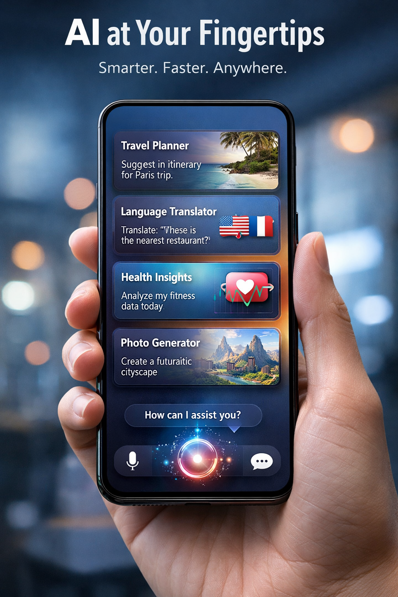

- **Social and ethical aspects of artificial intelligence**
  > Artificial intelligence systems (especially large language models, LLMs) become deeply integrated into everyday life.
  Their impact extends far beyond technical performance, raising a broad range of social, ethical, and political questions.

  - **Conceptual perspective**
    - AI is a socio-technical system, a combination of algorithms, data, institutions, incentives,
    and human behavior. 
    - responsible development requires not only better models,
    but also informed public discourse,
    interdisciplinary collaboration,
    and continuous ethical reflection.
    - __AI risks__
    - __advantages of AI__
    - __Ethical issues and AI regulations__

- **AI risks**
  - **Privacy and surveillance**
    > Modern AI systems rely heavily on large-scale data collection.
    - personal privacy
    - mass surveillance
    - secondary use of data beyond its original purpose
    - models do not store personal data explicitly, still,
    their training processes may reflect sensitive information
    - what to do with sensible data? -- regulations

  - **Copyright and intellectual property**
    > The training of LLMs on vast corpora of text and images challenges traditional notions of copyright.

    - whether training constitutes fair use
    - how original creators should be compensated
    - who owns AI-generated content
    - These issues remain legally unresolved in many jurisdictions
  and are evolving rapidly.

  - **Misinformation and epistemic risk**
    > LLMs can generate fluent, persuasive, and coherent text
    regardless of its truth value.
    - misinformation,
    - conspiracy theories,
    - automated production of fake news.
    - Because outputs often appear authoritative,
    users may over-trust incorrect or fabricated content.

  - **Legal responsibility and unexpected failures**
    > AI systems can fail in unpredictable and non-transparent ways
    - Who is responsible for harm caused by an AI system? (e.g. autonomous driving, legal advices or medical diagnosis)
    - The developer, deployer, user, or data provider?
    - Traditional liability frameworks are often ill-suited
  to systems that learn from data
  and adapt their behavior over time.

  - **Algorithmic bias and fairness**
    > AI systems inherit statistical patterns from their training data,
  including historical biases and social inequalities.
    - discriminatory outcomes,
    - unequal error rates across groups,
    - reinforcement of existing power structures.
    - Attempts to correct bias may also lead to overcompensation,
  where fairness constraints distort outputs in unintended ways,
  illustrating the difficulty of defining neutrality in complex social contexts.

  - **Transparency and explainability**
    > Many high-performing AI systems operate as black boxes,
    offering limited insight into how decisions are produced.
    - open versus closed-source models,
    - proprietary advantage versus public accountability,
    - performance versus explainability.
    - The demand for explainable AI reflects the need
    for trust, auditability, and informed human oversight.

  - **Societal Destabilization**
    > AI disrupts institutions faster than society can adapt.
    - massive job displacement
    - economic inequality amplification
    - political manipulation via misinformation
    - Deepfakes undermining trust

  - **Existential risk and doomsday narratives**
    > Some discussions frame advanced AI
    as a potential existential threat to humanity,
    ranging from loss of control
    to extreme “AI doomsday” scenarios.
    - misaligned Superintelligence: highly capable optimization without value alignment, "Paperclip maximizer"
    - loss of human control: rapid autonomous evolution, humans are unable to intervene
    - autonomous weapons: automatic response, escalation
    - concentration of power: humans become obsolate, and the AI realizes it
    - they influence public perception and policy,
    often blending technical uncertainty with cultural fear.

- **Advantages of AI**
    - illustration  
    - **Increased efficiency and scalability**
        - Automates repetitive and data-intensive tasks.
        - Operates continuously without fatigue.
        - Scales to millions of users at near-zero marginal cost.
        - Enables real-time processing of massive datasets.

    - **Support for scientific research and education**
        - Assists in data analysis, hypothesis generation, and simulation.
        - Accelerates discovery in domains such as biology, physics, and medicine.
        - Provides personalized tutoring and adaptive learning systems.
        - Helps summarize, structure, and explore large bodies of literature.

    - **Improved accessibility to information and services**
        - Natural-language interfaces lower technical barriers.
        - Real-time translation across languages.
        - Assistive technologies for people with disabilities.
        - Expands access to healthcare, legal, and educational support.

    - **Augmentation of human decision making**
        - Detects patterns beyond human perceptual limits.
        - Supports risk assessment and forecasting.
        - Provides scenario simulation and optimization tools.
        - Enhances evidence-based decision processes.

    - **Increases productivity**
        - Reduces time required for coding, writing, and analysis.
        - Automates documentation and administrative tasks.
        - Enables rapid prototyping and design iteration.
        - Improves workflow coordination across teams.

    - **Creates new professions**
        - Emergence of AI engineers, prompt engineers, and AI ethicists.
        - New roles in AI governance, auditing, and safety.
        - Growth of interdisciplinary fields combining AI with law, medicine, and arts.
        - Development of new creative and technical industries.

    - **Augments human capabilities**
        - Enhances memory and knowledge retrieval.
        - Assists creative processes (art, music, design).
        - Extends cognitive reach via simulation and modeling.
        - Acts as a collaborative partner in complex reasoning tasks.

