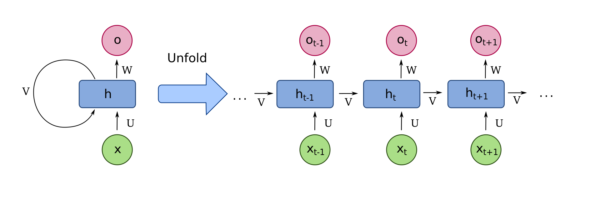

# Time series

- **time evolution**: $\tau: \Omega\times dT \to \Omega$
    - assume the complete world is fully deterministic
    - Markov process
    - does only on the time difference (not the absolute time)
    - consistency: $\tau(\omega, t_{ac}) = \tau(\tau(\omega,t_{ab}),t_{bc}))$

- **time evolution in a context**: $(\mathcal C, dt) \mapsto \Pi_\mathcal{C}(\tau(\omega, dt))$

- **goal of living beings**, **agents of the world**
  - all living being (agent) must secure the mainanence of its own life and also the existence of its species
  - must observe the world, and make decision according to the actual state
  - only partial observation is possible $\to$ context
  - decisions:
    - action focused
    - model based

- **action focused decision**
  - sensory input leads directly to action
  - direct representation of the world, System I
  - fast and accurate (if appropriate)
  - critics: world becomes too complicated to have a reaction to all possible environemntal situations

- **model based decision**
  - the agent maintains an up-to-date representation of the world
  - sensory input leads to updating the representation
  - representation can be used to try model scenarios (thinking)
  - decision after tried a sufficient number of scenarios
  - slower, general, less accurate in specific cases
  - System II

- **prediction**
  - time evolution must be predicted in order to be able to prepare the future
  - exact prediciton is possible only from the complete world $\to$ impossible in practice
  - we need contextual prediction

- **contextual prediction**
  - try to predict time evolution in a context $\mathcal C$
  - time evolution model: $M: (c, t)\mapsto (c', t')$, where $c,c'\in\mathcal C$
  - examples:
    - mechanical motion: $c$ contains the configuration data and the velocities, $t'=t+dt$, differential equation if $dt\to0$
    - large language models: $c$ is the complete textual history, $t'$ is the next token
  - must not be exact $\to$ errors in prediction
  - treatment of errors
    - expected value of the outcomes of time evolution starting from $c$ $\to$ deterministic evolution
    - statistical representation of the distribution around the expected value $\to$ stochastic evolution

- **deterministic evolution**
  - start from a context state $x$, and observe to possible outputs from this state after a time $dt$
    - assume no explicit time dependence (otherwise time is an element of the context)
    - everything depends on $dt$, we do not write out this dependence
  - $y$ is not unique $\to P(y\mid x)$
  - we expect a lot of independent effects $\Rightarrow$ $p$ is Gaussian $$P(y\mid x) =\mathcal N(M(x), C(x))(y),$$ the expected value is described by the model
  - we use a parametrized model $\to$ data model $\mathcal M(x,\omega)$ where $\omega\in\mathcal Q$ are parameters, approximate distribution $$ P(y\mid x, \omega) \sim e^{-\ell(y, \mathcal M(x,\omega))},$$
  where $\ell(y,\mu) = \frac12 (y-\mu)^T C^{-1}(y-\mu)$ loss function
  - if $C$ is not known, other approximate forms can be used for $\ell$ (like KL divergence)
  - parameter optimization from observed data $\to$ likelihood, parameter distribution

- **likelihood**
    - probability of measuring the observed dataset given the model $\mathcal M(x,\omega)$
    - $L : \mathcal Q \to [0,1]$
    - definition: $D$ sample data, assume independent measurements
      $L(\omega) = P(D \mid \omega)
      = \prod_{(x,y)\in D} P(x,y \mid \omega)$
    - total loss function:
      $\ell(\omega) = \sum_{(x,y)\in D} \ell(y,\mathcal M(x,\omega))$

- **parameter distribution**
    - posterior:
      $P(\omega \mid D)$
    - parameter prior:
      $P(\omega)$
    - value prior:
      $P(D)$
    - Bayes relation:
      $P(\omega \mid D) = \dfrac{P(D \mid \omega) P(\omega)}{P(D)}$
    - assumptions:
        - flat priors
        - $P(\omega)=\text{const}$
        - $P(D)=\text{const}$
    - approximation:
      $P(\omega \mid D) \sim L(\omega)$
    - normalization:
      $\int_{\omega\in\mathcal Q} P(\omega \mid D)=1$

- **confidence** 
    - confidence levels: $S_p$ hypersurface in the parameter space 
        - definition:
          $P(\omega \in S_p \mid D)=\text{const}$
        - $S_p$: hypersurface in $\mathcal Q$
    - confidence regions:
        - volume $V_p \subset \mathcal Q$
        - boundary $\partial V_p = S_p$
    - parametrization:
      $\int_{\omega\in V_p} P(\omega \mid D)=p$

- **differential equations**, **differentia equations**
  - time dependence $f:\mathbb R\to W$ where $W\sim \mathbb R^N$ (value) are vector spaces
  - deterministic evolution, Markov process, differentia equation $$f(t+\Delta t) = f(t) + \Delta t F_{\Delta t}(f(t)),$$ $\Delta t$ is a parameter (time step)
  - continuous limit: $\Delta t\to 0$, then time derivative $$\partial _t f = \dot f= \lim_{\Delta t\to0}\dfrac{f(t+\Delta t)-f(t)}{\Delta t},$$ then the evolution equation becomes a differential equation $$\partial_t f = F_0(f).$$
  - to determine full time evolution, we need to fix $N$ values (degrees of freedom)
    - can be $f(t_0)\;\to$ initial conditions
    - or it can be $f_a(t_i)$ for eventually different $t_i$ times (e.g. boundary conditions)
    - in extreme case $f_0(t)$ for $t\in\{t_1,\dots,t_N\}$ (or similarly for other components)
  - time embedding: give $f_0(t+n\Delta t)$ for $n=0,1,\dots N-1$ for fixed $a$
    - determines full time evolution
    - leads to a recursion equivalent to the original time series $$f_0(t) = \mathcal G(f_0(t-\Delta t),\dots f_0(t-N\Delta t))$$

- **conserved quantities**
  - function $E:W\to \mathbb R$ where $E(f(t))=$ constant
  - examples
    - with $v(t)=\dfrac{f(t+\Delta t)-f(t)}{\Delta t}$ we have $E = v- F_{\Delta t}(f) \equiv 0$ (equation of motion)
    - energy of a harmonic oscillator $$\left\{\begin{align*}& \dot x= y\\ &\dot y = -\omega^2 x\\ \end{align*}\right\}\Rightarrow E = \omega^2 x^2 +y^2$$

- **partial differential equations**
  - spatial-temporal configurations: $f(t,x)$, where $x\in V\sim \mathbb R^d$ $d$ dimensional space
  - formally: multicomponent function $f_x(t)=f(t,x)$, space is an index
  - local evolution
    - neighborhood of $x$ is $V_x\subset V$
    - time update comes only from a local neighborhood $$f(t+\Delta t,x) = f(t,x) + \Delta t F_{\Delta t}(\{f(t,y)\mid y\in V_x\})$$
    - less degrees of freedom than expected, but still a lot
  - initial conditions:
    - theoretically: full configuration in the complete space $\to$ usually not available
    - sampling space in a grid $\to$ not enough data for a complete time evolution
    - earlier time data $\to$ fewer information, diffusion, information loss

- **recurrent neural networks (RNN)**
  - purpose: model sequential / time-dependent data
    $$
    x_1, x_2, \dots, x_T \;\mapsto\; y_1, y_2, \dots, y_T
    $$
  - maintain an **internal (hidden) state** summarizing the past:
    $$
    h_t = f(h_{t-1}, x_t)
    $$
  - recurrent structure:
    - output (or hidden state) is fed back as input at the next time step
    - same parameters are reused across time (weight sharing)

  - **unfolding in time**:
    - RNN can be unfolded into a deep feed-forward network of depth $T$
    - each layer corresponds to one time step
    - training performed via *backpropagation through time* (BPTT)

  - **theoretical properties**:
    - expressive enough to approximate sequence-to-sequence mappings
    - in principle can capture long-range dependencies

  - **problems**:
    - vanishing gradients:
      - repeated multiplication by Jacobians with eigenvalues < 1
      - early inputs have negligible influence on later outputs
    - exploding gradients:
      - gradients grow exponentially, causing instability
    - slow convergence and sensitivity to initialization
    - limited effective memory in practice

  

---

- **Long Short-Term Memory (LSTM)**
  - motivation:
    - address vanishing gradient problem of plain RNNs
    - enable learning of long-term dependencies

  - core idea:
    - introduce an explicit **memory cell** with controlled information flow
    - separate *storage* from *exposure* of information

  - **components**:
    - **cell state** $c_t$: long-term memory
    - **hidden state** $h_t$: exposed representation
    - **input gate** $i_t$: controls how much new information is written
    - **forget gate** $f_t$: controls how much old memory is retained
    - **output gate** $o_t$: controls what part of memory is revealed

  - **gate dynamics**:
    $$
    f_t = \sigma(W_f x_t + U_f h_{t-1} + b_f)
    $$
    $$
    i_t = \sigma(W_i x_t + U_i h_{t-1} + b_i)
    $$
    $$
    c_t = f_t \odot c_{t-1} + i_t \odot \tilde c_t
    $$
    $$
    h_t = o_t \odot \tanh(c_t)
    $$
    - gates use sigmoid activations $\in [0,1]$
    - memory update is *additive*, improving gradient flow

  - **advantages**:
    - much more stable training than vanilla RNNs
    - effective for medium-range temporal dependencies
    - historically strong performance in speech, language, and time series

  - **limitations**:
    - complex architecture → many parameters
    - still sequential (poor parallelization)
    - struggles with very long sequences
    - training remains slow compared to modern architectures

  - **historical note**:
    - LSTMs were dominant from ~1997 to mid-2010s
    - today largely replaced by transformers in NLP and many sequence tasks
    - still used in resource-constrained or strictly causal settings

- **time series representation via embedding and prediction**
  - goal:
    - reconstruct the hidden state of a dynamical system
    - learn its temporal evolution for prediction or analysis

  - **delay embedding (Takens' theorem)**:
    - consider a scalar time series:
      $$
      x(t_1), x(t_2), \dots, x(t_T)
      $$
    - construct delay vectors:
      $$
      \mathbf y_t =
      \big(
      x(t),\ x(t-\tau),\ \dots,\ x(t-(m-1)\tau)
      \big)
      \in \mathbb R^m
      $$
    - parameters:
        - $m$: embedding dimension
        - $\tau$: delay time

  - **Takens' theorem (conceptual statement)**:
    - for a generic observation function and sufficiently large $m$,
      the delay embedding is a **diffeomorphic image** of the true state space
    - topological and geometric properties of the original system are preserved
    - implies that a single measured quantity can encode the full dynamics

  - **interpretation**:
    - delay vectors act as reconstructed **state representations**
    - the time series becomes a trajectory in an embedding space
    - prediction reduces to learning a map:
      $$
      \mathbf y_{t+1} = F(\mathbf y_t)
      $$

---

- **prediction as function approximation**
  - formulate time-series prediction as regression:
    $$
    x(t+1) = f\big(x(t), x(t-\tau), \dots\big)
    $$
    or equivalently:
    $$
    \mathbf y_{t+1} = F(\mathbf y_t)
    $$

  - **deep neural networks (DNNs)**:
    - can approximate nonlinear evolution operators $F$
    - capture complex dynamics beyond linear autoregressive models
    - applicable architectures:
        - feed-forward networks (MLP on delay vectors)
        - recurrent neural networks
        - LSTM / GRU
        - transformers (attention over time windows)

  - **advantages**:
    - no explicit physical model required
    - flexible and expressive
    - can handle noisy and partially observed systems

  - **limitations**:
    - Takens’ theorem assumes:
        - deterministic dynamics
        - stationarity
        - infinite data and noise-free observation (theoretical idealization)
    - real-world data often violate assumptions:
        - noise, stochastic forcing, regime changes
    - embedding dimension and delay must be chosen carefully

---

- **conceptual bridge**
  - classical dynamical systems:
    - state → evolution → observation
  - embedding approach:
    - observation → reconstructed state → learned evolution
  - deep learning:
    - replaces explicit equations with data-driven evolution operators

  - summary:
    > time-series modeling can be seen as **learning coordinates and dynamics simultaneously**

- **Physics-Informed Neural Networks (PINNs)**
  - core idea:
    - learn a function that represents the solution of a dynamical system
    - enforce known physical laws directly in the loss function
    - combine data-driven learning with first-principles constraints

  - **problem setting**:
    - given a physical system described by differential equations:
      $$
      \mathcal F\big(u(x,t), \partial_t u, \nabla u, \nabla^2 u, \dots\big) = 0
      $$
    - where $u(x,t)$ is the unknown state (field, trajectory, solution)

  - **neural representation**:
    - approximate the state by a neural network:
      $$
      u(x,t) \approx u_\theta(x,t)
      $$
    - network input:
        - space, time, parameters, boundary conditions
    - network output:
        - physical state variables

  - **physics-informed loss**:
    - total loss is a sum of terms:
      $$
      \mathcal L =
      \mathcal L_{\text{data}}
      + \lambda_{\text{phys}}\,\mathcal L_{\text{PDE}}
      + \lambda_{\text{bc}}\,\mathcal L_{\text{BC/IC}}
      $$
    - physics residual:
      $$
      \mathcal L_{\text{PDE}}
      =
      \mathbb E\left[
      \big\|
      \mathcal F(u_\theta)
      \big\|^2
      \right]
      $$
    - derivatives are computed via **automatic differentiation**

  - **relation to time-series embedding**:
    - classical embedding:
        - reconstruct state from observations
        - learn evolution implicitly
    - PINNs:
        - represent the state directly
        - enforce evolution laws explicitly
    - both aim to recover the underlying dynamical structure

  - **advantages**:
    - strong inductive bias from physics
    - requires less data than purely data-driven models
    - produces physically consistent predictions
    - can interpolate and extrapolate in space and time

  - **limitations**:
    - optimization can be difficult (stiff PDEs, competing loss terms)
    - sensitive to loss weighting
    - struggles with chaotic or highly multiscale systems
    - computationally expensive for high-dimensional problems

  - **interpretation**:
    - PINNs replace numerical solvers with function approximation
    - learning becomes constrained by conservation laws, symmetries, and dynamics

  - **summary**:
    > PINNs unify representation learning and physical modeling by embedding
    > the governing equations directly into the learning process

- **Temporal Convolutional Networks (TCN)**
  - goal:
    - model sequential / time-series data
    - predict future values from past observations
    - without recurrent connections

  - **core idea**:
    - use 1D convolutions along the time axis
    - enforce *causality*: output at time $t$ depends only on inputs at times $\le t$
    - represent temporal dependencies via convolutional receptive fields

  - **causal convolution**:
    - standard convolution modified so no “future leakage” occurs
    - for input sequence $x_t$:
      $$
      y_t = \sum_{k=0}^{K-1} w_k\, x_{t-k}
      $$
    - ensures suitability for forecasting and online prediction

  - **dilated convolutions**:
    - introduce gaps between convolution taps:
      $$
      y_t = \sum_{k=0}^{K-1} w_k\, x_{t-k\cdot d}
      $$
    - dilation factor $d$ grows exponentially with depth
    - allows very large temporal receptive fields with few layers

  - **effective memory**:
    - receptive field size:
      $$
      R = 1 + (K-1)\sum_{l=0}^{L-1} d_l
      $$
    - can cover long-range dependencies efficiently
    - memory length is explicit and controllable

---

- **architecture details**
  - typically built from **residual blocks**:
    - two (or more) dilated causal convolutions
    - nonlinearities (ReLU / GELU)
    - normalization (weight norm / layer norm)
    - residual skip connection:
      $$
      h_{l+1} = h_l + \mathcal F(h_l)
      $$

  - properties:
    - no hidden state carried across time
    - full parallelization across sequence length
    - fixed computation graph independent of sequence duration

---

- **comparison with RNN / LSTM**
  - RNNs:
    - implicit memory via recursion
    - sequential computation
    - difficult gradient propagation over long horizons
  - LSTMs:
    - gated memory improves stability
    - still sequential and hard to parallelize
  - TCNs:
    - memory via receptive field
    - stable gradients (no recurrence)
    - highly parallelizable

---

- **advantages**
  - stable training (no backpropagation through time)
  - explicit control over temporal horizon
  - strong performance on many time-series benchmarks
  - efficient on GPUs due to convolutional structure
  - suitable for both regression and classification

---

- **limitations**
  - receptive field must be chosen a priori
  - inefficient if dependencies exceed designed horizon
  - less adaptive than attention-based models
  - memory grows discretely (by architecture), not dynamically

---

- **interpretation**
  - TCNs replace recursion with *structured temporal filters*
  - temporal abstraction is achieved via depth and dilation
  - sequence modeling becomes a form of hierarchical feature extraction

  - summary:
    > TCNs model time by stacking causal, dilated convolutions,
    > turning sequence learning into a parallel, stable convolutional problem
