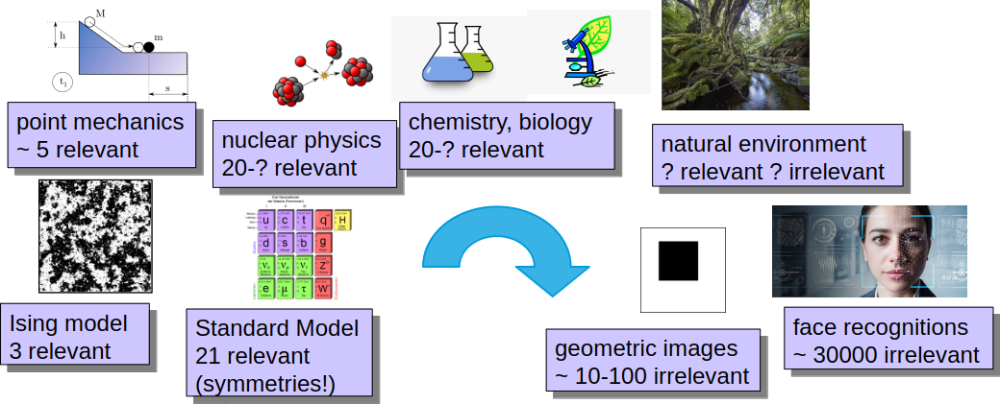

# Worldviews and Intelligence

These items describe different worldviews, their assumptions, methods, and relation to intelligence and learning.

---

- **worldviews**
    - types:
        - pre-scientific worldview
        - scientific worldview
        - intelligence worldview

---

- **pre-scientific worldview**
    - characteristics:
        - nature is chaotic and unpredictable
        - anthropomorphic explanations
        - understanding based on personal skills
        - artistic view: ateliers and schools
        - everything is art, from bridge building to poetry
        - divine spheres are controlled by laws
    - examples:
        - castle building
        - medieval art
        - Hagia Sophia dome

---

- **scientific worldview**
    - characteristics:
        - nature is governed by laws
        - laws can be discovered by systematic observation and experiment
        - mathematical description of nature
        - predictive models
        - technology based on scientific knowledge
        - laws are simple and elegant (Occam’s razor)
    - worldview traits:
        - analytic
        - reductionist
        - deterministic
    - method:
        - scientific method
    - examples:
        - physics (Newtonian mechanics, Maxwell’s equations, thermodynamics, etc.)
        - chemical elements
        - taxonomy in biology

---

- **scientific method**
    - steps:
        - observation
        - modelling
        - computation
        - prediction
        - experiment
        - theory refinement
    - assumptions:
        - nature is objective
        - laws are universal
        - experiments are reproducible
        - all effects have distinct causes
    - requirements:
        - parameters can be fixed by experiments
        - accurate measurements
        - controlled experiments
        - few relevant variables
    - consequences:
        - unique theory can be derived
        - prediction of new phenomena
        - limited validity range
        - falsifiability
    - hints:
        - symmetry principles
        - conservation laws
        - dimensional analysis
        - Occam’s razor
    - examples:
        - Ising model
        - Newtonian mechanics
        - physics (mechanics, electromagnetism, thermodynamics, quantum mechanics, relativity, QFT)
        - chemistry of simple systems
        - genetics and molecular biology of simple organisms
        - constraint systems (engineering, traffic, logistics)

---

- **Ising model**
    - definition:
      a mathematical model describing ferromagnetism in statistical mechanics
    - lattice:
        - $M = \{1,\dots,N\}^d$
        - $d$-dimensional cubic lattice
    - states:
        - spin at each lattice site ($\pm 1$)
    - Hamiltonian:
        - $H(\sigma) = -J \sum_{\langle i,j\rangle} \sigma_i\sigma_j - h\sum_i\sigma_i$
    - relevant parameters:
        - $J$: interaction strength
        - $h$: external magnetic field
    - partition function:
        - $Z = \sum_{\{\sigma\}} e^{-\beta H(\sigma)}$
    - temperature:
        - $\beta = 1/(k_B T)$
    - applications:
        - phase transitions
        - critical phenomena
        - complex systems

---

- **Newtonian mechanics**
    - definition:
      classical framework describing motion using Newton’s laws
    - laws:
        - inertia
        - $F=ma$
        - action–reaction
    - components:
        - point masses
        - forces
        - absolute time and space
    - applications:
        - planetary motion
        - engineering mechanics
        - classical dynamics

---

- **intelligence method**
    - steps:
        - set up a generic model
        - gather information
        - learn from data
        - refine model by experience
    - assumptions:
        - many relevant features exist
        - features do not have unique roles
        - not all effects have distinct causes
    - requirements:
        - learning ability
        - adaptability
        - uncertainty handling
        - integration of multiple sources
    - consequences:
        - multiple models can fit data
        - no unique theory
        - validation by real-world performance
        - limited validity and precision
    - examples:
        - pattern recognition
        - NLP
        - chemistry of complex molecules
        - biology of complex organisms
        - economics and social systems

---

- **analytic worldview**
    - definition:
      understanding complex systems by decomposing them into elementary components
    - characteristics:
        - reductionism
        - determinism
        - focus on individual elements
    - ontology:
        - realism
        - materialism
        - mechanism
    - ultimate theory:
        - theory of everything
    - practical realizations:
        - standard model
        - general relativity
    - criticism:
        - analytic worldview fails for multicomponent systems

---

- **the particle physicist and the grandma’s cake**
    - story:
        - physicist understands fundamental particles
        - grandma bakes a cake
        - paradox: knowledge of fundamentals does not imply practical competence
    - moral:
        - analytic worldview must fail somewhere
        - criticism of the analytic worldview

---

- **criticism of the analytic worldview**
    - points:
        - complexity does not scale linearly with components
        - multicomponent systems require new concepts
    - mathematical background: contexts, relevant features
    - examples:
        - few-molecule chaos vs many-molecule ideal gases
    - facit: the world can not be understood as a whole, only partial understadning is possibe
        - software-hardware analogy

---

- **software–hardware analogy**
    - points:
        - software does not determine hardware
        - hardware does not determine software
    - implications:
        - disciplines correspond to different descriptive levels
        - no single analytic reduction exists
        - multiple contexts are necessary

- **number of relevant features**
    - depends only on the context alone (not follows from other contexts)
    - few relevant features $\to$ *scientific approach*
    - lot os relevant features $\to$ *intelligent approach*
    - reason of few parameters
        - large "distance" from underlying world
        - forced by a subsystem (e.c. traffic)
    - examples for large distances
        - Standard Model: valid at least from 1GeV to 100 TeV: 5 orders of magnitude, details of the underlying theory do not count
        - quantum mechanics: atomic physics: 10 $\AA$, nucleus size: 1 fm = $10^{-15}m$, 5 orders of magnitude, details of the nucleus do not count
        - mechanics: intermolecular distances: $10^{-10}-10^{-8}$ m (solid vs. gas), observation scale $\sim 10^{-3}$ m: molecular details do not count
    - facit:
        - science (and mathematics) is not the language of the Nature, they are applicable by some fortunate circumstances
    - image: number_of_parameters
    

- **scientific approach**
    - contains few relevant quantities
    - each feature has a unique role, character (c.f. units of measure)
    - parameters can be fixed by dedicated measurements
    - unique description: **the model** of the world, fully determinable $\to$ *scientific method*
    - predictive ability (using the unique model), small deviation from reality, accurate
    - methods of predictions:
        - causal description (equations)
        - stochastic description

- **intelligent approach**:
    - contains a lot of relevant quantities
    - roles of the features are burred, conflated
    - not a unique description (no singled out model)
        - several descriptions work equally well $\to$ *intelligence method*
        - not fully "understandable" (which description?)
        - may have more and less important features
    - all descriptions are insufficient, makes mistakes, "Exceptio probat regulam", exceptions challange the rule
    - different methods to represent reality
